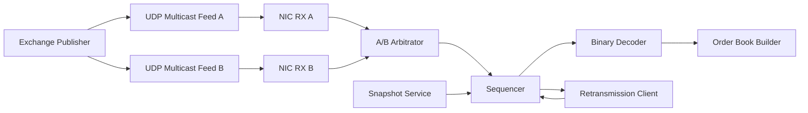
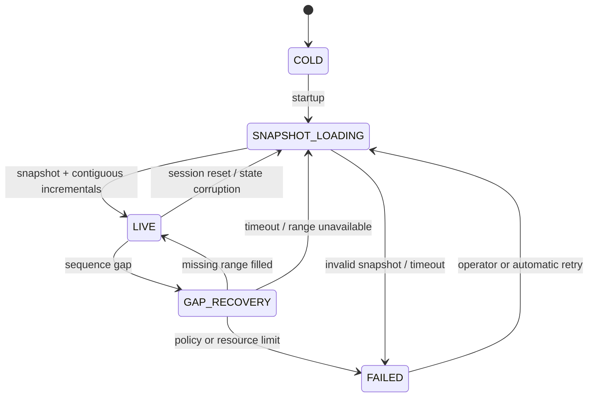

# 개요

Market data feed handler는 packet을 빠르게 decode하는 program이기 전에 **시장 event를 빠짐없이 한 번씩 순서대로 적용하는 state machine**이다.
UDP multicast는 하나의 publisher가 많은 receiver에게 같은 data를 낮은 overhead로 전달하기 좋다. 그러나 UDP 자체는 delivery, duplicate protection과 ordering을 보장하지 않는다.

```text
Exchange가 보낸 sequence
100 → 101 → 102 → 103 → 104
Receiver가 관찰한 도착 순서
100 → 102 → 102 → 101 → 104
       ^     ^     ^     ^
       gap   dup   late  103 missing
```

이 상태에서 도착한 순서대로 order book을 갱신하면 존재하지 않는 order를 cancel하거나 이미 지운 order를 다시 execute할 수 있다.
이 글에서는 UDP multicast 기반 binary incremental feed의 일반적인 reliability model을 살펴본다. 실제 packet header, sequence 범위, A/B feed 관계, retransmission과 snapshot 연결 방법은 venue마다 다르다.

> Production 구현의 최종 기준은 연결하려는 venue의 최신 network, transport, market-data와 recovery specification이다.

# 학습 위치

| 항목 | 내용 |
| --- | --- |
| BFS Level | Level 2-M — Market-data State와 Recovery |
| 선수 글 | [[Low Latency Trading] 초저지연 트레이딩 시스템 전체 구조](/posts/low-latency-trading-system-overview/) |
| 선수 글 | [[Low Latency Trading] Market Microstructure와 Limit Order Book](/posts/low-latency-market-microstructure/) |
| 선수 글 | [[Computer Architecture] Endianness와 Alignment](/posts/endianness-alignment/) |
| 연결 주제 | NIC RX queue, kernel bypass, feed handler와 deterministic replay |

완료 기준은 다음과 같다.

> Sequence gap을 발견한 순간부터 stale book을 차단하고, retransmission 또는 기준 sequence가 명확한 snapshot으로 복구한 뒤에만 LIVE 상태로 돌아가는 과정을 설명할 수 있는가?

# 1. 일반적인 Market Data 경로

Feed마다 transport 구성은 다르지만 학습용 일반 model은 다음과 같다.



각 단계의 책임을 섞지 않는 것이 좋다.

| 단계 | 핵심 책임 |
| --- | --- |
| Network receiver | Datagram 수신, 길이와 interface metadata 확보 |
| Packet parser | Header와 message boundary 검증 |
| Arbitrator | 중복된 A/B 경로 중 사용할 data 선택 |
| Sequencer | duplicate, gap, late와 순서를 판정 |
| Decoder | Binary field를 typed event로 변환 |
| Book builder | 검증된 event를 상태에 적용 |
| Recovery | 누락 범위 또는 전체 snapshot 복구 |

Book builder가 raw datagram 도착 순서를 직접 신뢰하면 network 문제와 domain state가 결합된다.
# 2. UDP Multicast가 해결하는 것과 해결하지 않는 것

IP multicast는 하나의 datagram을 host group에 전달한다. Receiver가 multicast group에 가입하면 같은 publisher data를 여러 host가 받을 수 있다.

```text
Publisher
   ├─ Receiver 1
   ├─ Receiver 2
   └─ Receiver 3
```

UDP는 connection setup과 per-message acknowledgement 없이 작은 transport header를 제공한다. 반면 RFC 768은 ordered reliable delivery와 duplicate protection을 제공하지 않는다고 명시한다.
RFC 1112의 multicast delivery도 일반 IP datagram과 같은 best-effort model이다.
따라서 application protocol이 다음 정보를 제공해야 할 수 있다.

```text
어느 session과 channel의 data인가?
어느 sequence부터 몇 message가 들어 있는가?
누락을 어떻게 요청하는가?
재전송 범위가 더 이상 보관되지 않으면 어떻게 snapshot을 얻는가?
```

UDP multicast를 사용한다고 모든 venue가 같은 recovery protocol을 사용하는 것은 아니다.
# 3. Binary Incremental Feed

Incremental feed는 현재 book 전체를 매 packet 반복하지 않고 이전 상태에 대한 변경 event를 보낸다.

```text
Add Order 501
Execute Order 501 by 20
Cancel Order 501 by 10
Delete Order 501
```

Bandwidth와 decode 비용을 줄일 수 있지만 한 event가 빠지면 이후 상태의 기준이 깨진다.

```text
실제 event
Add 501 → Execute 20 → Delete 501
Execute가 유실된 local state
Add 501 → Delete 501
최종 book이 비어 보이더라도 trade와 quantity history는 틀리다.
```

더 위험한 경우는 Add가 유실되고 Execute 또는 Cancel만 도착하는 상황이다. 이때 “모르는 order이므로 무시”하면 장애를 숨길 뿐이다.

> Incremental feed에서 unknown order, quantity underflow와 impossible transition은 gap 또는 state corruption의 증거로 취급해야 한다.

# 4. Packet, Message와 Session Sequence를 구분한다

`sequence number`라는 이름만 보고 하나의 숫자라고 생각하면 안 된다.
## 4.1 Packet Sequence

Datagram 또는 transport packet의 순서를 식별할 수 있다.

```text
Packet 900: Message A, B, C
Packet 901: Message D, E
```

어떤 protocol은 packet header에 “첫 message sequence + message count”를 넣어 packet이 담당하는 sequence 범위를 표현한다.
## 4.2 Message Sequence

논리적인 market-data message 하나마다 증가하는 번호다.

```text
Packet first sequence = 1000
Message count         = 3
Message 0 → sequence 1000
Message 1 → sequence 1001
Message 2 → sequence 1002
Next expected         = 1003
```

다른 protocol은 packet과 message sequence를 별도로 둘 수 있다. Message count가 0인 heartbeat나 control packet의 의미도 protocol마다 다르다.
## 4.3 Session Identifier

Sequence의 lifetime을 구분하는 identifier다.

```text
(session, channel, sequence)
```

새 거래일, publisher restart 또는 disaster-recovery 전환에서 session이 바뀔 수 있다. Session이 다른 packet의 sequence 숫자만 비교해서는 안 된다.

```text
Session OLD, sequence 5,000,000
Session NEW, sequence 1
```

이는 거대한 backward gap이 아니라 새 session일 수 있다. 반대로 예상하지 못한 session 변경은 즉시 recovery가 필요한 장애일 수 있다.
## 4.4 Channel Sequence

Feed가 symbol을 여러 channel로 나누면 sequence 공간도 channel별일 수 있다.

```text
Channel 1: A-E symbols
Channel 2: F-N symbols
Channel 3: O-Z symbols
```

Channel 1의 gap을 Channel 2의 sequence로 채울 수 없다. Partition과 channel mapping은 매일 또는 specification revision에 따라 달라질 수 있다.
## 4.5 Business Identifier는 Sequence가 아니다

Order ID, trade ID, tracking number와 timestamp는 recovery sequence와 역할이 다르다.
Timestamp가 증가해 보인다는 이유로 gap이 없다고 판단해서는 안 된다. 여러 engine, clock과 batch 때문에 timestamp의 ordering 의미도 specification으로 확인해야 한다.
# 5. MoldUDP64는 하나의 구체적인 예다

Nasdaq MoldUDP64는 UDP 위에서 sequenced message를 전달하고 누락 범위를 다시 요청할 수 있게 하는 transport protocol 예시다.
Downstream packet은 개념적으로 다음 정보를 가진다.

```text
Session
First Sequence Number
Message Count
Repeated Message Block
  ├─ Message Length
  └─ Message Data
```

여러 message를 하나의 datagram에 담아 network overhead를 줄일 수 있고 client는 원하는 sequence 범위의 retransmission을 요청할 수 있다.
MoldUDP64에서 `Message Count = 0`은 heartbeat, `0xFFFF`는 end-of-session이다. 두 packet은 모두 Message Block 대신 다음 expected sequence를 Header에 전달한다.
Re-request 응답은 한 UDP packet에 완전히 들어가는 message까지만 반환할 수 있으므로 요청 범위가 남으면 후속 요청이 필요하다.
MoldUDP64는 transport와 re-request 형식을 정의할 뿐 order book snapshot의 기준 sequence나 incremental splice 규칙까지 정의하지 않는다. Snapshot semantics는 상위 market-data specification에서 확인해야 한다.
그러나 이 형식을 다른 venue feed에 그대로 적용하면 안 된다. ITCH payload의 field와 MoldUDP64 transport field도 서로 다른 계층이다.
# 6. Expected Sequence로 분류하기

Sequencer는 session과 channel마다 `expected`를 유지한다.
현재 `expected = 103`이라고 하자.

```text
received == expected
  → 다음 message
received < expected
  → 이미 처리한 duplicate 또는 늦게 도착한 message 후보
received > expected
  → [expected, received)의 gap 발견
```

단순 pseudo code는 다음과 같다.

```text
on_message(session, sequence, payload):
    if session != active_session:
        handle_session_change()
        return
    if sequence == expected:
        apply(payload)
        expected = next(sequence)
        drain_buffered_contiguous_messages()
        return
    if sequence_is_before(sequence, expected):
        count_duplicate_or_late()
        return
    mark_book_stale()
    buffer_if_within_limit(sequence, payload)
    request_missing(expected, previous(sequence))
```

실제 구현은 packet 안의 각 message sequence, wraparound, session reset과 recovery 중 새 gap까지 처리해야 한다.
# 7. Duplicate, Gap과 Out-of-Order

## 7.1 Duplicate

A/B feed, retransmission 또는 network duplication으로 이미 적용한 sequence가 다시 올 수 있다.
Duplicate는 **decode 비용을 줄이기 위해 빨리 버릴 대상**이지만, 먼저 session과 channel이 같고 정말 같은 logical sequence인지 확인해야 한다.
같은 sequence에 서로 다른 payload가 오면 단순 duplicate가 아니라 data disagreement다. 즉시 metric과 alert를 남기고 venue 규칙에 따라 안전 상태로 전환해야 한다.
## 7.2 Gap

`expected = 100`인데 `105`를 받으면 일반적으로 `[100, 105)`가 빠졌다.

```text
Missing: 100, 101, 102, 103, 104
Observed future: 105
```

Gap을 발견한 뒤 105를 바로 book에 적용하면 안 된다. 누락 event와 독립적이라는 것을 generic feed handler가 증명할 수 없기 때문이다.
## 7.3 Out-of-Order

`105`를 먼저 받고 잠시 뒤 `100~104`가 도착할 수 있다. A/B path 길이, buffering과 retransmission 때문에 발생할 수 있다.
미래 message를 bounded buffer에 보관한 뒤 gap이 채워지면 연속된 순서로 drain할 수 있다. Buffer가 무한히 커지게 두면 burst나 공격적인 input이 memory exhaustion으로 이어진다.
# 8. A/B Feed Arbitration

많은 market-data service는 물리적으로 분리된 redundant feed를 제공한다.

```text
Feed A: 100, 101, 102,     104
Feed B: 100, 101, 102, 103, 104
```

이 경우 B의 103으로 A의 loss를 가릴 수 있다.
일반적인 first-valid-arrival model은 다음과 같다.

```text
1. A와 B packet을 모두 parse·validate한다.
2. 같은 logical sequence 중 먼저 도착한 valid message를 후보로 선택한다.
3. 정확히 expected인 message만 book에 적용한다.
4. 나중에 온 동일 sequence는 duplicate로 버린다.
5. 두 path 모두 expected를 제공하지 못하면 gap recovery로 전환한다.
```

주의할 점이 있다.

- A와 B가 정말 동일한 logical stream인지 specification으로 확인한다.
- Session ID나 network header가 달라 byte-for-byte 동일하지 않을 수 있다.
- 한 path의 packet이 valid해도 payload message가 semantic validation을 실패할 수 있다.
- A/B first-arrival latency와 loss를 path별로 기록해야 장애를 찾을 수 있다.
- 두 feed가 다른 payload를 같은 sequence로 제공하면 조용히 하나를 고르지 않는다.

Redundant feed와 symbol partition channel을 혼동하면 안 된다.
# 9. Recovery State Machine

Recovery는 boolean `has_gap`보다 명시적인 state machine으로 표현하는 편이 안전하다.



각 state에서 strategy에 공개할 수 있는 data를 정해야 한다.

| State | Book 사용 가능 여부 |
| --- | --- |
| COLD | 불가 |
| SNAPSHOT_LOADING | 불가, 별도 staging state만 변경 |
| LIVE | 가능 |
| GAP_RECOVERY | 기본적으로 불가 또는 stale 표시 |
| FAILED | 불가 |

Venue가 channel 단위 sequence를 사용한다면 gap의 영향 범위도 해당 channel 전체일 수 있다. 특정 symbol event 하나만 빠졌다고 임의로 좁혀서는 안 된다.
# 10. Retransmission Recovery

작은 gap이고 retransmission service가 해당 range를 보관하고 있다면 누락 message를 요청할 수 있다.

```text
expected = 100
105 수신
1. Book을 STALE로 전환
2. 105 이후 future message를 bounded buffer에 저장
3. 100~104 retransmission 요청
4. 100, 101, 102, 103, 104 순서로 검증·적용
5. Buffer의 105부터 contiguous하게 drain
6. 모든 invariant 확인
7. LIVE로 원자적으로 전환
```

Retransmission packet도 duplicate, out-of-order, corruption과 loss를 겪을 수 있다. Recovery channel이라고 신뢰를 생략하면 안 된다.
다음 조건이면 snapshot으로 escalation할 수 있다.

```text
Missing range가 retransmission retention 밖에 있음
Recovery timeout 초과
Buffered future data가 limit 초과
Session이 변경됨
같은 sequence의 payload가 불일치
Book invariant가 이미 깨짐
```

정확한 request format, 최대 범위, rate limit과 timeout은 venue specification을 따른다.
# 11. Snapshot Recovery

Snapshot은 특정 기준 시점의 state를 다시 구성하기 위한 data다.
가장 중요한 값은 **snapshot이 어느 incremental sequence까지 반영한 상태인가**다.

```text
Snapshot reference = S
Snapshot은 S까지 반영된 state
다음 적용할 incremental = S + 1
```

위 표현의 inclusive/exclusive 의미는 일반 규칙이 아니다. 실제 snapshot specification이 “reference sequence”를 어떻게 정의하는지 확인해야 한다.
안전한 일반 절차는 다음과 같다.

```text
1. LIVE book과 분리된 staging book을 비운다.
2. Snapshot chunk를 staging book에 적용한다.
3. Snapshot completeness와 end marker를 검증한다.
4. Snapshot reference sequence S를 확인한다.
5. S 이하의 buffered incremental을 버린다.
6. S 다음부터 contiguous한 incremental만 staging book에 적용한다.
7. 중간 gap이 있으면 recovery를 계속한다.
8. Book invariant를 검사한다.
9. 완성된 staging book을 strategy에 한 번에 publish한다.
```

부분적으로 받은 snapshot을 live object에 직접 섞으면 strategy가 반쪽짜리 book을 관찰할 수 있다.
Snapshot을 받는 동안 incremental feed는 계속 진행할 수 있다. Buffer의 시작점, 최대 크기와 snapshot보다 오래된 event 처리 정책을 미리 정해야 한다.
Snapshot에 믿을 수 있는 sequence 기준점이 없다면 generic 방식으로 incremental과 안전하게 splice할 수 있다고 가정하면 안 된다.
# 12. Stale Book을 차단한다

Gap 발생 후 마지막 정상 book을 계속 publish하면 값은 그럴듯하지만 이미 과거 상태다.

```text
Book data        = 마지막 정상 값
Book validity    = STALE
Last applied seq = 99
Observed seq     = 105
```

Strategy interface는 최소한 validity와 sequence watermark를 함께 전달해야 한다.
안전 정책의 예는 다음과 같다.

```text
새 주문 생성 차단
Quote update 중단
해당 channel 또는 symbol 전략 비활성화
Risk와 operator에 stale event 전달
필요하면 기존 주문 cancel 요청
```

기존 주문을 자동 cancel할지는 별도의 risk policy다. Feed gap과 order-entry session 장애를 같은 것으로 단정해서도 안 된다.
# 13. Sequence Wraparound

고정 bit-width sequence는 최대값 뒤에 0 또는 정의된 시작값으로 돌아갈 수 있다.
단순한 `received < expected` 비교는 wrap 근처에서 실패한다.
32-bit unsigned sequence의 일반적인 modular 비교 예시는 다음과 같다.

```cpp
#include <cstdint>

bool is_ahead(std::uint32_t value, std::uint32_t reference) {
    const std::uint32_t distance = value - reference;
    return distance != 0 && distance < 0x80000000u;
}
```

이 방식은 비교하려는 두 값의 실제 거리가 sequence 공간 절반보다 작다는 전제가 필요하다.
그러나 어떤 feed는 거래일 안에서 wrap하지 않거나 session 변경으로 reset하고, 어떤 feed는 64-bit sequence를 사용한다.

> Wrap width, reset value와 session 경계는 반드시 venue transport specification을 기준으로 구현한다.

Session reset과 숫자 wrap을 같은 사건으로 처리하면 recovery 범위를 잘못 계산할 수 있다.
# 14. Packet Bounds Check

Binary parser는 network input을 신뢰하지 않는다.
최소 검사는 다음과 같다.

```text
고정 header 길이가 packet 안에 있는가?
Message count가 implementation limit 이하인가?
Length field 자체를 읽을 byte가 남아 있는가?
Message length가 transport와 상위 application specification의 허용 범위인가?
Message end가 packet end를 넘는가?
Length 덧셈에 integer overflow가 있는가?
Message type별 고정·최소 길이가 맞는가?
정수 byte order와 signedness가 맞는가?
허용되지 않은 trailing byte가 남는가?
```

`reinterpret_cast`로 unaligned packet memory를 C++ struct로 바로 읽으면 alignment, padding, object lifetime과 endianness 문제가 생길 수 있다.
먼저 byte 단위로 경계를 검증하고 `memcpy` 또는 명시적인 big-endian decode를 사용한다.
중요한 원칙은 malformed packet의 앞쪽 message만 book에 반영하지 않는 것이다.

```text
Packet message 1: valid
Packet message 2: valid
Packet message 3: truncated
```

Parser가 1과 2를 이미 적용했다면 packet 단위 재시도와 sequence 상태가 복잡해진다. 먼저 packet 전체의 boundary를 검증해 view 또는 preallocated event batch를 만든 뒤 순서대로 적용하는 편이 안전하다.
# 15. 간단한 C++ Packet Parser

아래 코드는 “10-byte session + 8-byte first sequence + 2-byte count + length-prefixed messages”라는 학습용 format을 검증한다.
이는 MoldUDP64의 구조를 참고한 축약 예제일 뿐이며 production parser는 실제 specification의 field와 제한을 사용해야 한다.

```cpp
#include <array>
#include <cstddef>
#include <cstdint>
#include <limits>
#include <span>
constexpr std::size_t HEADER_SIZE = 20;
constexpr std::size_t MAX_MESSAGES = 128;
constexpr std::uint16_t END_OF_SESSION_COUNT = 0xFFFFu;
enum class PacketKind {
    DATA,
    HEARTBEAT,
    END_OF_SESSION
};
struct MessageView {
    std::uint64_t sequence;
    std::span<const std::byte> payload;
};
struct PacketView {
    std::array<std::byte, 10> session;
    std::uint64_t first_sequence{};
    PacketKind kind{PacketKind::DATA};
    std::array<MessageView, MAX_MESSAGES> messages;
    std::size_t count{};
};
std::uint16_t read_be16(std::span<const std::byte> bytes) {
    return (std::uint16_t(std::to_integer<unsigned>(bytes[0])) << 8) |
           std::uint16_t(std::to_integer<unsigned>(bytes[1]));
}
std::uint64_t read_be64(std::span<const std::byte> bytes) {
    std::uint64_t value = 0;
    for (std::byte byte : bytes.first<8>()) {
        value = (value << 8) | std::to_integer<unsigned>(byte);
    }
    return value;
}
bool parse_packet(std::span<const std::byte> packet, PacketView& out) {
    PacketView candidate{};
    if (packet.size() < HEADER_SIZE) return false;
    for (std::size_t i = 0; i < candidate.session.size(); ++i) {
        candidate.session[i] = packet[i];
    }
    const std::uint64_t first = read_be64(packet.subspan(10, 8));
    const std::uint16_t count = read_be16(packet.subspan(18, 2));
    candidate.first_sequence = first;
    if (count == END_OF_SESSION_COUNT) {
        if (packet.size() != HEADER_SIZE) return false;
        candidate.kind = PacketKind::END_OF_SESSION;
        out = candidate;
        return true;
    }
    if (count > MAX_MESSAGES) return false;
    candidate.kind = count == 0 ? PacketKind::HEARTBEAT : PacketKind::DATA;
    if (count != 0 &&
        first > std::numeric_limits<std::uint64_t>::max() - (count - 1)) {
        return false; // 이 예제는 session 안의 wrap을 허용하지 않는다.
    }
    std::size_t offset = HEADER_SIZE;
    for (std::size_t i = 0; i < count; ++i) {
        if (packet.size() - offset < 2) return false;
        const std::uint16_t length = read_be16(packet.subspan(offset, 2));
        offset += 2;
        if (length > packet.size() - offset) return false;
        candidate.messages[i] = MessageView{
            .sequence = first + i,
            .payload = packet.subspan(offset, length)
        };
        offset += length;
    }
    if (offset != packet.size()) return false; // 실제 protocol의 padding 규칙 확인
    candidate.count = count;
    out = candidate;
    return true;
}
```

이 함수는 packet 전체를 검증한 뒤에만 local `candidate`를 `out`에 commit한다. `first_sequence`를 별도 보존하므로 data가 없는 heartbeat와 end-of-session에서도 next expected sequence를 확인할 수 있다. MoldUDP64 transport는 zero-length Message Data를 허용하지만, ITCH 같은 상위 protocol의 message type별 최소 길이는 semantic decode 단계에서 별도로 검사해야 한다. `false`를 반환하면 호출자는 기존 `out`도 사용하지 않아야 한다. `MessageView::payload`는 원본 packet storage를 빌린 `span`이므로 view의 lifetime은 packet buffer보다 길 수 없다. NIC/ring buffer가 재사용되기 전에 소비하고, queue로 넘길 때는 buffer ownership을 이관하거나 preallocated owned event로 decode해야 한다. 성공한 뒤에도 enum 범위, price precision, quantity와 order lifecycle을 별도로 검증해야 한다.
# 16. Sequencer와 Book 적용

Packet parsing 성공이 곧 book 적용 허용을 뜻하지 않는다.
다음 pseudo C++는 핵심 분기만 보여준다.

```cpp
void on_message(const MessageView& message) {
    if (state == FeedState::COLD || state == FeedState::FAILED) {
        quarantine_or_drop_by_policy(message);
        return;
    }
    if (state == FeedState::SNAPSHOT_LOADING) {
        buffer_if_allowed(message);
        return;
    }
    if (message.sequence == expected) {
        const bool recovering = state == FeedState::GAP_RECOVERY;
        if (!decode_validate_and_apply(message.payload)) {
            state = FeedState::FAILED;
            publish_stale(expected, message.sequence);
            return;
        }
        ++expected;
        drain_contiguous_buffer();
        if (recovering && gap_closed_and_invariants_hold()) {
            state = FeedState::LIVE;
        }
        return;
    }
    if (is_before(message.sequence, expected)) {
        ++duplicate_or_late_count;
        return;
    }
    state = FeedState::GAP_RECOVERY;
    publish_stale(expected, message.sequence);
    buffer_if_allowed(message);
    request_retransmission(expected, message.sequence - 1);
}
```

Production code는 다음 실패도 처리해야 한다.

```text
decode_validate_and_apply 실패
buffer insertion 실패 또는 limit 초과
retransmission request rate limit
recovery 중 더 큰 gap
session 변경
book invariant 위반
```

Book mutation과 `expected` 증가는 하나의 성공 조건으로 다뤄야 한다. Apply가 실패했는데 sequence만 증가하면 그 event를 영구히 잃는다.
# 17. FIX Sequence와 혼동하지 않는다

FIX Session Layer도 `MsgSeqNum`, `ResendRequest`, `SequenceReset`과 `PossDupFlag`를 사용해 ordered session delivery와 recovery를 다룬다.
핵심 아이디어는 비슷하다.

```text
Next expected sequence 유지
Gap 발견
Missing range 요청
Duplicate 표시와 억제
Session state 영속화
```

그러나 FIX session recovery를 UDP market-data feed에 그대로 적용할 수는 없다.
FIX에는 어떤 application message를 resend하고 어떤 session message를 gap fill할지에 대한 별도 규칙이 있다. Market-data transport는 MoldUDP64, SoupBinTCP 또는 venue 고유 protocol의 규칙을 따른다.
Protocol 이름이 아니라 연결한 session의 공식 specification과 bilateral rules of engagement가 기준이다.
# 18. Deterministic Replay

Recovery code는 live network에서만 시험하면 재현하기 어렵다. Raw input과 판정을 기록해 같은 실행을 반복할 수 있어야 한다.
최소 replay record는 다음 정보를 포함한다.

```text
Venue / feed / channel
Session identifier
Interface A 또는 B
Kernel 또는 hardware receive timestamp
Raw packet bytes와 captured length
Parser result
First sequence와 count
Arbitration decision
Feed state transition
Recovery request와 response
Software version과 configuration
```

Replay는 strategy 결과만 비교하지 않는다.

```text
같은 packet에서 같은 parse 결과가 나오는가?
같은 logical sequence가 한 번만 적용되는가?
같은 지점에서 STALE과 LIVE가 전환되는가?
최종 book hash와 invariant 결과가 같은가?
```

Receive timestamp 순서와 logical sequence 순서를 별도로 보존해야 A/B arbitration을 재현할 수 있다.
# 19. Failure Injection Test

정상 pcap 하나를 읽는 것만으로 recovery를 검증할 수 없다.

| Test | 기대 결과 |
| --- | --- |
| Packet 한 개 drop | gap 탐지, 즉시 STALE, recovery 요청 |
| 같은 packet 두 번 | sequence당 한 번만 적용 |
| 100, 102, 101 순서 | 102 보류 후 101부터 순서 적용 |
| Feed A만 loss | Feed B로 무중단 보완 가능 여부 확인 |
| A/B 모두 같은 loss | retransmission 또는 snapshot 전환 |
| A/B payload 불일치 | alert 후 안전 상태, 조용한 선택 금지 |
| Retransmission duplicate | 중복 적용 없음 |
| Retransmission도 gap | 재요청 또는 snapshot escalation |
| Truncated header | OOB read 없이 packet 거절 |
| Length가 remaining 초과 | 부분 book mutation 없이 거절 |
| 과도한 message count | fixed limit에서 거절 |
| Unknown message type | specification 정책에 따른 fail/skip |
| Sequence wrap 경계 | modular 비교와 expected 갱신 검증 |
| 예상치 못한 session 변경 | 기존 state를 LIVE로 재사용하지 않음 |
| Snapshot chunk 유실 | partial snapshot publish 금지 |
| Snapshot 중 incremental burst | bounded buffer와 watermark 검증 |
| Recovery timeout | FAILED 또는 snapshot 정책 실행 |
| Unknown order cancel | state corruption 신호 발생 |

각 test는 final book뿐 아니라 state transition과 metric도 검증해야 한다.
# 20. 운영 Metric

Low latency instrumentation은 hot path를 과도하게 방해하지 않으면서 다음 값을 관찰해야 한다.

```text
Packet과 message receive rate
Expected / last applied / highest observed sequence
Feed A/B first-arrival 비율과 latency delta
Duplicate와 late count
Gap count와 missing range 크기
Retransmission request·success·timeout
Snapshot count와 recovery duration
STALE 누적 시간
Parser reject reason
Future buffer high-water mark
Book invariant failure
```

Gap count만 0이라고 안전한 것은 아니다. NIC drop counter, socket drop, parser reject와 sequence metric이 함께 맞아야 한다.
반대로 sequence가 연속이어도 malformed message를 잘못 decode하면 book은 틀릴 수 있다.
# 21. Feed Handler Invariant

다음 invariant를 code와 test에서 명시적으로 검사할 수 있다.

```text
1. 같은 session·channel의 logical sequence는 최대 한 번 적용된다.
2. LIVE book에는 expected 직전까지 빈틈 없이 적용되어 있다.
3. Gap 탐지 후 affected book은 LIVE로 publish되지 않는다.
4. Snapshot staging state는 완료 전 외부에 노출되지 않는다.
5. Snapshot과 incremental을 연결하는 기준 sequence가 명확하다.
6. Parser는 captured packet boundary 밖을 읽지 않는다.
7. Malformed packet은 부분적인 book mutation을 남기지 않는다.
8. Future buffer와 recovery 시간은 bounded다.
9. Session 변경은 명시적인 state transition을 거친다.
10. Replay가 같은 final state와 state-transition trace를 만든다.
```

Book의 domain invariant는 이전 글의 quantity, order lifecycle과 price-level 검사를 함께 적용한다.
# 22. 완료 기준

다음 질문에 자료 없이 답할 수 있어야 한다.

1. UDP multicast가 delivery와 ordering을 보장하지 않는 이유는 무엇인가?
2. Packet, message, channel과 session sequence는 어떻게 다른가?
3. `received > expected`일 때 book을 바로 갱신하면 왜 안 되는가?
4. A/B feed는 loss를 어떻게 줄이며 어떤 불일치를 새로 만드는가?
5. Retransmission과 snapshot recovery를 선택하는 기준은 무엇인가?
6. Snapshot reference sequence 없이 incremental을 섞으면 왜 위험한가?
7. Recovery 중 stale book이 strategy로 나가지 않게 어떻게 막는가?
8. Sequence wrap과 session reset을 어떻게 구분하는가?
9. Length-prefixed binary parser가 먼저 검사해야 할 경계는 무엇인가?
10. 어떤 raw data와 판정을 저장해야 A/B arbitration까지 replay할 수 있는가?

# 정리

Market data reliability는 UDP를 TCP처럼 만드는 작업이 아니다.

```text
Datagram 수신
  → Packet boundary 검증
  → A/B arbitration
  → Session과 sequence 확인
  → Duplicate 억제
  → Gap에서 STALE 전환
  → Retransmission 또는 Snapshot
  → Contiguous event 적용
  → Invariant 검증
  → LIVE publish
```

가장 중요한 규칙은 gap을 조용히 건너뛰지 않는 것이다.
빠른 stale book은 느리더라도 정확한 book보다 위험하다. Recovery의 종료 조건은 packet을 다시 받았다는 사실이 아니라 sequence 연속성, snapshot 기준점과 book invariant가 모두 복구되었다는 증명이다.
모든 sequence width, reset, A/B equivalence, request format과 snapshot splice 규칙은 실제 venue의 최신 specification을 기준으로 확정해야 한다.
# 참고 자료

- [RFC 768 — User Datagram Protocol](https://www.rfc-editor.org/rfc/rfc768.html)
- [RFC 1112 — Host Extensions for IP Multicasting](https://www.rfc-editor.org/rfc/rfc1112.html)
- [RFC 3376 — Internet Group Management Protocol, Version 3](https://www.rfc-editor.org/rfc/rfc3376.html)
- [Nasdaq MoldUDP64 Protocol Specification](https://www.nasdaqtrader.com/content/technicalsupport/specifications/dataproducts/moldudp64.pdf)
- [Nasdaq TotalView-ITCH 5.0 Specification](https://www.nasdaqtrader.com/content/technicalsupport/specifications/dataproducts/NQTVITCHSpecification.pdf)
- [FIX Session Layer](https://www.fixtrading.org/standards/fix-session-layer-online/)
- [FIX Session Layer Test Cases](https://www.fixtrading.org/standards/fix-session-testcases-online/)
