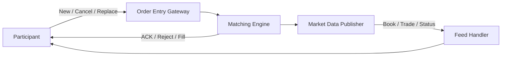

# 개요
초저지연 trading system은 시장에서 발생한 event를 빠르게 처리한다. 하지만 빠른 parser와 queue를 만들기 전에 그 event가 시장에서 무엇을 뜻하는지 알아야 한다.
```text
매수 주문 추가
  → Best Bid가 바뀌는가?
  → Spread가 줄어드는가?
  → 즉시 체결되는가?
  → Book에 남는가?
  → 일부만 체결되고 나머지가 남는가?
```
이 질문에 답하려면 bid, ask, spread, tick, lot과 Limit Order Book의 기본 상태 전이를 이해해야 한다. 이 글에서는 price-time priority를 사용하는 단순한 continuous market을 손으로 계산하며 기본 구조를 익힌다. 다만 이것은 **일반 학습 model**이다. 실제 matching priority, 지원 order type, cancel/replace의 우선순위, auction과 fee 정책은 venue와 상품마다 다르다.
> Production code의 최종 기준은 연결하려는 거래소의 최신 rulebook과 protocol specification이다.

# 학습 위치

| 항목 | 내용 |
| --- | --- |
| BFS Level | Level 1-M — Market Microstructure 공통 기반 |
| 엄격한 선수 글 | [[Low Latency Trading] 초저지연 트레이딩 시스템 전체 구조](/posts/low-latency-trading-system-overview/) |
| 보강 글 | [[증권산업] 주식 주문은 실제로 어떻게 처리될까?](/posts/stock-order-processing/) |
| 다음 글 | [[Low Latency Trading] Market Data Sequence와 Gap Recovery](/posts/low-latency-market-data-sequencing/) |
완료 기준은 다음 질문에 답하는 것이다.
> Order event를 순서대로 받았을 때 L1, L2와 L3 book을 손으로 갱신하고, 부분 체결과 queue priority 변화를 설명할 수 있는가?

# 1. Market Microstructure란
Market microstructure는 주문이 어떤 규칙으로 접수되고, 우선순위를 얻고, 체결되며, 시장 정보로 공개되는지를 다룬다. 초저지연 programmer에게 중요한 구성 요소는 다음과 같다.
```text
Participant
  → Order Entry Session
  → Exchange Gateway
  → Matching Engine
  → Market Data Feed
  → Participant의 Feed Handler
```
각 경계의 data는 서로 다르다.

| 경계 | 대표 정보 |
| --- | --- |
| Order Entry | 신규, 취소, 정정 요청과 ACK·Reject·Fill |
| Matching Engine | Order priority, match와 trade 생성 |
| Market Data | Book 변경, trade, auction imbalance와 trading status |
Market data는 시장 상태를 관찰하는 경로이고 order entry는 자신의 주문 의도를 전달하는 경로다. 둘을 같은 protocol이나 같은 sequence 공간이라고 가정하면 안 된다. 예를 들어 Nasdaq TotalView-ITCH는 outbound market data feed이며 주문 입력 protocol이 아니다.

# 2. Bid와 Ask
`bid`는 사고 싶은 주문의 가격이고 `ask` 또는 `offer`는 팔고 싶은 주문의 가격이다.
```text
Buy side                           Sell side

Bid 99.90 x 100                    Ask 100.10 x 80
Bid 99.80 x 200                    Ask 100.20 x 150
```
가장 높은 bid를 `Best Bid`, 가장 낮은 ask를 `Best Ask`라고 한다.
```text
Best Bid = 99.90
Best Ask = 100.10
```
일반적인 continuous order book은 buy 쪽을 높은 가격부터, sell 쪽을 낮은 가격부터 정렬한다.
```text
Ask
100.30 x 120
100.20 x 150
100.10 x  80  ← Best Ask
-----------------------------
 99.90 x 100  ← Best Bid
 99.80 x 200
 99.70 x  50
Bid
```

# 3. Spread
Spread는 Best Ask와 Best Bid의 차이다.
```text
Spread = Best Ask - Best Bid
       = 100.10 - 99.90
       = 0.20
```
Mid-price는 두 가격의 중간값으로 계산할 수 있다.
```text
Mid = (Best Bid + Best Ask) / 2
    = (99.90 + 100.10) / 2
    = 100.00
```
Mid-price는 실제 체결 가능한 가격을 보장하지 않는다. 큰 주문은 여러 level을 소비하므로 마지막 체결가격과 수량 가중 평균가격이 mid에서 멀어질 수 있다. Auction과 locked/crossed market에서는 통상적인 양의 spread 해석이 달라지며, 한쪽 quote가 없으면 spread와 mid-price 자체를 계산할 수 없다.

# 4. Tick Size와 Lot Size

## 4.1 Tick Size
Tick size는 주문 가격이 움직일 수 있는 최소 가격 단위다. Tick이 `0.05`라면 다음 가격은 유효할 수 있다.
```text
99.90
99.95
100.00
100.05
```
반면 `100.03`은 해당 규칙에서 유효하지 않다. Tick size는 상품, 가격 구간, 시장 제도와 날짜에 따라 달라질 수 있다. 가격을 binary floating-point로 계산한 뒤 단순 비교하면 반올림 문제가 생길 수 있다. Hot path에서는 protocol이 정의한 정수 가격이나 tick 단위 정수를 유지하는 방식이 흔하다.
```text
Protocol price = 1,000,500
Precision      = 4
Display price  = 100.0500
```
정확한 precision과 유효 가격 검사는 venue specification이 최종 기준이다.

## 4.2 Lot Size
Lot size는 주문이나 표시 수량을 해석하는 거래 단위와 관련된다. 다음 용어를 볼 수 있다.
```text
Round lot
Odd lot
Mixed lot
Minimum order quantity
Contract multiplier
```
주식 수량 `100`과 선물 계약 수 `100`은 경제적 의미가 다르다. Market data에 표시되는 수량 단위와 order entry에 입력하는 수량 단위도 specification으로 확인해야 한다.

# 5. Market Order와 Limit Order

## 5.1 Market Order
Market order는 일반적으로 현재 이용 가능한 반대편 유동성과 즉시 체결하려는 주문이다.
```text
현재 Ask

100.10 x 40
100.20 x 60
100.40 x 80
```
수량 70의 market buy가 들어오면 단순 model에서는 다음처럼 체결된다.
```text
100.10에서 40 체결
100.20에서 30 체결

총 체결수량 = 70
평균 체결가격 = (100.10 × 40 + 100.20 × 30) / 70
             ≈ 100.142857
```
Market order는 실행 가능성을 높이지만 특정 가격을 보장하지 않는다. 유동성이 부족하거나 보호 장치가 동작하면 일부만 체결되거나 거절·취소될 수도 있다. 정확한 동작은 venue rule을 확인해야 한다.

## 5.2 Limit Order
Limit buy는 지정 가격 이하에서, limit sell은 지정 가격 이상에서만 체결되도록 가격 경계를 둔다.
```text
Limit Buy 100.20 x 70
```
앞의 ask에서 이 주문은 다음처럼 처리될 수 있다.
```text
100.10 x 40과 체결
100.20 x 30과 체결
총 70 체결
```
반대로 `Limit Buy 100.15 x 70`이라면 다음과 같다.
```text
100.10 x 40과 체결
100.20은 limit보다 비싸므로 중단
40 체결, 30 잔여
```
남은 30이 book에 `Bid 100.15`로 게시되는지, 즉시 취소되는지는 Time-in-Force와 order type에 달렸다. Limit price는 체결 가격의 경계이지 체결 자체의 보장이 아니다.

# 6. Marketable Limit Order
반대편 Best Price와 같거나 더 공격적인 limit order를 marketable limit order라고 부를 수 있다.
```text
Best Ask = 100.10

Buy Limit 100.00  → 즉시 체결 불가, 보통 Bid에 대기
Buy Limit 100.10  → 100.10의 Ask와 체결 가능
Buy Limit 100.30  → 100.30 이하 Ask를 여러 level 소비 가능
```
Market order와 달리 최악의 체결 가격을 limit으로 제한할 수 있다. 하지만 venue의 price collar, self-trade prevention, routing과 protection rule이 추가로 개입할 수 있다.

# 7. Price-Time Priority
이 글의 손계산에서는 다음 단순 matching rule을 사용한다.
```text
1. 더 좋은 가격이 먼저다.
2. 같은 가격이면 먼저 도착한 order가 먼저다.
```
Sell book에 다음 order가 있다고 하자.

| 도착 순서 | Order | Price | Remaining Qty |
| ---: | --- | ---: | ---: |
| 1 | S1 | 100.10 | 50 |
| 2 | S2 | 100.10 | 30 |
| 3 | S3 | 100.20 | 40 |
수량 60의 marketable buy가 들어오면 다음 순서로 체결된다.
```text
S1: 50 전량 체결
S2: 10 부분 체결
S2: 20 잔여
S3: 40 잔여
```
체결 후 sell book은 다음과 같다.

| Queue 순서 | Order | Price | Remaining Qty |
| ---: | --- | ---: | ---: |
| 1 | S2 | 100.10 | 20 |
| 2 | S3 | 100.20 | 40 |
수량 보존을 확인하면 다음과 같다.
```text
초기 sell quantity = 50 + 30 + 40 = 120
체결 quantity      = 60
잔여 quantity      = 20 + 40 = 60

120 - 60 = 60
```
이 계산은 단순 price-time model에서의 예시다. 실제 venue는 price/display/time, pro-rata, size priority, participant allocation 또는 상품별 별도 규칙을 사용할 수 있다.

# 8. Partial Fill
Order의 전체 수량보다 반대편 유동성이 적으면 부분 체결이 발생한다.
```text
Original Qty   = 100
Executed Qty   = 35
Remaining Qty  = 65
```
항상 유지해야 하는 기본 관계는 다음과 같다.
```text
Original Qty = Cumulative Executed Qty + Remaining Qty + Canceled Qty
```
수수료, 정정과 bust/correction까지 다루는 실제 system에서는 상태 모델이 더 복잡해진다. Cancel request를 보냈다고 remaining quantity가 즉시 0이 되는 것도 아니다. 거래소가 cancel을 처리하기 전에 추가 fill이 발생할 수 있다.
```text
Participant                 Exchange

Cancel Request  ---------->
                     Match 발생
Fill            <----------
Cancel ACK      <----------
```
OMS와 gateway는 fill과 cancel의 경쟁을 protocol 규칙에 맞게 처리해야 한다.

# 9. Cancel과 Replace
Cancel은 아직 살아 있는 quantity를 제거하려는 요청이다.
```text
Order S2: remaining 20
Full cancel accepted
Order S2: terminal, remaining 0
```
Replace 또는 modify는 기존 order의 price, quantity나 attribute를 변경하려는 요청이다. 여기서 중요한 질문은 priority다.
```text
가격을 변경하면 기존 queue position을 유지하는가?
수량을 줄이면 유지하는가?
수량을 늘리면 새 timestamp를 받는가?
Replace는 기존 ID를 유지하는가, 새 ID를 부여하는가?
```
많은 시장에서 공격적인 변경이나 수량 증가는 priority를 잃을 수 있지만 이를 보편 규칙으로 코딩하면 안 된다. Cancel/replace의 원자성, ID 관계와 priority 변화는 실제 venue의 order-entry specification이 최종 기준이다.

# 10. Queue Position
같은 가격에 여러 order가 있으면 자신의 앞에 있는 quantity가 체결 가능성과 대기 시간을 좌우한다.
```text
Bid 100.00 queue

B1 100 shares  ← 먼저 도착
B2  50 shares
ME  20 shares  ← 내 주문
```
단순 price-time model에서 내 주문 앞의 visible quantity는 `150`이다. B1이 30을 cancel하면 추정 ahead quantity는 `120`이 된다. 이후 sell order가 100.00에서 100을 체결하면 추정 ahead quantity는 `20`이 된다. 그러나 market data만으로 실제 queue position을 완벽히 아는 것은 어려울 수 있다.
- Non-displayed order가 있을 수 있다.
- Reserve size의 숨은 부분이 있을 수 있다.
- 같은 event의 실제 matching priority가 feed 표현과 다를 수 있다.
- Packet loss와 recovery 동안 local state가 stale할 수 있다.
- 자신의 order ACK와 public feed event의 timestamp 기준이 다를 수 있다.
따라서 queue position은 venue와 feed가 제공하는 정보 범위 안에서 계산한 model임을 명시해야 한다.

# 11. L1, L2와 L3 Market Data
용어의 정확한 의미는 vendor와 venue마다 다를 수 있지만 일반적으로 다음처럼 구분한다.

| Level | 일반적인 의미 | 예시 |
| --- | --- | --- |
| L1 | Top of Book | Best Bid와 Best Ask |
| L2 | Price-level depth | 가격별 aggregate quantity |
| L3 | Order-level event | 개별 order add, execute, cancel, replace |

## 11.1 L1
```text
Best Bid 100.00 x 120
Best Ask 100.05 x 80
```
Best price 밖의 depth와 같은 가격 내부 queue는 알 수 없다.

## 11.2 L2
```text
Ask 100.10 x 200
Ask 100.05 x  80
Bid 100.00 x 120
Bid  99.95 x 300
```
가격별 총량은 알 수 있지만 동일 가격을 구성하는 개별 order의 정확한 순서를 모를 수 있다.

## 11.3 L3
```text
Add     Order 501, Sell, 100.05, 50
Add     Order 502, Sell, 100.05, 30
Execute Order 501, Qty 20
Cancel  Order 502, Qty 10
```
Order-level feed를 순서대로 적용하면 공개된 order의 lifecycle을 재구성할 수 있다. 그러나 L3라고 해도 hidden liquidity를 포함한 matching engine 내부 전체 상태를 모두 공개한다는 뜻은 아니다. Nasdaq TotalView-ITCH도 specification이 정의한 order-level data와 trade·administrative message 범위 안에서 해석해야 한다.

# 12. Book을 손으로 갱신하기
초기 book이 다음과 같다고 하자.
```text
Ask 100.20 x 40  [S3]
Ask 100.10 x 80  [S1=50, S2=30]
-------------------------------
Bid 100.00 x 70  [B1=70]
Bid  99.90 x 90  [B2=90]
```
다음 event를 순서대로 적용한다.
```text
E1. Add B3: Buy 100.05 x 20
E2. Execute S1: 35
E3. Cancel S2: 10
E4. Add B4: Buy Limit 100.10 x 50
```

## 12.1 E1 적용
B3는 Best Ask보다 낮으므로 즉시 체결되지 않고 새 Best Bid가 된다.
```text
Best Bid = 100.05 x 20
Best Ask = 100.10 x 80
Spread   = 0.05
```

## 12.2 E2 적용
S1의 remaining은 `50 - 35 = 15`다. 100.10 level의 총량은 `15 + 30 = 45`가 된다.

## 12.3 E3 적용
S2의 remaining은 `30 - 10 = 20`이다. 100.10 level의 총량은 `15 + 20 = 35`가 된다.

## 12.4 E4 적용
B4는 100.10의 ask와 가격이 맞으므로 time priority에 따라 S1부터 체결한다.
```text
B4 50
  → S1 15 전량 체결
  → S2 20 전량 체결
  → B4 remaining 15
```
단순 DAY limit이라고 가정하면 남은 15는 100.10 bid로 게시된다. 최종 book은 다음과 같다.
```text
Ask 100.20 x 40  [S3]
-------------------------------
Bid 100.10 x 15  [B4]
Bid 100.05 x 20  [B3]
Bid 100.00 x 70  [B1]
Bid  99.90 x 90  [B2]
```
E4의 Time-in-Force가 IOC였다면 남은 15는 book에 게시되지 않고 취소되는 식으로 결과가 달라질 수 있다.

# 13. Auction과 Continuous Trading
Continuous trading에서는 incoming order가 resting order와 연속적으로 match될 수 있다. Auction은 일정 구간에 order와 imbalance를 모아 하나의 clearing price를 결정하는 방식이다.
```text
Opening Auction
Closing Auction
Reopening Auction after Halt
Volatility Auction
```
Auction price는 단순히 현재 Best Bid와 Best Ask의 중간값으로 정해지지 않는다. 체결수량 최대화, imbalance 최소화, 기준가격과의 거리 같은 tie-break rule이 사용될 수 있으며 정확한 순서는 venue별로 다르다. Feed handler는 다음 상태를 구분해야 한다.
```text
Pre-open
Auction or Call phase
Continuous trading
Halted or Paused
Quotation only
Resumed
Closed
```
Trading status message를 놓친 상태에서 continuous book update만 적용하면 전략이 거래 불가능한 종목에 주문을 낼 수 있다.

# 14. Trading Halt
Halt는 특정 종목이나 시장의 거래가 중단된 상태다. Halt 중 허용되는 order 입력, cancel, quote, auction 참여와 market data 동작은 시장마다 다르다. 따라서 다음처럼 단순화하면 위험하다.
```text
halt == 모든 message가 멈춤
resume == 기존 book을 그대로 다시 사용
```
실제 system은 halt reason, book 유지·삭제 여부, reopening auction과 resume event를 specification에 따라 처리해야 한다.

# 15. Maker와 Taker
일반적인 설명에서 다음 용어를 사용한다.
```text
Maker
  → Book에 resting liquidity를 제공한 order

Taker
  → 기존 resting liquidity와 즉시 체결한 incoming order
```
하지만 maker/taker fee 또는 rebate 구조는 모든 시장에 동일하지 않다.
- 상품과 participant tier에 따라 비용이 다를 수 있다.
- Auction과 midpoint execution은 별도 fee를 가질 수 있다.
- Post-only order의 reject 또는 repricing 규칙이 다를 수 있다.
- Resting order라고 항상 경제적으로 유리한 것은 아니다.
따라서 maker와 taker를 matching 의미와 fee 의미로 나누고 최신 venue fee schedule을 확인해야 한다.

# 16. Feed와 Order Entry를 분리한다
두 경로는 방향과 목적이 다르다.

자신의 order ACK가 왔다고 public market data에서 해당 order event를 이미 적용했다고 가정할 수 없다. 반대로 public feed에서 예상한 order를 보았다고 자신의 order entry request가 accept되었다고 판단해서도 안 된다. 각 session은 독립적인 identifier, sequence, timestamp와 recovery rule을 가질 수 있다.

# 17. Matching Rule은 Venue별로 다르다
Price-time은 중요한 기본 model이지만 유일한 matching rule은 아니다.
```text
Price / Time
Price / Display / Time
Pro-Rata
Size Priority
Participant Priority
Auction-specific Allocation
```
같은 venue 안에서도 continuous book과 auction, displayed와 non-displayed order, 주식과 파생상품의 rule이 다를 수 있다. 구현 시 최소한 다음 문서를 함께 고정해야 한다.
```text
Venue와 market identifier
상품과 symbol universe
Rulebook revision
Market-data specification revision
Order-entry specification revision
Trading calendar와 session schedule
Fee schedule revision
```
Specification이 바뀌면 parser만이 아니라 state transition과 test fixture도 바뀔 수 있다.

# 18. Limit Order Book Invariant
단순 L3 book builder에서 검사할 수 있는 invariant는 다음과 같다.
```text
1. 모든 live order의 remaining quantity는 양수다.
2. Execution과 cancel quantity는 처리 전 remaining을 넘지 않는다.
3. 같은 side의 price level은 정의한 가격 순서로 정렬된다.
4. 한 order는 하나의 side, price level과 queue에만 존재한다.
5. Visible L2 quantity는 그 level의 visible L3 remaining 합과 같다.
6. Terminal order는 protocol이 허용한 correction 외에는 다시 변경되지 않는다.
7. Event는 feed가 정의한 sequence 순서로 정확히 한 번 적용된다.
8. Trading status가 invalid 또는 stale이면 strategy에 tradable book으로 공개하지 않는다.
```
다섯 번째 invariant는 feed가 L2와 L3에 같은 visible universe를 제공할 때만 사용할 수 있다. Hidden, reserve와 별도 book이 존재하면 비교 범위를 specification에 맞춰야 한다. Best Bid가 Best Ask보다 항상 낮다는 조건도 모든 순간과 시장에 보편적인 invariant는 아니다. Auction, crossed input, 여러 venue를 합친 view와 recovery 중간 상태를 구분해야 한다.

# 19. 최소 구현 실습
첫 order book은 최적화보다 정확성을 우선한다.
```text
1. 정수 tick으로 Price type을 만든다.
2. Order ID에서 order state를 찾는 map을 만든다.
3. Bid와 Ask price level을 별도로 관리한다.
4. 같은 price에서는 arrival order를 보존한다.
5. Add, Execute, Cancel, Replace를 한 개씩 구현한다.
6. 각 event 뒤 invariant를 검사한다.
7. Raw event log를 replay해 같은 final state가 나오는지 확인한다.
8. 이후 allocation과 cache layout을 측정하며 최적화한다.
```
초기 구현과 최적화 구현에 같은 replay fixture를 적용하면 semantics가 바뀌지 않았는지 비교할 수 있다.

# 20. 완료 기준
다음 질문에 자료를 보지 않고 답할 수 있어야 한다. 1. Best Bid, Best Ask, spread와 mid-price를 계산할 수 있는가? 2. Tick size와 lot size가 parser와 risk check에 왜 필요한가? 3. Market order와 marketable limit order의 차이는 무엇인가? 4. Price-time queue에서 partial fill 후 remaining order를 계산할 수 있는가? 5. Cancel request와 fill이 경쟁할 수 있는 이유는 무엇인가? 6. Replace가 queue priority에 미치는 영향을 왜 venue 문서에서 확인해야 하는가? 7. L1, L2와 L3가 각각 어떤 정보를 잃는가?
8. Visible queue position이 matching engine의 실제 priority와 다를 수 있는 이유는 무엇인가? 9. Auction과 continuous matching을 같은 rule로 처리하면 왜 안 되는가? 10. Market data feed와 order-entry session을 왜 별도 state machine으로 관리해야 하는가?

# 정리
Limit Order Book은 가격별 숫자 표가 아니라 order event를 순서대로 적용한 상태다.
```text
Bid / Ask
  → Best Price와 Spread
  → Tick과 Lot 제약
  → Market / Limit Order
  → Price와 Queue Priority
  → Partial Fill
  → Cancel / Replace
  → Auction / Halt State
```
Price-time priority는 학습을 위한 좋은 출발점이지만 실제 matching engine의 보편 법칙은 아니다. Venue별 rulebook과 protocol specification을 기준으로 state transition, invariant와 test를 다시 정의해야 한다. 다음 글에서는 이 book event가 UDP multicast로 전달될 때 duplicate, gap과 out-of-order를 어떻게 감지하고 복구하는지 살펴본다.

# 참고 자료
- [Nasdaq TotalView-ITCH 5.0 Specification](https://www.nasdaqtrader.com/content/technicalsupport/specifications/dataproducts/NQTVITCHSpecification.pdf)
- [Nasdaq Equity 4 — Equity Trading Rules](https://listingcenter.nasdaq.com/rulebook/nasdaq/rules/Nasdaq%20Equity%204)
- [FIX Trading Community Standards](https://www.fixtrading.org/standards/)
- [SEC Trading Basics](https://www.sec.gov/file/trading101basicspdf)
