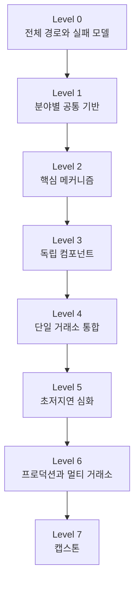

# 개요

초저지연 트레이딩 시스템 프로그래밍은 한 과목이 아니다.

시장 구조, C++, CPU와 memory, Linux, network, concurrency, protocol, risk와 운영이 한 packet-to-fill 경로에서 만난다.

흥미로운 주제 하나를 깊게 읽는 DFS 방식으로 시작하면 다음과 같은 빈틈이 생기기 쉽다.

- Atomic memory order는 알지만 market-data sequence gap을 처리하지 못한다.
- DPDK 예제는 실행하지만 어떤 state가 stale인지 판단하지 못한다.
- 평균 benchmark는 빠르지만 p99.9와 packet drop을 기록하지 않는다.
- Order를 빨리 전송하지만 cancel과 fill의 경쟁 상태를 잘못 처리한다.

이 로드맵은 먼저 전체 지도를 보고, 같은 깊이의 여러 분야를 한 번씩 넓게 순회한 뒤 더 깊은 구현으로 내려가는 BFS 방식으로 구성한다.



> 같은 Level의 필수 노드를 모두 완료한 뒤 다음 Level로 이동한다. 같은 Level 안에서도 표시된 선수 글은 먼저 읽는다.

# 1. 이 로드맵의 상태 표시

| 표시 | 의미 |
| --- | --- |
| `기존` | 현재 블로그에 있고 이 순서에서 그대로 활용할 글 |
| `기존·초안` | 내용은 활용할 수 있지만 `published: false`인 글 |
| `기존·부분` | 일부 개념은 유용하지만 해당 노드를 완전히 충족하지는 않는 글 |
| `신규` | 이번 초저지연 시리즈에서 새로 작성한 글 |
| `후속` | 다음 작성 묶음에서 만들 글 |
| `선택` | 목표 직무나 장비에 따라 나중에 선택할 글 |

하나의 글에 여러 상태가 해당하면 `기존·초안·부분`처럼 표시를 결합한다.

원래 블로그의 강한 영역은 CPU cache, virtual memory, NUMA와 C atomic이었다.

1차 작성 묶음에서는 다음 입구를 새로 채웠다.

- 초저지연 trading system의 전체 packet-to-fill 지도
- Market microstructure와 order book
- Modern C++ hot-path 설계
- Linux CPU 격리와 scheduler jitter
- Ethernet, UDP/TCP, multicast와 NIC receive path
- Latency clock, histogram과 tail 측정
- Market-data sequence와 gap recovery

2차 작성 묶음에서는 설명을 독립 component와 검증 가능한 실습으로 내렸다.

- CPU pipeline, out-of-order execution, branch prediction과 ABI
- CPU interconnect, uncore, memory controller와 PCIe topology
- Cache-friendly layout과 memory pool
- Bounded SPSC ring과 thread-per-core architecture
- Allocation-free parser와 feed handler
- L2/L3 order-book reconstruction engine
- Order gateway와 FIX/binary session recovery
- Fixed-point numerics와 constant-bounded pre-trade risk
- `perf`, PMU와 compiler output 분석
- Binary event log, deterministic replay와 fault injection

Kernel bypass, hardware timestamp, exchange emulator와 end-to-end 통합은 Level 4 이후 후속 묶음으로 둔다.

# 2. BFS를 적용하는 규칙

## 2.1 빠른 기술보다 정확한 기반을 먼저 둔다

학습 우선순위는 다음과 같다.

```text
시장 의미와 correctness
  → 측정 가능한 baseline
  → 실행 경로와 병목
  → 구조 변경과 최적화
  → 장애·복구와 운영
```

Lock-free, kernel bypass와 FPGA는 강력한 도구지만 root node가 아니다.

## 2.2 모든 실습은 재현 조건을 남긴다

최소한 다음 정보를 함께 기록한다.

- CPU model, core와 NUMA topology
- kernel, compiler와 build option
- CPU affinity, IRQ와 power 설정
- 입력 message 크기, rate와 burst 모양
- warm-up과 측정 시간
- p50, p99, p99.9, max, throughput와 drop 수
- 변경 전후의 correctness test 결과

## 2.3 실제 주문 대신 emulator를 사용한다

학습용 client는 실제 시장에 주문하지 않는다.

Recorded feed, synthetic generator와 exchange emulator를 사용해 다음 상황을 의도적으로 만든다.

- partial fill
- cancel과 fill race
- packet gap, duplicate와 reorder
- disconnect와 reconnect
- queue saturation
- process restart
- clock offset 또는 timestamp 이상

## 2.4 Level 종료 조건을 통과한다

글을 읽은 것만으로 완료하지 않는다.

각 Level에서 설명, 작은 구현, test 또는 측정 보고서 중 하나 이상의 산출물을 만든다.

# 3. Level 0 — 전체 시스템 지도

목표는 최적화할 대상을 고르는 것이 아니라 전체 경로와 실패 전파를 설명하는 것이다.

## 0.1 Packet-to-fill 경로

- `신규` [[Low Latency Trading] 초저지연 트레이딩 시스템 전체 구조](/posts/low-latency-trading-system-overview/)

다음 경로를 먼저 익힌다.

```text
NIC RX
  → Feed Handler
  → Order Book
  → Strategy
  → Pre-Trade Risk
  → Order Gateway
  → Matching Engine
  → ACK / Fill
  → OMS / Position / Audit
```

## 0.2 주문의 업무 생명주기

- `기존·부분` [[증권산업] 주식 주문은 실제로 어떻게 처리될까?](/posts/stock-order-processing/)

이 글은 고객 주문, 증권사, 거래 장소, 체결, 청산과 결제의 큰 흐름에 사용한다.

초저지연 학습에서는 여기에 market-data path, venue session sequence, queue position과 recovery를 추가해야 한다.

## 0.3 요구사항과 실패 모델

전체 구조 글을 읽으며 다음 표를 직접 작성한다.

| 축 | 정의할 내용 |
| --- | --- |
| latency | 어느 timestamp 사이를 측정하는가? |
| throughput | steady rate와 burst rate는 얼마인가? |
| correctness | 절대 깨지면 안 되는 state invariant는 무엇인가? |
| loss | 어느 event를 버릴 수 있고 어느 event는 복구해야 하는가? |
| availability | disconnect와 restart에서 무엇을 보존하는가? |
| risk | stale state, limit breach와 kill switch에서 무엇을 막는가? |

### Level 0 완료 기준

1. 시세 packet 한 개와 주문 한 개의 전체 경로를 그릴 수 있다.
2. Data plane과 control plane의 책임을 구분할 수 있다.
3. Latency 목표와 correctness invariant가 충돌할 때의 정책을 설명할 수 있다.
4. 최소 5개의 failure scenario와 탐지·복구 방법을 적을 수 있다.

# 4. Level 1 — 분야별 공통 기반

Level 1에서는 한 분야만 깊게 파지 않는다. 시장, 언어, hardware, OS, network, concurrency, 측정과 risk를 한 바퀴 돈다.

## 1.M Market microstructure

- `신규` [[Low Latency Trading] Market Microstructure와 Limit Order Book](/posts/low-latency-market-microstructure/)

핵심 질문:

- Bid, ask, spread, tick과 lot은 무엇인가?
- Market, limit, cancel과 replace는 book을 어떻게 바꾸는가?
- Price-time priority와 queue position은 어떻게 다른가?
- L1, L2와 L3 data로 무엇을 알 수 있는가?
- Auction, halt와 matching rule을 왜 venue specification에서 확인해야 하는가?

## 1.C Modern C++

- `신규` [[Low Latency Trading] Hot Path를 위한 Modern C++ 설계 원칙](/posts/low-latency-cpp-hot-path/)

핵심 질문:

- Price와 quantity를 floating point 대신 어떤 type으로 표현할 것인가?
- Object lifetime과 ownership이 성능 버그와 correctness 버그로 어떻게 이어지는가?
- Heap allocation을 cold path로 옮기려면 무엇을 미리 준비해야 하는가?
- STL, exception과 virtual dispatch를 이름만 보고 금지하면 안 되는 이유는 무엇인가?
- Undefined behavior를 성능 기법으로 사용할 수 없는 이유는 무엇인가?

## 1.H CPU와 memory

다음 글은 기존 글이지만 2026년 8월 7일 현재 초안 상태다.

1. `기존·초안` [[CPU] Memory Access와 Cache Hierarchy](/posts/cpu-memory-cache-hierarchy/)
2. `기존·초안` [[Memory] Virtual Memory와 TLB](/posts/virtual-memory-tlb/)
3. `기존·초안` [[Computer Architecture] Endianness와 Alignment](/posts/endianness-alignment/)
4. `기존·초안` [[Memory] NUMA 구조와 Local·Remote Memory](/posts/numa-memory-architecture/)

이 단계에서는 세부 instruction보다 다음 연결을 이해한다.

```text
data layout
  → cache line
  → virtual-to-physical translation
  → physical page placement
  → CPU / memory / NIC NUMA locality
```

## 1.O Linux 실행 환경

- `신규` [[Low Latency Trading] Linux 실행 환경과 CPU 격리](/posts/low-latency-linux-execution/)

핵심 질문:

- CPU affinity와 CPU isolation은 무엇이 다른가?
- Scheduler tick, IRQ, softirq, RCU callback과 kthread가 어떻게 jitter를 만드는가?
- Page fault를 hot path 전에 처리한다는 것은 무엇인가?
- `mlockall`, `nohz_full`, `SCHED_FIFO`, SMT와 power-state 변경에 어떤 비용과 위험이 있는가?

## 1.N Network path

- `신규` [[Low Latency Trading] Market Data가 NIC에서 Application까지 오는 길](/posts/low-latency-network-path/)

Level 1에서는 NIC부터 socket까지의 전체 경로와 측정 지점만 잡는다. MMIO, DMA와 interrupt의 세부 동작은 Level 2.D에서 내려간다.

핵심 질문:

- Ethernet frame, IP packet, UDP datagram과 TCP byte stream은 어떻게 다른가?
- Market data에 multicast가 사용되는 이유와 손실 복구는 무엇인가?
- NIC descriptor, DMA, MSI-X, NAPI와 socket receive queue는 어떻게 이어지는가?
- RSS, RPS와 RFS가 packet의 CPU locality에 어떤 영향을 주는가?

## 1.X Concurrency

1. `기존` [[C언어] Atomic Operation 1. 왜 Atomic이 필요한가](/posts/c-atomic-operation-1/)
2. `기존` [[C언어] Atomic Operation 2. stdatomic.h 기본 사용법](/posts/c-atomic-operation-2/)

이 단계의 목표는 모든 memory order를 외우는 것이 아니다.

- data race와 lost update
- atomic operation과 critical section의 범위
- single-writer로 공유 변경을 피하는 방법
- mutex, atomic과 message passing의 역할

을 구분한다.

## 1.T 시간과 측정

- `신규` [[Low Latency Trading] Latency를 올바르게 측정하는 방법](/posts/low-latency-measurement/)

핵심 질문:

- `CLOCK_REALTIME`, monotonic clock, TSC와 NIC PHC는 어떤 용도인가?
- Clock resolution, precision, accuracy와 timestamp overhead는 무엇이 다른가?
- p99.9와 max가 평균과 다른 정보를 주는 이유는 무엇인가?
- Coordinated omission이 느린 구간을 숨기는 이유는 무엇인가?

## 1.R 주문 상태와 risk

- `기존·초안·부분` [[프로젝트] 멀티자산 OMS 시뮬레이션 플랫폼을 만들며 배운 것](/posts/multi-asset-oms-lessons/)

OMS 글에서는 주문 상태, 멱등성과 cancel-fill race의 문제의식만 가져온다.

Fixed-point 수치와 constant-bounded pre-trade risk는 [Level 2.R 글](/posts/low-latency-trading-numerics-risk/)에서 다룬다.
거절 intent의 decision log, fill 단위 exposure, cancel-fill race와 duplicate-safe recovery는 [Order Gateway 글](/posts/low-latency-order-gateway-session/)과 [Replay 글](/posts/low-latency-event-log-replay/)로 이어진다.

Trade-date position과 settled position, 상품별 fee/PnL 회계와 외부 drop-copy reconciliation은 Level 4 이후에 별도로 보강한다.

### Level 1 권장 읽기 순서

Level 1은 다음 순서로 한 바퀴 돈다.

```text
1.M Market microstructure
  → 1.C Modern C++
  → 1.H Cache / TLB / data layout / NUMA
  → 1.O Linux execution
  → 1.N Network path
  → 1.X Atomic 기초
  → 1.T Latency measurement
  → 1.R OMS와 risk 문제 정의
```

### Level 1 완료 기준

1. 간단한 order book을 손으로 체결할 수 있다.
2. Fixed-point `Price`와 `Quantity` type을 만들 수 있다.
3. Cache miss, TLB miss, page fault와 NUMA remote access를 구분할 수 있다.
4. Thread와 IRQ의 CPU affinity를 조사할 수 있다.
5. UDP sequence gap을 탐지하는 작은 receiver를 만들 수 있다.
6. Race, atomic과 mutex의 차이를 재현할 수 있다.
7. 같은 workload의 p50, p99, p99.9, max와 drop 수를 함께 기록할 수 있다.
8. Cancel 요청과 완료, late fill과 duplicate event가 주문·risk state에 미치는 영향을 설명할 수 있다.

# 5. Level 2 — 핵심 메커니즘

Level 2부터 각 분야를 한 단계 더 깊게 연결한다.

## 2.M Market-data state

- `신규` [[Low Latency Trading] Market Data Sequence와 Gap Recovery](/posts/low-latency-market-data-sequencing/)
- `신규` [[Low Latency Trading] L2·L3 Order Book Reconstruction Engine](/posts/low-latency-order-book-engine/) — Level 2→3 연결 글

Level 2에서는 sequence, duplicate, gap, snapshot과 recovery invariant까지만 읽는다.
Order book component와 property test는 3.2에서 구현한다.

완료 산출물:

- duplicate, gap과 out-of-order를 구분하는 state machine
- gap 상태에서 book 사용을 막는 policy
- retransmission 또는 snapshot 적용 뒤 정상 상태로 돌아오는 test

## 2.P Binary protocol

1. `기존·초안` [[Computer Architecture] Endianness와 Alignment](/posts/endianness-alignment/)
2. `신규` [[Low Latency Trading] Allocation-Free Binary Parser와 Feed Handler](/posts/low-latency-feed-handler/) — Level 2→3 연결 글
3. `신규` [[Low Latency Trading] Order Gateway와 FIX·Binary Session Recovery](/posts/low-latency-order-gateway-session/) — Level 2→3 연결 글

Level 2에서는 두 연결 글의 byte order, alignment, bounds-checked codec, FIX·binary 비교와 packet/session sequence 분리 원칙까지만 읽는다.
Feed handler와 gateway component는 각각 3.1과 3.5에서 구현한다.

완료 산출물:

- byte order와 unaligned field를 명시적으로 읽는 decoder
- truncated, oversized와 unknown message test
- packet sequence와 order-session sequence를 분리한 model

## 2.H CPU와 memory 심화

권장 순서는 다음과 같다.

1. `기존·초안` [[CPU] Memory Access와 Cache Hierarchy](/posts/cpu-memory-cache-hierarchy/)
2. `기존·초안` [[Memory] Virtual Memory와 TLB](/posts/virtual-memory-tlb/)
3. `기존·초안` [[Computer Architecture] Endianness와 Alignment](/posts/endianness-alignment/)
4. `기존·초안` [[Memory] NUMA 구조와 Local·Remote Memory](/posts/numa-memory-architecture/)
5. `신규` [[Low Latency Trading] CPU Pipeline·Out-of-Order·Branch Prediction과 ABI](/posts/low-latency-cpu-pipeline-branch-abi/)
6. `신규` [[Low Latency Trading] CPU Interconnect와 Uncore — Core·Memory·PCIe 연결 경로](/posts/low-latency-cpu-interconnect-uncore/)
7. `신규` [[Low Latency Trading] Cache-Friendly Data Layout과 Memory Pool](/posts/low-latency-cache-layout-memory-pool/)

완료 산출물:

- Local/remote load, cache-line ownership, NIC DMA와 MMIO doorbell의 transaction path
- CPU, memory controller, PCIe root complex와 NIC를 연결한 topology map
- contiguous array와 pointer chasing 비교 benchmark
- first-touch와 CPU/memory affinity 조합 비교
- branch와 cache event를 포함한 가설·측정 보고서

## 2.X C memory model과 synchronization

기존 글의 안전한 순서는 다음과 같다.

1. [[C언어] Atomic Operation 1. 왜 Atomic이 필요한가](/posts/c-atomic-operation-1/)
2. [[C언어] Atomic Operation 2. stdatomic.h 기본 사용법](/posts/c-atomic-operation-2/)
3. [[C언어] Atomic Operation 3. Atomic은 실제로 어떻게 동작하는가](/posts/c-atomic-operation-3/)
4. [[CPU] Store Buffer는 어떻게 동작하는가](/posts/cpu-store-buffer/)
5. [[C언어] Atomic Operation 4. Memory Order 이해하기](/posts/c-atomic-operation-4/)
6. [[C언어] Atomic Operation 5. Atomic과 Mutex 비교하기](/posts/c-atomic-operation-5/)
7. `신규` [[Low Latency Trading] SPSC Ring Buffer와 Thread-per-Core 설계](/posts/low-latency-spsc-thread-per-core/)

Atomic 3의 AArch64 `LDAPR` 예시는 RCpc와 target feature 조건을 확인한다. 일반적인 acquire load를 설명할 때는 `LDAR`를 기준점으로 두는 편이 안전하다.

완료 산출물:

- acquire-release SPSC queue
- padding 전후 false-sharing benchmark
- queue full과 shutdown policy test

## 2.D Device I/O와 NIC의 기반

Level 1-N에서 그린 receive path를 기준 지도로 삼아 다음 세부 동작을 학습한다.

1. `신규` [[Low Latency Trading] CPU Interconnect와 Uncore — Core·Memory·PCIe 연결 경로](/posts/low-latency-cpu-interconnect-uncore/) — 2.H→2.D 연결 글
2. `기존·초안` [[Device I/O] CPU는 Device와 어떻게 통신하는가](/posts/cpu-device-communication/)
3. `기존·초안` [[Device I/O] Interrupt와 Polling, DMA는 어떻게 연결되는가](/posts/interrupt-polling-dma/)
4. `후속` NIC RX/TX ring, RSS, NAPI와 busy polling 실험

완료 산출물:

- descriptor, DMA buffer, doorbell과 completion 경로 설명
- `/proc/interrupts`, queue와 CPU affinity mapping 표
- interrupt와 polling의 latency·CPU 사용 비교

## 2.T 측정과 profiler

1. `신규` [[Low Latency Trading] Latency를 올바르게 측정하는 방법](/posts/low-latency-measurement/)
2. `신규` [[Low Latency Trading] perf·PMU와 Compiler Output으로 병목 찾기](/posts/low-latency-perf-pmu/)
3. `후속` PTP, PHC, TSC와 hardware timestamp 실습

완료 산출물:

- benchmark protocol 문서
- raw sample 또는 histogram artifact
- wall-clock과 monotonic interval을 섞지 않는 timestamp model

## 2.R Trading numerics와 risk

- `신규` [[Low Latency Trading] Fixed-Point Trading Numerics와 O(1) Pre-Trade Risk](/posts/low-latency-trading-numerics-risk/)

이 글에서 tick, lot, scale, rounding, overflow와 notional을 먼저 읽은 뒤 position, reservation, rate, price collar와 stale-data gate를 구현한다.

완료 산출물:

- type-safe 계산기와 경계값 test
- 모든 risk rule의 fail-open 또는 fail-closed 정책표

### Level 2 완료 기준

1. 정상 packet, duplicate, gap과 recovery를 replay할 수 있다.
2. Malformed binary input이 process memory를 침범하지 않게 검증할 수 있다.
3. CPU, memory, device와 NIC의 locality를 하나의 topology로 설명할 수 있다.
4. SPSC queue의 memory order와 full policy를 설명할 수 있다.
5. Benchmark 결과에서 cache, branch, scheduler와 queueing 가설을 분리할 수 있다.

# 6. Level 3 — 독립 컴포넌트 구현

이 Level의 글은 완료한 2차 작성 묶음의 핵심이다.

| 순서 | 상태 | 글 주제 | 최소 산출물 |
| ---: | --- | --- | --- |
| 3.1 | `신규` | [Allocation-free market-data parser와 feed handler](/posts/low-latency-feed-handler/) | bounds check, sequence, duplicate/gap test |
| 3.2 | `신규` | [L2/L3 order book engine](/posts/low-latency-order-book-engine/) | price-time invariant, snapshot 일치, property test |
| 3.3 | `신규` | [SPSC ring과 thread-per-core architecture](/posts/low-latency-spsc-thread-per-core/) | ownership, padding, backpressure, shutdown |
| 3.4 | `신규` | [Constant-bounded pre-trade risk](/posts/low-latency-trading-numerics-risk/) | price/qty/value/rate/position, kill switch |
| 3.5 | `신규` | [Order gateway와 FIX/binary session](/posts/low-latency-order-gateway-session/) | ACK/fill/reject/cancel, resend, reconnect |
| 3.6 | `신규` | [`perf`, PMU와 compiler output](/posts/low-latency-perf-pmu/) | cycles, instructions, cache/branch/TLB 분석 |
| 3.7 | `신규` | [Binary event log와 deterministic replay](/posts/low-latency-event-log-replay/) | virtual clock, event hash, restart rebuild |
| 3.8 | `후속` | Hot-path observability | counter, timestamp, nonblocking log handoff |

각 component는 아직 서로 network로 연결하지 않아도 된다. 먼저 deterministic input과 expected output을 가진 library로 검증한다.

### Level 3 완료 기준

- Feed handler, order book, gateway와 risk gate가 독립 test를 통과한다.
- 동일 입력 replay의 event와 최종 state가 같다.
- Hot path의 allocation, queue depth와 latency를 측정할 수 있다.
- 정상뿐 아니라 loss, duplicate, malformed input과 late fill을 test한다.

# 7. Level 4 — 단일 거래소 end-to-end 통합

| 순서 | 상태 | 글 주제 | 핵심 검증 |
| ---: | --- | --- | --- |
| 4.1 | `후속` | Feed-to-order paper-trading system | feed → book → dummy strategy → risk → gateway |
| 4.2 | `후속` | Exchange emulator와 matching engine | deterministic price-time match와 execution report |
| 4.3 | `후속` | Snapshot, journal과 restart recovery | 재시작 후 order/position/book 재구축 |
| 4.4 | `후속` | 단계별 tick-to-trade latency budget | component와 end-to-end percentile |
| 4.5 | `후속` | Fault injection과 invariant | loss/reorder/disconnect/cancel-fill/clock jump |
| 4.6 | `후속` | Audit, drop copy와 reconciliation | order, fill, position 불일치 탐지 |

Dummy strategy는 의도적으로 단순하게 유지한다. 이 Level의 목표는 alpha가 아니라 system contract다.

### Level 4 완료 기준

```text
recorded or synthetic feed
  → book
  → dummy decision
  → risk
  → exchange emulator
  → ACK / fill
  → position / audit
```

이 흐름이 정상, 재시작과 failure injection에서 일관되어야 한다.

# 8. Level 5 — 초저지연 심화

Level 4의 baseline과 profiler evidence가 생긴 뒤 적용한다.

| 상태 | 주제 | 먼저 답할 질문 |
| --- | --- | --- |
| `후속` | NIC queue, busy polling과 interrupt moderation | 현재 receive latency의 병목이 wake-up인가? |
| `선택` | AF_XDP, DPDK와 vendor user-space stack | Kernel stack 비용을 분리해 측정했는가? |
| `후속` | NUMA placement, huge page와 memory pool | TLB와 remote access가 실제 병목인가? |
| `선택` | MPSC/MPMC, ABA와 memory reclamation | SPSC 또는 single-writer로 해결할 수 없는가? |
| `후속` | Multi-line A/B feed arbitration과 live failover 실험 | 장애 중 어떤 source를 authoritative하게 선택하는가? |
| `후속` | Tail latency, overload와 batching | Burst에서 queue와 freshness가 어떻게 변하는가? |
| `후속` | Fuzz, property, soak와 conformance test | 빠른 정상 경로 밖의 입력을 검증했는가? |
| `후속` | Self-trade prevention과 mass cancel | Risk failure의 안전한 기본값은 무엇인가? |

### Level 5 완료 기준

- 최적화 전후의 같은 workload와 correctness result가 있다.
- p99.9 이상, max, drop, queue depth와 CPU 사용을 함께 공개한다.
- 정상 부하뿐 아니라 burst와 recovery 중에도 policy가 유지된다.

# 9. Level 6 — 프로덕션과 멀티 거래소

| 상태 | 주제 | 산출물 |
| --- | --- | --- |
| `후속` | Multi-venue normalization과 SOR | 의미 손실을 표시하는 공통 model과 router |
| `후속` | Active/passive HA와 fencing | duplicate order 없는 failover test |
| `후속` | Global risk와 reconciliation | venue 합산 position/PnL/credit |
| `후속` | Colocation topology와 capacity planning | CPU, NUMA, NIC, PCIe와 switch diagram |
| `후속` | Immutable build, config와 deployment | validation, canary/shadow, rollback runbook |
| `후속` | Clock, security와 audit 규정 | timestamp lineage와 threat model |
| `선택` | FPGA와 SmartNIC partition | software reference와 bit-exact 검증 계획 |
| `후속` | Game day | feed 단절, clock unlock, disk full, risk breach 보고서 |

### Level 6 완료 기준

Failover, global risk, deployment와 운영 절차가 주문 중복이나 미확인 position 없이 동작해야 한다.

# 10. Level 7 — 포트폴리오 캡스톤

## 7.1 필수: 저지연 trading client

다음을 하나의 repository에 통합한다.

- 이중 또는 simulated A/B market-data feed
- bounds-checked feed handler
- L2 또는 L3 order book
- dummy strategy
- pre-trade risk와 kill switch
- OMS와 order gateway
- exchange emulator
- binary event log와 deterministic replay
- latency histogram과 health telemetry
- disconnect, restart와 failover test

## 7.2 권장: Matching engine

- deterministic price-time matching
- new, cancel, replace와 partial fill
- session sequence와 duplicate suppression
- market-data incremental publication
- snapshot과 restart recovery
- fairness, throughput와 tail-latency report

## 7.3 선택: Hardware acceleration

FPGA 또는 SmartNIC을 목표로 한다면 parser, risk gate 또는 book update 일부를 후보로 삼는다.

Software reference model과 bit-exact test 없이 hardware 결과만 구현 완료로 보지 않는다.

## 캡스톤 완료 기준

- Warm-up 이후 정의한 hot path의 heap allocation 0회
- 같은 입력 replay에서 같은 최종 state와 event hash
- Packet loss, duplicate, reorder, restart와 late fill 처리
- Kill switch, cancel-on-disconnect와 stale-data 차단
- Order, position과 drop-copy 대사
- p50, p99, p99.9, p99.99, max, throughput, drop와 queue depth 공개
- ASan/UBSan, 적용 가능한 범위의 TSan, fuzz/property/soak test
- Hardware, build, pinning, tuning과 load generation을 포함한 재현 문서
- 장애 대응 runbook과 주요 설계 결정 기록

# 11. 지금 당장 읽을 실제 순서

글 하나가 Level 2의 원리와 Level 3의 구현 실습을 함께 담기도 한다.
그 경우에도 처음 읽을 때 바로 component를 통합하지 않는다. 먼저 아래 순서로 같은 깊이의 원리를 모두 읽고, 그다음 Level 3 구현 순서로 돌아온다.

## 11.1 Level 0~1 — 전체 폭을 한 바퀴 돈다

1. [[Low Latency Trading] 초저지연 트레이딩 시스템 전체 구조](/posts/low-latency-trading-system-overview/)
2. [[증권산업] 주식 주문은 실제로 어떻게 처리될까?](/posts/stock-order-processing/)
3. [[Low Latency Trading] Market Microstructure와 Limit Order Book](/posts/low-latency-market-microstructure/)
4. [[Low Latency Trading] Hot Path를 위한 Modern C++ 설계 원칙](/posts/low-latency-cpp-hot-path/)
5. [[CPU] Memory Access와 Cache Hierarchy](/posts/cpu-memory-cache-hierarchy/)
6. [[Memory] Virtual Memory와 TLB](/posts/virtual-memory-tlb/)
7. [[Computer Architecture] Endianness와 Alignment](/posts/endianness-alignment/)
8. [[Memory] NUMA 구조와 Local·Remote Memory](/posts/numa-memory-architecture/)
9. [[Low Latency Trading] Linux 실행 환경과 CPU 격리](/posts/low-latency-linux-execution/)
10. [[Low Latency Trading] Market Data가 NIC에서 Application까지 오는 길](/posts/low-latency-network-path/)
11. [[C언어] Atomic Operation 1. 왜 Atomic이 필요한가](/posts/c-atomic-operation-1/)
12. [[C언어] Atomic Operation 2. stdatomic.h 기본 사용법](/posts/c-atomic-operation-2/)
13. [[Low Latency Trading] Latency를 올바르게 측정하는 방법](/posts/low-latency-measurement/)
14. [[프로젝트] 멀티자산 OMS 시뮬레이션 플랫폼을 만들며 배운 것](/posts/multi-asset-oms-lessons/)

여기까지 끝내기 전에는 lock-free queue, order book 또는 gateway 하나만 깊게 파지 않는다.

## 11.2 Level 2 — 핵심 메커니즘을 폭 우선으로 읽는다

15. [[Low Latency Trading] Market Data Sequence와 Gap Recovery](/posts/low-latency-market-data-sequencing/)
16. [[Low Latency Trading] CPU Pipeline·Out-of-Order·Branch Prediction과 ABI](/posts/low-latency-cpu-pipeline-branch-abi/)
17. [[Low Latency Trading] CPU Interconnect와 Uncore — Core·Memory·PCIe 연결 경로](/posts/low-latency-cpu-interconnect-uncore/)
18. [[C언어] Atomic Operation 3. Atomic은 실제로 어떻게 동작하는가](/posts/c-atomic-operation-3/)
19. [[Device I/O] CPU는 Device와 어떻게 통신하는가](/posts/cpu-device-communication/)
20. [[Low Latency Trading] Fixed-Point Trading Numerics와 O(1) Pre-Trade Risk](/posts/low-latency-trading-numerics-risk/)
21. [[Low Latency Trading] Cache-Friendly Data Layout과 Memory Pool](/posts/low-latency-cache-layout-memory-pool/)
22. [[CPU] Store Buffer는 어떻게 동작하는가](/posts/cpu-store-buffer/)
23. [[C언어] Atomic Operation 4. Memory Order 이해하기](/posts/c-atomic-operation-4/)
24. [[C언어] Atomic Operation 5. Atomic과 Mutex 비교하기](/posts/c-atomic-operation-5/)
25. [[Device I/O] Interrupt와 Polling, DMA는 어떻게 연결되는가](/posts/interrupt-polling-dma/)
26. [[Low Latency Trading] perf·PMU와 Compiler Output으로 병목 찾기](/posts/low-latency-perf-pmu/)
27. [[Low Latency Trading] SPSC Ring Buffer와 Thread-per-Core 설계](/posts/low-latency-spsc-thread-per-core/)
28. [[Low Latency Trading] Allocation-Free Binary Parser와 Feed Handler](/posts/low-latency-feed-handler/) — Level 2→3 연결 읽기
29. [[Low Latency Trading] L2·L3 Order Book Reconstruction Engine](/posts/low-latency-order-book-engine/) — Level 2→3 연결 읽기
30. [[Low Latency Trading] Order Gateway와 FIX·Binary Session Recovery](/posts/low-latency-order-gateway-session/) — Level 2→3 연결 읽기

15~20은 Level 2의 첫 파동으로 market state, CPU execution·interconnect, atomic, device와 numerics를 각각 한 단계 내린다.
21~27은 그 기반을 layout, memory order, DMA, profiler와 queue 원리에 연결하는 두 번째 파동이다.
20, 26과 27처럼 Level 2 원리와 Level 3 실습을 함께 담은 글은 첫 번째 읽기에서 원리와 제약만 확인하고, component 산출물은 아래 순서에서 구현한다.
28~30은 순수 Level 2 묶음을 모두 읽은 뒤 따라가는 연결 파동이다.
여기서도 codec, invariant와 session-state 원리까지만 읽고 component 산출물은 아래 순서에서 구현한다.

## 11.3 Level 3 — 읽은 글의 산출물을 이 순서로 구현한다

1. Feed handler 글의 bounds-checked decoder, sequence와 malformed-input test
2. Order-book 글의 L2/L3 reference model, invariant와 property test
3. SPSC 글의 bounded ring, backpressure와 shutdown test
4. Numerics/risk 글의 strong type, checked arithmetic와 reservation ledger
5. Gateway 글의 order reducer, fake session과 reconnect test
6. `perf` 글의 baseline profile과 변경 전후 보고서
7. [[Low Latency Trading] Binary Event Log·Deterministic Replay와 Fault Injection](/posts/low-latency-event-log-replay/) 글의 binary log, virtual clock과 fault-injection harness
8. 위 component를 같은 event log에 연결한 differential replay

Level 3에서는 아직 실제 거래소로 주문하지 않는다.
Recorded data와 exchange emulator를 사용하고 각 component를 독립적으로 검증한다.
Hot-path observability 글은 아직 `후속`이므로 현재는 measurement와 replay 글의 counter, queue-depth, timestamp 지침을 적용한다.

# 12. 현재 학습 순서에서 제외한 글

여기서 제외는 글 전체의 가치를 부정하거나 삭제한다는 뜻이 아니다. 현재 상태로 필수 선수 글에 두지 않고, 필요한 부분을 검증·개정한 뒤 다시 연결한다는 뜻이다.

다음 글은 주제가 비슷해 보여도 현재 상태로는 이 로드맵에 넣지 않는다.

## 12.1 Bypassing the Cache

`What Every Programmer Should Know About Memory - Chapter6.1 Bypassing the Cache`는 현재 필수 읽기에서 보류한다.

Non-temporal access의 cache allocation과 coherence 동작을 지나치게 단정하고, `MOVNTDQA`의 memory type 제약과 fence·global visibility 조건을 충분히 구분하지 않기 때문이다. 해당 부분은 target CPU의 instruction specification을 기준으로 검증한 뒤 다시 연결한다.

## 12.2 이전 CPU·함수 최적화 글

다음 글도 선수지식으로 사용하지 않는다.

- `CPU의 속도에 대하여`
- `함수 호출에 대해서`
- `[C언어] inline 함수, 장단점, 주의점`
- `Linux kernel 분석하기`

Clock과 instruction 수의 관계, direct/indirect call, ABI register-save 규칙, stack 방향, C `inline` linkage와 kernel build 설명을 보강한 뒤 별도 Level 1~2 글로 교체하는 편이 안전하다.

## 12.3 본선과 선택 과목을 분리한다

Oracle, Spring, Kubernetes, ML, GPU와 storage 글은 가치가 없어서 제외한 것이 아니다.

초저지연 trading client의 packet-to-fill 본선과 직접 이어지지 않기 때문에 다음처럼 분리한다.

- Database: audit, reference data와 cold/control path 선택 과목
- Spring/Kubernetes: 일반 backend와 운영 platform 선택 과목
- ML/GPU: quant research와 offline compute 별도 트랙
- Storage: journal, replay와 simulator 방법론의 보조 트랙

# 13. 작성 작업을 나누는 순서

## 1차 묶음: BFS의 폭 채우기

완료했다.

- 전체 system overview
- Market microstructure와 order book
- Modern C++ hot path
- Linux execution과 CPU isolation
- Network packet path
- Latency와 clock 측정
- Market-data sequence와 gap recovery
- 이 BFS roadmap

## 2차 묶음: Level 2~3 구현

완료했다.

- Pipeline, OoO, branch prediction과 ABI
- CPU interconnect, uncore와 PCIe topology
- Bounds-checked binary parser와 feed handler
- Cache-friendly layout과 memory pool
- SPSC queue와 thread-per-core architecture
- Order-book reconstruction engine
- FIX/binary order-entry gateway와 session recovery
- Fixed-point trading numerics와 O(1) risk
- `perf`, PMU와 compiler output
- Binary event log, deterministic replay와 fault injection

## 3차 묶음: Level 4~5 통합과 최적화

- Exchange emulator와 end-to-end client
- Timestamp point와 latency budget instrumentation
- PTP, PHC, TSC와 hardware timestamp
- NIC queue tuning과 busy polling
- AF_XDP, DPDK와 vendor kernel-bypass 비교
- Snapshot, restart, HA와 reconciliation
- Tail latency, overload와 hot-path observability

## 4차 묶음: Level 6~7 production

- Multi-venue normalization과 SOR
- Global risk, failover와 deployment
- Colocation topology와 capacity planning
- Security, audit와 game day
- Portfolio capstone 정리

# 정리

이 BFS의 핵심 줄기는 다음과 같다.

```text
전체 packet-to-fill 지도
  → 시장 / C++ / CPU / Linux / network / concurrency / 측정 / risk
  → protocol / memory model / device I/O / sequence recovery
  → feed handler / book / gateway / risk / replay
  → 단일 거래소 end-to-end 통합
  → kernel bypass / NUMA / tail / failure 심화
  → multi-venue와 production 운영
  → 재현 가능한 capstone
```

기존 CPU와 atomic 글은 버리는 것이 아니라 올바른 선수지식 뒤로 이동한다.

1차 묶음으로 BFS의 root와 주요 branch 입구를 채웠고, 2차 묶음으로 parser, queue, book, gateway, risk와 replay를 독립 검증 가능한 수준까지 내렸다.

다음 작성 묶음은 Level 4의 exchange emulator와 feed-to-order paper-trading client다. 그 통합 baseline이 정확히 replay된 뒤에야 hardware timestamp, NIC tuning과 kernel bypass로 내려간다.
