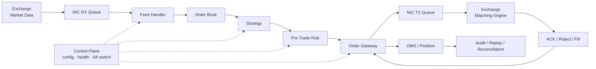
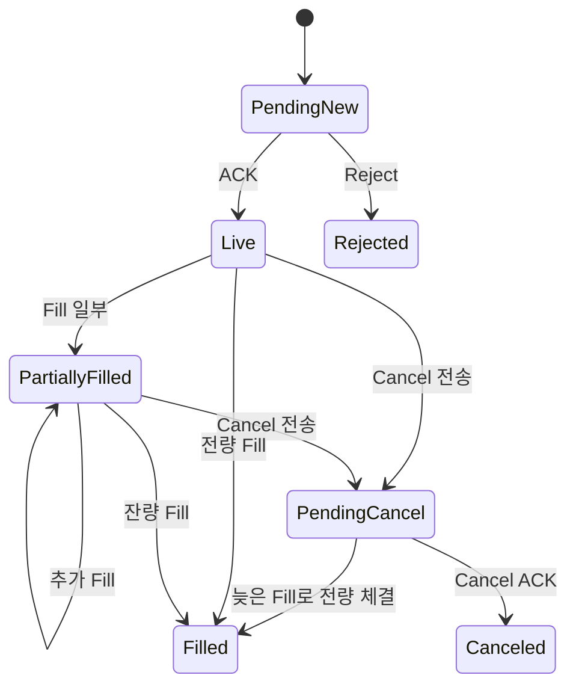
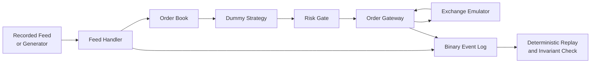

# 개요

초저지연 트레이딩 시스템을 공부하면 CPU cache, lock-free queue, kernel bypass와 같은 기술이 먼저 눈에 들어온다.

그러나 개별 기술부터 파고들면 두 가지 문제가 생긴다.

- 최적화하려는 코드가 전체 주문 경로의 어느 위치에 있는지 알기 어렵다.
- 몇 ns를 줄였지만 그보다 큰 queueing, packet loss 또는 잘못된 상태 전이를 놓칠 수 있다.

초저지연 시스템의 출발점은 특정 기법이 아니라 **한 개의 시장 데이터 event가 주문과 체결로 이어지는 전체 경로**다.

```text
Exchange Market Data
  → NIC
  → Feed Handler
  → Order Book
  → Strategy
  → Pre-Trade Risk
  → Order Gateway
  → Exchange Matching Engine
  → ACK / Fill
  → OMS / Position / Audit
```

이 글은 이 경로를 구성 요소, 지연 예산, 실패 모델과 thread 배치 관점에서 한 번 넓게 훑는다.

> BFS 학습 Level 0의 목표는 모든 부품을 최적화하는 것이 아니다. 각 부품의 입력, 출력, 책임과 실패가 어디로 전파되는지 설명하는 것이다.

선행 글은 없지만, 거래의 업무 흐름이 낯설다면 먼저 [[증권산업] 주식 주문은 실제로 어떻게 처리될까?](/posts/stock-order-processing/)를 함께 읽는 것이 좋다.

# 1. 초저지연은 단순히 평균이 빠른 시스템이 아니다

Latency는 event가 한 지점에서 다른 지점까지 이동하는 데 걸린 시간이다.

예를 들어 market data packet을 받은 시점부터 주문을 NIC로 내보낸 시점까지의 시간은 다음처럼 나타낼 수 있다.

```text
tick-to-trade latency
  = packet receive
  + decode
  + book update
  + strategy decision
  + risk check
  + order encode
  + transmit
```

하지만 평균 하나로는 시스템의 성격을 설명하기 어렵다.

| 항목       | 질문                                                             |
| ---------- | ---------------------------------------------------------------- |
| p50        | 평상시 전형적인 요청은 얼마나 걸리는가?                          |
| p99        | 느린 1%에서는 무엇이 개입하는가?                                 |
| p99.9 이상 | 드문 scheduler, page fault, queue burst와 장애가 보이는가?       |
| max        | 측정 구간의 최악값은 무엇이며 원인을 추적할 수 있는가?           |
| jitter     | 같은 입력의 지연이 얼마나 흔들리는가?                            |
| throughput | 목표 message rate를 유지하면서 지연 목표를 만족하는가?           |
| loss       | 부하가 커질 때 지연 대신 packet 또는 event를 버리고 있지 않은가? |

초저지연 시스템은 보통 낮은 평균뿐 아니라 다음 속성을 함께 요구한다.

- 예측 가능한 tail latency
- 입력 순서와 상태 전이의 정확성
- burst 상황에서의 명시적인 정책
- 장애 후 복구와 중복 억제
- 어느 구간이 느렸는지 재구성할 수 있는 timestamp와 audit trail

따라서 “가장 빠른 코드”보다 더 정확한 표현은 다음과 같다.

> 정해진 부하와 실패 조건에서 latency budget, correctness invariant와 risk limit을 재현 가능하게 지키는 시스템

# 2. Packet-to-fill 전체 경로

전체 구조를 data plane과 control plane까지 포함해 그리면 다음과 같다.



이 그림에는 서로 다른 종류의 일이 섞여 있다.

## 2.1 Inbound market-data path

```text
wire
  → NIC가 frame 수신
  → DMA로 host memory에 기록
  → application이 packet 발견
  → binary message decode
  → sequence 검증
  → order book state 갱신
```

Feed handler의 목적은 byte를 C++ structure로 바꾸는 데서 끝나지 않는다.

- packet과 message boundary를 검증한다.
- session 또는 channel sequence를 확인한다.
- duplicate, gap과 malformed message를 구분한다.
- snapshot과 incremental update를 일관된 상태로 합친다.
- downstream이 사용할 정규화 event를 만든다.

빠르게 잘못된 book을 만드는 것은 올바른 결과가 아니다.

## 2.2 Decision path

```text
normalized event
  → book update
  → feature 또는 signal 갱신
  → 주문 의도 생성
```

이 구간은 전략마다 크게 달라진다.

시스템 프로그래머에게 중요한 부분은 전략의 수익 공식 자체보다 계약이다.

- 어떤 market state가 충분히 최신인가?
- 입력 event 하나가 decision을 몇 개 만들 수 있는가?
- stale 또는 incomplete book에서는 주문을 허용하는가?
- 가격과 수량은 어떤 단위와 범위를 사용하는가?
- decision에 사용한 source sequence와 timestamp를 남기는가?

## 2.3 Outbound order path

```text
order intent
  → pre-trade risk
  → client order ID 할당
  → venue protocol encode
  → session sequence 할당
  → NIC transmit
```

Pre-trade risk는 hot path에 있으므로 빨라야 하지만 생략할 수는 없다.

대표적인 검사는 다음과 같다.

- 주문 수량과 주문 금액 한도
- 가격 band 또는 collar
- 현재 position과 예상 position 한도
- message rate limit
- stale market-data 차단
- strategy, symbol, account와 venue kill switch

검사를 O(1)로 만들기 위해 미리 계산한 상태를 사용할 수는 있다. 하지만 race가 있는 오래된 상태로 검사하거나 실패 시 주문을 통과시키면 의미가 없다.

## 2.4 Execution-report path

거래소로 보낸 주문에는 여러 결과가 올 수 있다.

```text
new order
  → ACK 또는 reject
  → zero or more partial fills
  → full fill 또는 cancel
```

취소 요청과 체결은 서로 경쟁할 수 있다.



`PendingCancel`은 취소 완료가 아니다. 이 상태에서도 fill이 도착할 수 있다.

Execution report는 다음 상태로 이어진다.

- live order와 leaves quantity
- position과 exposure
- realized 또는 unrealized PnL
- drop copy 대사
- 감사 기록과 재시작 복구 상태

# 3. Market data와 order entry는 성격이 다르다

둘 다 network message지만 요구사항은 같지 않다.

| 구분           | Market data                                 | Order entry                                     |
| -------------- | ------------------------------------------- | ----------------------------------------------- |
| 대표 통신      | UDP multicast 또는 venue 전용 feed          | TCP 또는 venue 전용 reliable session            |
| 주요 방향      | one-to-many 배포                            | client와 venue의 양방향 session                 |
| 손실 처리      | sequence gap 탐지, retransmission, snapshot | session sequence, resend, reconnect             |
| 상태           | 외부 시장의 book 재구성                     | 자신의 주문 상태 관리                           |
| 잘못 처리할 때 | stale 또는 corrupted view                   | duplicate order, unknown order, 잘못된 position |

이 표는 흔한 구조를 설명할 뿐 모든 거래소에 그대로 적용되는 규칙은 아니다. 실제 구현에서는 대상 venue의 최신 protocol specification과 certification rule이 기준이다.

# 4. Data plane과 control plane

## 4.1 Data plane

Data plane은 latency-sensitive event가 이동하는 경로다.

```text
packet → decode → state update → decision → risk → order
```

일반적으로 다음 성질을 원한다.

- bounded work
- 예측 가능한 memory access
- 명확한 ownership
- hot path allocation 최소화
- block하지 않는 logging과 telemetry 전달
- system call과 thread wake-up 최소화

## 4.2 Control plane

Control plane은 설정과 운영 상태를 관리한다.

- strategy enable과 disable
- risk limit 변경
- symbol 또는 venue 상태
- session 연결과 복구 명령
- health check
- kill switch와 mass cancel
- 배포, configuration validation과 rollback

Control plane이 덜 빠르다고 덜 중요한 것은 아니다. 잘못된 설정을 hot path에 전파하거나 kill switch가 도착하지 않으면 전체 시스템이 위험해진다.

두 plane을 분리하는 핵심 이유는 **서로 다른 실행 특성과 실패 정책**을 갖기 때문이다.

예를 들어 data plane에서 JSON formatting, synchronous disk I/O 또는 remote configuration lookup을 수행하면 예측하기 어려운 지연을 만든다. 대신 control plane이 검증한 immutable snapshot을 data plane에 안전하게 publish할 수 있다.

# 5. Hot, warm, cold path

모든 코드를 같은 방식으로 최적화할 필요는 없다.

| 경로      | 예                                             | 일반적인 관심사                           |
| --------- | ---------------------------------------------- | ----------------------------------------- |
| hot path  | packet decode, book update, risk, order encode | cycles, cache, branch, allocation, jitter |
| warm path | session heartbeat, 통계 전달, snapshot 전환    | bounded delay, correctness, 간헐적 burst  |
| cold path | 시작, 설정 읽기, reconnect 준비, report 생성   | 명확성, 검증, 복구 가능성                 |

시작할 때 memory를 할당하고 protocol schema를 검증하는 일은 cold path에서 해도 된다.

반면 매 message마다 heap allocation, lock contention, string formatting과 blocking I/O를 수행하면 hot path의 변동이 커질 수 있다.

다만 다음 등식은 성립하지 않는다.

```text
hot path = STL 금지 = abstraction 금지 = 모든 코드를 수작업
```

실제 비용은 type 이름이 아니라 target compiler가 만든 코드, object lifetime, memory access pattern과 runtime input으로 측정해야 한다.

# 6. Thread와 state ownership

초저지연 설계에서 중요한 질문은 “thread를 몇 개 만들까?”보다 “누가 어떤 상태를 쓰는가?”다.

## 6.1 Single-writer 원칙

한 mutable state를 한 thread만 변경하도록 만들면 여러 이점이 있다.

- lock 없이 invariant를 유지하기 쉽다.
- cache line ownership 이동을 줄일 수 있다.
- event 순서를 reasoning하기 쉽다.
- deterministic replay와 실제 실행의 모델을 맞추기 쉽다.

예를 들어 한 feed channel의 book partition을 한 thread가 소유하게 할 수 있다.

```text
RX / decode thread
  → SPSC queue
  → book + strategy owner thread
  → SPSC queue
  → risk + gateway owner thread
```

그러나 queue를 추가하면 공짜로 병렬화되는 것은 아니다.

- enqueue와 dequeue 비용
- cache line 이동
- producer와 consumer 사이의 대기
- queueing latency
- full queue에서의 backpressure 또는 drop 정책

처리 단계가 짧다면 한 core에서 run-to-completion으로 끝내는 편이 더 빠를 수도 있다. 반대로 protocol session, strategy와 risk의 독립성이 중요하다면 명시적인 queue boundary가 운영상 유리할 수 있다.

결론은 topology를 먼저 정하는 것이 아니라 **state ownership과 측정 결과에 맞춰 실행 모델을 정하는 것**이다.

# 7. Latency budget 만들기

전체 목표만 두면 어느 component가 개선되어야 하는지 알기 어렵다.

다음처럼 timestamp point를 정의한다.

```text
t0: NIC가 packet을 받은 시점
t1: application이 packet을 읽은 시점
t2: decode와 sequence check 완료
t3: book update 완료
t4: strategy decision 완료
t5: risk check 완료
t6: order message 완성
t7: NIC transmit 시점
t8: venue ACK 수신
```

그러면 구간별 지연을 분리할 수 있다.

```text
host receive       = t1 - t0
feed handling      = t2 - t1
book update        = t3 - t2
decision           = t4 - t3
risk               = t5 - t4
order encode       = t6 - t5
host transmit      = t7 - t6
venue round trip   = t8 - t7
```

이 숫자를 만들 때 세 가지를 주의한다.

1. timestamp를 찍는 비용도 측정 대상에 영향을 준다.
2. 서로 다른 clock domain의 시각을 바로 빼면 안 된다.
3. 구간별 p99를 더한 값은 일반적으로 end-to-end p99가 아니다.

Latency budget은 한 번 정하고 끝나는 숫자가 아니다. message rate, packet size, book depth, burst 모양과 hardware configuration을 함께 기록해야 비교할 수 있다.

# 8. Queue는 지연을 숨기기도 하고 만들기도 한다

처리율을 `μ`, 입력률을 `λ`라고 하자.

평균적으로 `λ < μ`라고 해서 항상 안전한 것은 아니다. 짧은 burst에서 순간 입력률이 처리율보다 커지면 queue가 쌓인다.

```text
arrival burst
  → queue depth 증가
  → 오래된 market event 처리
  → decision freshness 저하
  → tail latency 증가
```

Queue가 full일 때 선택할 수 있는 정책은 component마다 다르다.

- producer를 block한다.
- 오래된 event 또는 새 event를 버린다.
- strategy를 중단하고 book recovery를 시작한다.
- 주문 경로를 fail-closed로 막는다.
- 부가 telemetry만 sample 또는 drop한다.

Market data gap을 조용히 무시하는 것과 diagnostic counter 일부를 sample하는 것은 같은 손실이 아니다.

따라서 모든 queue에는 적어도 다음 계약이 필요하다.

- capacity
- single 또는 multiple producer/consumer 여부
- event ordering
- full과 empty일 때의 행동
- depth와 high-water mark 관측 방법
- shutdown과 recovery 방식

# 9. Correctness invariant

초저지연 트레이딩에서 correctness는 성능 이후에 덧붙이는 조건이 아니다.

대표적인 invariant는 다음과 같다.

## 9.1 Market data

- 적용한 sequence가 기대한 다음 값인지 확인한다.
- snapshot과 incremental event의 기준점을 확인한다.
- gap 상태의 book을 정상 상태처럼 사용하지 않는다.
- symbol, price level과 side별 수량이 음수가 되지 않는다.

## 9.2 Order state

- client order ID는 정의된 범위에서 유일하다.
- cumulative fill은 감소하지 않는다.
- Active order에서는 일반적으로 `orderQty = cumQty + leavesQty` 관계를 유지하되, cancel·reject·expire 같은 terminal 상태와 replace는 venue protocol의 규칙을 따른다.
- duplicate execution report를 두 번 반영하지 않는다.
- cancel 요청과 cancel 완료를 구분한다.

## 9.3 Risk

- 주문 전송을 승인하기 전 또는 같은 직렬화 경계 안에서 예상 exposure를 예약한다.
- stale state에서의 정책이 명확하다.
- limit update의 version과 적용 시점을 기록한다.
- kill switch는 주문 생성, queue와 gateway의 어느 경계까지 막는지 정의한다.

Invariant가 명확하면 property test, replay와 fault injection의 판정 기준도 명확해진다.

# 10. 대표적인 실패 모델

정상 입력만 빠르게 처리하는 benchmark로는 production 시스템을 설명할 수 없다.

| 실패                    | 탐지                           | 안전한 동작 예                                  |
| ----------------------- | ------------------------------ | ----------------------------------------------- |
| market-data packet loss | sequence gap                   | 관련 book 사용 중단, recovery 요청              |
| duplicate packet        | 이미 적용한 sequence           | 중복 억제와 counter 증가                        |
| out-of-order event      | expected sequence 불일치       | protocol 규칙에 따른 buffer 또는 recovery       |
| malformed length        | decoder bounds check           | packet 격리, process memory 보호                |
| venue disconnect        | heartbeat와 socket error       | 새 주문 차단, cancel-on-disconnect 정책 확인    |
| late fill               | order state와 execution ID     | terminal처럼 보이는 상태도 protocol에 맞게 반영 |
| clock jump 또는 unlock  | offset/servo 상태              | latency sample 분리, 규정상 timestamp 정책 적용 |
| queue saturation        | depth/high-water mark          | 명시한 backpressure, drop 또는 fail-closed      |
| process restart         | journal/snapshot/session state | replay 후 상태 재구축과 venue 대사              |

실패 정책은 성능 정책이기도 하다. 예를 들어 gap 이후 계속 book을 갱신하면 빠르게 보이지만, 잘못된 시장 상태를 사용하게 된다.

# 11. Hardware와 software가 만나는 지점

System call 하나만 줄인다고 전체 지연이 사라지지는 않는다. packet path에는 여러 자원이 연결된다.

```text
Exchange link
  → switch
  → NIC RX queue
  → PCIe / DMA
  → host memory
  → CPU cache / TLB
  → decoder instructions
  → shared state 또는 queue
```

각 지점의 대표 질문은 다음과 같다.

| 영역            | 질문                                                       |
| --------------- | ---------------------------------------------------------- |
| NIC             | 어느 RX queue로 들어왔고 hardware timestamp가 있는가?      |
| IRQ/polling     | application은 도착을 어떤 방식으로 발견하는가?             |
| NUMA            | NIC, CPU와 packet buffer가 같은 node에 있는가?             |
| cache           | hot data의 working set과 access pattern은 어떤가?          |
| TLB             | page 크기와 page fault가 tail에 영향을 주는가?             |
| compiler        | source abstraction이 어떤 instruction과 branch가 되었는가? |
| synchronization | cache line이 core 사이를 얼마나 이동하는가?                |

이 때문에 hardware, Linux, network와 C++를 별도 과목으로만 배우면 부족하다. 전체 packet path에서 만나는 순서로 다시 연결해야 한다.

# 12. 먼저 최적화하지 않을 것

다음 선택은 실제로 유용할 수 있지만 Level 0에서 바로 적용할 대상은 아니다.

- 모든 socket을 DPDK나 다른 kernel-bypass stack으로 교체
- 모든 공유 구조를 lock-free로 변경
- 모든 allocation을 custom allocator로 교체
- 모든 함수를 강제로 inline
- 항상 busy polling
- 무조건 huge page, real-time scheduler와 CPU isolation 사용
- SIMD 또는 FPGA로 이동

각 선택은 운영 비용과 새로운 실패 모드를 만든다.

예를 들어 busy polling은 wake-up 지연을 줄일 수 있지만 core를 전용으로 사용하고 power와 thermal 상태에 영향을 준다. CPU isolation은 OS jitter를 줄일 수 있지만 housekeeping CPU와 IRQ 배치를 잘못하면 다른 병목을 만든다.

올바른 순서는 다음에 가깝다.

```text
정확한 경로 정의
  → invariant와 실패 모델 정의
  → timestamp와 workload 정의
  → baseline 측정
  → 병목 가설
  → 한 변수 변경
  → correctness와 latency 재검증
```

# 13. 학습용 최소 시스템

실제 시장에 연결하지 않고도 대부분의 원리를 연습할 수 있다.



첫 구현에서는 전략을 단순하게 유지한다.

- best bid와 ask를 읽는다.
- 사전에 정한 조건에서만 한 주문 의도를 만든다.
- risk gate가 수량과 가격 범위를 확인한다.
- exchange emulator가 ACK, partial fill과 cancel race를 발생시킨다.
- 모든 입력을 replay했을 때 같은 최종 상태 hash가 나오는지 확인한다.

이 프로젝트는 수익을 내는 전략을 만드는 실습이 아니다. protocol, state, latency와 recovery를 검증하는 시스템 프로그래밍 실습이다.

# 14. 완료 기준

다음 질문에 그림 없이 답할 수 있으면 Level 0의 첫 글을 완료한 것이다.

1. Market-data packet이 주문으로 바뀌어 ACK 또는 fill로 돌아오는 경로는 무엇인가?
2. Feed handler, order book, strategy, risk와 gateway의 책임은 어떻게 다른가?
3. Market data와 order-entry session의 손실·복구 방식은 왜 다를 수 있는가?
4. Hot path와 control plane을 분리하는 이유는 무엇인가?
5. 평균 latency만으로 시스템을 설명할 수 없는 이유는 무엇인가?
6. Queue가 full일 때 반드시 정의해야 하는 정책은 무엇인가?
7. `PendingCancel` 상태에서도 fill을 처리해야 할 수 있는 이유는 무엇인가?
8. Kernel bypass나 lock-free를 baseline 측정보다 먼저 선택하면 안 되는 이유는 무엇인가?

추가 산출물로 다음 한 장을 직접 작성한다.

```text
내가 만들 시스템의 packet-to-fill diagram
각 component의 입력과 출력
각 boundary의 timestamp
5개 이상의 correctness invariant
5개 이상의 failure scenario와 정책
```

# 정리

초저지연 트레이딩 시스템은 다음 네 가지를 동시에 다룬다.

```text
Market semantics
  + Correct state transitions
  + Predictable systems performance
  + Risk and recovery
```

CPU cache와 network tuning은 이 전체 구조 안에서 의미가 있다.

첫 단계에서는 packet-to-fill 경로, data plane과 control plane, state ownership, latency budget과 실패 모델을 먼저 그린다. 이후 시장 미시구조, C++, CPU와 memory, Linux, network와 측정이라는 각 branch를 같은 깊이로 넓힌 뒤 심화 주제로 내려간다.

# 참고 자료

- [Nasdaq TotalView-ITCH 5.0 Specification](https://www.nasdaqtrader.com/content/technicalsupport/specifications/dataproducts/NQTVITCHspecification.pdf)
- [FIX Trading Community - FIX Session Layer](https://www.fixtrading.org/standards/fix-session-layer-online/)
- [Linux Kernel Documentation - Scaling in the Linux Networking Stack](https://docs.kernel.org/networking/scaling.html)
- [Linux Kernel Documentation - CPU Isolation](https://docs.kernel.org/admin-guide/cpu-isolation.html)
- [DPDK Programmer's Guide](https://doc.dpdk.org/guides/prog_guide/)
