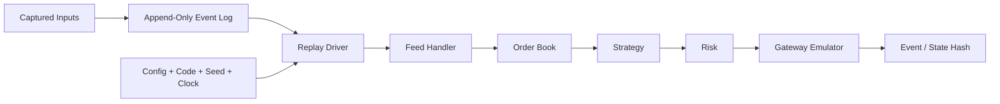
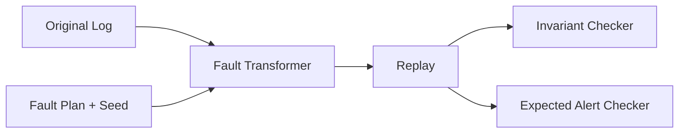

# 개요

초저지연 system에서 가장 어려운 bug는 평소에는 보이지 않고 특정 event ordering에서만 나타난다.

```text
market-data gap
  + cancel-fill race
  + queue saturation
  + reconnect
  + process restart
```

“그때 log에는 이상이 없었다”로는 부족하다.
같은 입력을 다시 넣어 같은 decision, outbound command와 최종 state를 재현할 수 있어야 한다.



Deterministic replay는 단순히 packet file을 다시 읽는 기능이 아니다.
입력 순서, 시간, configuration, random source와 외부 효과를 통제해 **live와 같은 state transition code**를 다시 실행하는 architecture다.

# 학습 위치

| 항목 | 내용 |
| --- | --- |
| BFS Level | Level 3-SR — State Recovery와 Replay |
| 선수 글 | [[Low Latency Trading] Market Data Sequence와 Gap Recovery](/posts/low-latency-market-data-sequencing/) |
| 선수 글 | [[Low Latency Trading] Latency를 올바르게 측정하는 방법](/posts/low-latency-measurement/) |
| 적용 대상 | Feed handler, order book, risk와 order gateway |
| 다음 단계 | Exchange emulator, snapshot/restart와 end-to-end fault injection |

완료 기준은 다음과 같다.

> Process를 두 번 실행해 같은 log를 replay했을 때 같은 normalized event, order decision, outbound intent, state hash와 invariant 결과를 얻는가?

# 1. 무엇을 기록할 것인가

“Raw packet만 있으면 전부 복원할 수 있다”와 “Domain event만 있으면 충분하다”는 둘 다 조건부 주장이다.
목적이 다른 여러 층을 구분한다.

## 1.1 Raw Network Capture

가장 입력에 가까운 byte와 metadata다.

```text
interface / RX queue
capture timestamp
packet length
link/IP/UDP/TCP bytes
hardware timestamp status
drop counter 또는 capture gap
```

장점:

- Parser와 protocol behavior를 다시 검증할 수 있다.
- Malformed packet과 framing bug를 보존한다.
- 새 decoder와 이전 decoder를 비교할 수 있다.

한계:

- NIC나 capture path에서 이미 drop된 packet은 없다.
- Kernel/driver metadata가 모두 보존된다는 보장이 없다.
- Encryption, proprietary framing과 session secret이 필요할 수 있다.
- Order-entry TCP byte만으로 application의 local intent timing을 알 수 없다.

## 1.2 Normalized Domain Event

Feed handler가 검증한 event다.

```text
AddOrder
CancelOrder
ExecuteOrder
Trade
BookReset
FeedGapDetected
FeedLive
```

장점:

- Order book과 strategy를 network 없이 test할 수 있다.
- Venue protocol이 달라도 공통 component input을 만들 수 있다.
- Compact하고 replay가 빠르다.

한계:

- Decoder가 field를 잘못 해석한 bug를 그대로 고정할 수 있다.
- Normalization 과정에서 venue 의미를 잃을 수 있다.
- Raw input과 변환 version을 연결하지 않으면 원인을 추적하기 어렵다.

## 1.3 Decision과 Business Event

```text
StrategyDecision
RiskApproved / RiskRejected
OrderCommandCreated
SessionMessageSent
OrderAccepted / Filled / Canceled / Rejected
PositionChanged
KillSwitchChanged
```

이 층은 “system이 무엇을 결정했는가?”를 설명한다.
Audit와 reconciliation에 중요하지만 raw input을 대체하지는 않는다.

## 1.4 State Snapshot

긴 log를 처음부터 전부 재생하지 않기 위한 기준 state다.

```text
snapshot at event N
  + events N+1 ... latest
  = recovered state
```

Snapshot이 어느 event까지 포함했는지 정확한 watermark를 가져야 한다.
Event log와 원자적으로 같은 파일에 있을 필요는 없지만 일관성 protocol이 필요하다.

# 2. 하나의 거대한 Log보다 역할을 분리한다

다음처럼 목적을 나눌 수 있다.

| Log | 손실 정책 | 주요 소비자 |
| --- | --- | --- |
| Raw market/order input | 가능한 한 lossless, drop 명시 | Parser, incident analysis |
| Normalized event | State rebuild에 필요하면 lossless | Book, replay |
| Business event | 손실 허용 불가 | OMS, risk, audit |
| Performance trace | Sampling/drop 가능 | Profiler, operator |
| Debug text | Sampling/drop 가능 | Human investigation |

Debug log queue가 가득 찼다고 fill event를 함께 버리면 안 된다.
반대로 모든 debug 문자열을 동기식 durable storage에 쓰면 hot path를 멈출 수 있다.

# 3. Binary Record의 최소 Envelope

Record가 payload만 연속으로 있으면 partial tail과 schema change를 찾기 어렵다.

```cpp
struct RecordHeader {
    std::uint32_t magic;
    std::uint16_t format_version;
    std::uint16_t event_type;
    std::uint32_t payload_length;
    std::uint64_t stream_sequence;
    std::uint64_t monotonic_timestamp_ns;
    std::uint64_t source_timestamp_ns;
    std::uint32_t source_clock_id;
    std::uint32_t flags;
};
```

이 구조를 그대로 disk에 `write(sizeof(header))`하자는 뜻은 아니다.
C++ object padding, byte order와 layout version을 피하려면 field별 wire encoding을 명시한다.

필요한 metadata는 system contract에 따라 다음을 포함할 수 있다.

- File/session magic과 format version
- Record type와 payload schema version
- Stream ID와 monotonic sequence
- Payload length와 최대 허용 길이
- Receive, exchange와 decision timestamp
- 각 timestamp의 clock domain과 validity flag
- Source channel/session sequence
- Configuration/build ID
- Integrity checksum

# 4. Framing과 Bounds Check

Replay file도 untrusted binary input처럼 다룬다.

```text
remaining >= fixed_header_size
payload_length <= configured_max
payload_length <= remaining - trailer_size
type is known or safely skippable
checksum covers exactly documented bytes
```

Integer overflow를 피하기 위해 `offset + length <= size`보다 다음 형태가 안전하다.

```cpp
bool has_bytes(std::size_t offset,
               std::size_t length,
               std::size_t size) noexcept {
    return offset <= size && length <= size - offset;
}
```

Unknown type 처리도 version 정책으로 정한다.

- Required event unknown: replay 중단
- Explicitly skippable extension: length만큼 건너뛰고 metric
- Business state에 영향 가능: 절대 임의 skip 금지

# 5. Partial Tail과 Crash Consistency

Process가 record 중간에 죽을 수 있다.

```text
[complete][complete][header + partial payload EOF]
```

Reader는 마지막 incomplete record를 이전 complete boundary까지만 인정할 수 있다.
하지만 torn write, reordered persistence와 storage cache까지 고려하면 length만으로 모든 손상을 탐지할 수는 없다.

가능한 기법은 다음과 같다.

- Header와 trailer에 length 또는 sequence 반복
- Record checksum
- Block 단위 checksum과 commit marker
- Segment file rotation
- 명시적인 flush/fdatasync policy
- Storage hardware의 persistence guarantee 확인

Checksum은 accidental corruption을 탐지하는 도구이며 암호학적 authenticity를 자동으로 제공하지 않는다.

## 5.1 Durability Boundary

다음 시점을 구분한다.

```text
event copied to process buffer
event enqueued to logger
write syscall returned
filesystem accepted data
storage reports persistence
snapshot committed
```

어느 시점부터 crash 후 복구 가능하다고 간주하는지 문서화한다.
모든 event를 동기 flush할지, batch할지, 별도 durable medium을 사용할지는 latency와 recovery 요구의 trade-off다.

# 6. Sequence는 Log의 척추다

Timestamp만으로 event order를 정하지 않는다.
동일 timestamp, clock resolution, thread 간 clock skew와 clock correction이 있기 때문이다.

```text
stream_id + stream_sequence
```

를 각 stream 내부의 authoritative ordering key로 두고 timestamp는 시간 의미에 사용한다.
서로 다른 stream 사이의 total order가 business result에 영향을 준다면 별도의 global merge sequence 또는 동등한 결정적 tie-break를 기록해야 한다.

여러 source를 합칠 때는 단일 global order를 누가 정했는지 기록한다.

```text
RX A source_seq 100
RX B source_seq 100
timer fired
strategy decision
gateway ACK
```

서로 다른 source의 sequence 값이 같다는 사실만으로 duplicate는 아니다.

Live system에서 arbitrator 또는 event loop가 정한 merge order를 log에 보존하지 않으면 replay가 다른 결과를 낼 수 있다.

# 7. Determinism을 깨는 Source

같은 input file만으로 같은 결과가 나오지 않는 이유를 찾는다.

## 7.1 Wall Clock 직접 호출

```cpp
if (std::chrono::system_clock::now() > deadline) {
    cancel();
}
```

Replay 시 실행한 오늘의 시간이 들어가면 결과가 달라진다.
Clock을 dependency로 주입한다.

```cpp
class Clock {
public:
    virtual MonoTime now() const noexcept = 0;
    virtual ~Clock() = default;
};
```

Hot path에서 virtual dispatch를 원하지 않으면 template, function object 또는 event-loop-owned scalar clock을 사용할 수 있다.
핵심은 live clock과 replay virtual clock이 같은 business code에 값을 제공한다는 점이다.

## 7.2 Random Number

Sampling, backoff와 strategy decision에 random source가 있다면 algorithm, seed와 draw order를 기록한다.

```text
rng algorithm version
seed
stream/shard ID
number of draws or state checkpoint
```

OS entropy를 replay 중 다시 읽지 않는다.

## 7.3 Thread Scheduling

두 thread가 공유 state를 경쟁해 순서가 scheduler에 따라 달라지면 replay도 흔들린다.

해결 방향은 다음과 같다.

- Component별 single writer
- Message에 sequence를 부여한 deterministic merge
- Replay에서 실제로 관찰한 merge order 재생
- Shared mutable state와 data race 제거

Data race는 nondeterminism 기능이 아니라 undefined behavior다.

## 7.4 Iteration Order

Hash container iteration 순서, pointer address와 allocator state에 decision을 의존하지 않는다.

```text
unordered candidates에서 첫 원소 선택
```

대신 stable key로 정렬하거나 명시적인 tie-break rule을 둔다.

## 7.5 Floating-Point Environment

Compiler option, CPU instruction set, rounding mode와 parallel reduction order가 floating-point 결과에 영향을 줄 수 있다.
Execution boundary는 fixed-point로 normalize하고, model reproducibility가 필요하면 build/FP environment를 함께 고정한다.

## 7.6 External I/O

DNS, database, current config service와 live venue에 replay가 연결되면 안 된다.
모든 외부 응답을 fixture 또는 recorded event로 바꾼다.

# 8. Replay 가능한 Architecture

State transition core를 I/O에서 분리한다.

```cpp
struct Effects {
    SmallVector<OutboundCommand, 4> outbound;
    SmallVector<AuditEvent, 4> audit;
    bool request_shutdown{};
};

Effects apply(SystemState& state,
              const Event& event,
              VirtualTime now);
```

여기서 `SmallVector`는 C++ 표준 type이 아니라 project-specific fixed-capacity container를 나타내는 placeholder다.

`apply`가 직접 socket write, file write 또는 wall-clock read를 하지 않으면 다음 두 runner가 같은 code를 쓸 수 있다.

```text
Live runner:
  socket/timer → Event → apply → real adapters

Replay runner:
  log record → Event → apply → fake adapters + assertions
```

작은 fixed-capacity effect buffer의 실제 크기는 workload와 overflow policy를 검증해야 한다.

# 9. Replay Mode를 구분한다

## 9.1 As-Fast-As-Possible

Event timestamp 간 wait 없이 최대 속도로 재생한다.

용도:

- Correctness regression
- State rebuild
- Fuzz corpus 확대
- Throughput benchmark

실제 queueing/timing behavior는 재현하지 않는다.

## 9.2 Time-Scaled

원래 event 간격을 배율로 줄이거나 늘린다.

```text
replay_delta = recorded_delta / speed_factor
```

Timer와 burst behavior를 살피는 데 유용하지만 OS scheduling은 원본과 같지 않다.

## 9.3 Step/Breakpoint

특정 sequence, instrument, order ID 또는 invariant 직전에 멈춘다.

```text
break when event.sequence == 918271
break when order C42 state changes
break when book becomes crossed
```

Incident 분석에 유용하다.

## 9.4 Shadow/Differential

같은 event stream을 old와 new implementation에 동시에 넣고 결과를 비교한다.

```text
old decoder/book/risk
        vs
new decoder/book/risk
```

Latency 개선이 semantic change를 만들지 않았는지 확인한다.

# 10. Event Hash와 State Hash

수백만 state field를 매 event 비교하기 어렵다면 deterministic digest를 사용할 수 있다.

```text
event_hash_n = H(event_hash_{n-1}, canonical_event_n)
state_hash checkpoint = H(canonical_state_fields)
```

주의할 점은 다음과 같다.

- Struct padding과 pointer value를 hash하지 않는다.
- Map iteration을 stable key 순서로 canonicalize한다.
- Byte order와 encoding version을 고정한다.
- Hash algorithm과 seed를 build metadata에 기록한다.
- Hash 일치만으로 모든 correctness를 증명한다고 주장하지 않는다.

Hash mismatch가 처음 나타나는 sequence를 binary search하면 긴 incident log를 빠르게 좁힐 수 있다.

# 11. Snapshot과 Replay

Snapshot은 derived state의 cache다.
Source-of-truth event와의 연결점이 필요하다.

```cpp
struct SnapshotMetadata {
    std::uint32_t schema_version;
    std::uint64_t included_event_sequence;
    ConfigVersion config_version;
    BuildId writer_build;
    Digest state_digest;
};
```

Recovery 절차 예시는 다음과 같다.

```text
1. 가장 최근의 complete, verified snapshot 선택
2. Schema/build compatibility 검사
3. included_event_sequence까지 state가 반영됐는지 검증
4. N+1부터 log replay
5. 모든 invariant 검사
6. Venue/broker authoritative state와 reconcile
7. 그 뒤에만 LIVE로 전환
```

Local replay 성공만으로 외부 venue의 실제 open order를 확정할 수는 없다.
연결 단절이나 capture loss가 있으면 반드시 reconciliation이 필요하다.

# 12. Schema Evolution

Record type에 field가 추가되거나 의미가 바뀐다.

나쁜 방법:

```text
현재 C++ struct의 sizeof를 file format으로 사용
```

좋은 contract는 다음을 명시한다.

- File envelope version
- Event별 payload version
- Field byte order와 width
- Required/optional field
- Unknown version policy
- Upgrade tool 또는 multi-version reader 범위

Migration은 원본 log를 덮어쓰지 않고 새 segment를 생성하며 source digest와 변환 tool version을 기록하는 편이 안전하다.

# 13. Backpressure와 Loss Accounting

Logger가 느릴 때 hot path가 무엇을 할지 정한다.

```text
producer → bounded SPSC event ring → logger core → block buffer → storage
```

가능한 정책:

| Event class | Queue full 정책 예시 |
| --- | --- |
| Fill/order state | fail-safe stop, loss 없는 spill 경로 |
| Risk decision | fail-safe stop 또는 검증된 durable path |
| Market packet | capture drop counter와 recovery marker, capacity 증설 |
| Performance sample | sample/drop + dropped count |
| Debug string | drop + reason counter |

`dropped_events++`조차 producer끼리 contended atomic이 되면 hot path를 흔들 수 있다.
Per-core counter를 두고 cold path에서 aggregate할 수 있다.

# 14. Fault Injection은 Event 변환이다

실제 장애를 기다리지 않고 replay stream을 결정적으로 변형한다.



Fault plan 자체를 versioned artifact로 저장한다.

## 14.1 Network Fault

- Packet 또는 message drop
- Duplicate
- Bounded reorder
- Delay와 burst compression
- Datagram truncation
- TCP segmentation과 partial read
- Disconnect 직전/직후 byte cut
- A/B feed 한쪽만 지연

## 14.2 Protocol Fault

- Unknown message type
- Invalid length
- Invalid enum과 reserved value
- Sequence gap 또는 session change
- Duplicate execution ID
- Impossible quantity transition

## 14.3 Time Fault

- Timer가 event와 같은 timestamp에 발생
- Wall-clock step forward/backward
- PHC/PTP health flag loss
- Stale market-data threshold 직전/직후
- Long scheduler pause

Interval용 monotonic clock을 실제로 backward 이동시키는 test는 clock contract 위반을 검사하는 별도 case로 둔다.

## 14.4 Capacity Fault

- Input/output ring full
- Logger가 느려짐
- Memory pool exhaustion
- File segment rotation 실패
- Disk full 또는 read-only 전환
- Control-plane update burst

## 14.5 Trading State Fault

- Cancel ACK 직전 fill
- Cancel 뒤 late fill
- ACK 유실 후 accepted order 존재
- Replace reject와 원 order live
- Bust/correction
- Kill switch 중 queued command

# 15. Fault를 무작위 시간에만 넣지 않는다

Seeded random injection은 유용하지만 boundary-specific test가 더 설명력이 높다.

```text
before risk reservation
after reservation, before gateway handoff
after encode, before socket write
after venue accept, before ACK
after fill receive, before position apply
after snapshot write, before commit marker
```

각 commit point 사이에 crash를 넣어 무엇이 중복되고 무엇이 누락되는지 확인한다.

# 16. Invariant Checker

Fault injection의 성공 기준은 process가 죽지 않는 것만이 아니다.

## 16.1 Market Data와 Book

```text
sequence gap 중 book은 tradable이 아님
quantity는 음수가 아님
bid/ask ordering과 price-level aggregate 일치
order-level quantity 합 == level quantity
snapshot watermark 이후 incremental만 적용
```

## 16.2 Order와 Execution

```text
cum_qty와 leaves_qty가 정의한 관계를 만족
execution ID는 최대 한 번 accounting에 반영
cancel pending에서도 합법적인 fill을 처리
terminal state의 불가능한 전이를 alert
```

## 16.3 Risk와 Position

```text
reservation >= 0
reservation == authoritative open leaves exposure
position == initial/snapshot position + unique fill·correction의 signed effect 합
unknown state에서 신규 주문 차단
kill generation 이후 new transmit 없음
```

## 16.4 Logging

```text
record sequence가 단조 증가
business event gap 없음
checksum과 length 유효
snapshot watermark와 log 연결
drop이 허용된 stream은 drop count가 정확함
```

# 17. Golden Fixture, Property와 Fuzz를 함께 쓴다

## 17.1 Golden Fixture

작고 사람이 검토한 binary/log fixture와 expected event를 repository에 둔다.

```text
normal open
partial fill
gap recovery
cancel-fill race
reconnect duplicate
partial log tail
```

Protocol revision이 바뀌면 expected diff를 review한다.

## 17.2 Property Test

유효한 event sequence를 생성하고 invariant를 검사한다.
Reference model은 느려도 단순하게 만든다.

```text
optimized aggregate book
  vs
ordered map/list reference book
```

## 17.3 Coverage-Guided Fuzz

Binary decoder와 log reader에 arbitrary bytes를 넣는다.

성공 조건:

- Out-of-bounds read/write 없음
- Signed overflow와 invalid shift 없음
- Allocation 폭증 없음
- 무한 loop 없음
- Invalid input은 명시적 error로 종료

ASan과 UBSan build로 먼저 돌리고, protocol-aware mutator를 추가한다.

# 18. Performance Replay의 함정

Replay는 correctness에는 강력하지만 production latency를 그대로 재현하지 않는다.

- File input은 NIC DMA와 interrupt/busy-poll path가 아니다.
- As-fast replay의 burst 모양은 원본과 다르다.
- Warm cache로 반복하면 cold behavior가 사라진다.
- Logging을 끄면 observer cost를 놓친다.
- Emulator의 ACK latency는 실제 venue가 아니다.

따라서 두 종류를 분리한다.

```text
deterministic functional replay
performance experiment with explicit hardware/network conditions
```

같은 fixture를 쓰되 성능 수치는 실험 환경과 timestamp point를 함께 기록한다.

# 19. Minimal Replay Driver

```cpp
class ReplayDriver {
public:
    ReplayDriver(System& system,
                 VirtualClock& clock,
                 EffectSink& effects)
        : system_{system}, clock_{clock}, effects_{effects} {}

    ReplayResult run(RecordReader& reader) {
        while (auto record = reader.next()) {
            if (!record->valid()) {
                return ReplayResult::corrupt_input;
            }

            clock_.advance_to(record->monotonic_time());
            auto event = decode_event(*record);
            if (!event) {
                return ReplayResult::decode_error;
            }

            auto produced = system_.apply(*event, clock_.now());
            effects_.accept(produced);
            check_invariants(system_.state());
        }
        return reader.clean_end()
            ? ReplayResult::complete
            : ReplayResult::partial_tail;
    }

private:
    System& system_;
    VirtualClock& clock_;
    EffectSink& effects_;
};
```

실제 code에서는 decode error, partial tail, unsupported version과 invariant failure를 서로 다른 결과로 남긴다.
또한 `advance_to`에 전달하는 virtual time의 clock domain을 고정하고, 이전 값보다 작은 timestamp를 reject할지 clock-anomaly event로 처리할지 명시해야 한다.

# 20. Incident Workflow

Production incident를 replay artifact로 바꾸는 절차 예시는 다음과 같다.

```text
1. 영향 session/time range를 freeze
2. Raw, normalized, business log와 drop counter 수집
3. Binary artifact digest와 custody metadata 기록
4. Build/config/reference-data version 확보
5. 원본을 read-only로 보존
6. 최소 재현 range 추출
7. 첫 event/state hash mismatch 탐색
8. Fault plan 또는 regression fixture 생성
9. Fix 전후 differential replay
10. Production과 같은 조건의 별도 latency 검증
```

민감한 주문·고객 data는 access control, encryption, retention과 redaction 정책을 따른다.

# 21. 구현 순서

1. Component state transition에서 clock과 I/O를 분리한다.
2. Canonical event type과 monotonic stream sequence를 정의한다.
3. Bounds-checked binary record reader/writer를 만든다.
4. Complete record와 partial tail test를 작성한다.
5. Virtual clock과 fake effect sink로 작은 replay를 통과시킨다.
6. Event/state canonical hash를 추가한다.
7. Snapshot watermark와 replay start를 연결한다.
8. Drop, duplicate, reorder와 disconnect transformer를 만든다.
9. Queue/disk/pool exhaustion을 주입한다.
10. End-to-end emulator와 reconciliation으로 확장한다.

# 22. 실습 과제

## 과제 A — Binary Log

다음 record를 쓰고 읽는다.

```text
MarketEvent
TimerEvent
RiskDecision
OrderCommand
ExecutionEvent
```

마지막 byte를 1개씩 잘라 모든 truncation 위치가 안전하게 거절되는지 test한다.

## 과제 B — Determinism Audit

Codebase에서 다음 호출을 찾는다.

```text
system_clock::now
random_device
unordered iteration
external RPC
thread-shared mutable state
floating-point reduction
```

각 항목을 injected dependency 또는 recorded event로 바꾼다.

## 과제 C — Crash Matrix

Order lifecycle과 log commit point 사이 모든 경계에 crash를 넣는다.
Restart 뒤 local state, venue emulator state와 expected reconciliation action을 표로 비교한다.

## 과제 D — Differential Replay

Order book 또는 risk implementation의 baseline과 optimized version을 같은 100만 event에 실행한다.

```text
event hash
checkpoint state hash
outbound command sequence
final state
```

가 모두 같은지 확인한 뒤 성능을 비교한다.

# 23. 체크리스트

- [ ] Raw, normalized, business와 telemetry log의 목적을 구분했다.
- [ ] Business event 손실 정책을 debug log와 분리했다.
- [ ] Record length, type, version, sequence와 checksum contract가 있다.
- [ ] Partial tail과 oversized length를 안전하게 처리한다.
- [ ] Timestamp 외에 authoritative event sequence가 있다.
- [ ] Clock, RNG, configuration과 외부 I/O가 replay에서 통제된다.
- [ ] Live와 replay가 같은 state transition code를 사용한다.
- [ ] Struct padding, pointer와 unordered iteration을 hash하지 않는다.
- [ ] Snapshot이 포함한 마지막 event sequence를 기록한다.
- [ ] Local replay 뒤에도 외부 venue state를 reconcile한다.
- [ ] Fault plan은 seed, 위치와 transformation을 기록한다.
- [ ] Fault 후 process 생존뿐 아니라 domain invariant를 검사한다.
- [ ] Performance replay의 한계를 별도 측정 문서에 적었다.

# 참고 자료

- [IETF RFC 768, User Datagram Protocol](https://www.rfc-editor.org/rfc/rfc768)
- [IETF RFC 9293, Transmission Control Protocol](https://www.rfc-editor.org/rfc/rfc9293)
- [FIX Trading Community, FIX Session Layer](https://www.fixtrading.org/standards/fix-session-layer-online/)
- [Nasdaq, TotalView-ITCH 5.0 Specification](https://nasdaqtrader.com/content/technicalsupport/specifications/dataproducts/NQTVITCHSpecification.pdf)
- [Linux man-pages, clock_gettime(2)](https://man7.org/linux/man-pages/man2/clock_gettime.2.html)
- [Linux kernel documentation, CoreSight Perf](https://docs.kernel.org/trace/coresight/coresight-perf.html)

# 정리

Deterministic replay는 logging library 하나가 아니라 system 경계를 정리하는 설계 원칙이다.

```text
canonical input order
  + virtual clock
  + versioned config/build
  + controlled randomness
  + pure state transition core
  + explicit effects
  = repeatable decision and state
```

그 위에 fault transformation과 invariant checker를 얹으면 드문 race와 장애를 기다리지 않고 반복해서 검증할 수 있다.

가장 중요한 질문은 “log가 있는가?”가 아니다.

> 그 log만으로 어떤 state까지 확실히 재구성할 수 있고, 어느 경계부터 외부 authoritative source와 reconciliation해야 하는가?

이 경계를 정확히 답할 수 있을 때 replay는 debugging 도구를 넘어 recovery와 release validation의 기반이 된다.
