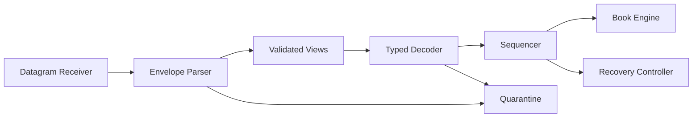

# 개요
Feed handler는 UDP byte를 C++ structure로 바꾸는 함수 하나가 아니다. 신뢰할 수 없는 datagram을 받아 protocol boundary를 검증하고, lifetime이 제한된 byte view를 안전한 typed event로 바꾸며, 검증된 sequence만 downstream에 전달하는 component다.
```text
UDP Datagram
  → Packet Envelope
  → Validated Message Views
  → Typed Event Batch
  → Sequencer
  → Order Book
```
이 경로에서 앞 단계의 책임이 뒤 단계로 새면 오류 원인을 분리하기 어렵다.
```text
Parser가 book을 수정한다.
Decoder가 gap을 임의로 건너뛴다.
Book이 raw buffer를 오래 보관한다.
Logger가 malformed packet 때문에 hot path를 막는다.
```
이 글은 transport와 recovery 이론을 다시 설명하지 않는다. 그 내용은 선수 글에 맡기고, 실제 feed-handler component의 interface, bounded storage, validation 순서와 test contract에 집중한다.

> Wire layout, message type, field width와 session 정책의 최종 기준은 연결할 venue의 최신 specification이다. 아래 코드는 Nasdaq protocol 일부를 참고한 학습용 subset이지 호환 구현이 아니다.

# 학습 위치

| 항목 | 내용 |
| --- | --- |
| BFS Level | Level 2-P → Level 3-MD — Binary Protocol에서 독립 Market Data Component로 연결 |
| 엄격한 선수 글 | [[Low Latency Trading] Market Data Sequence와 Gap Recovery](/posts/low-latency-market-data-sequencing/) |
| 엄격한 선수 글 | [[Low Latency Trading] Hot Path를 위한 Modern C++ 설계 원칙](/posts/low-latency-cpp-hot-path/) |
| 보강 글 | [[Computer Architecture] Endianness와 Alignment](/posts/endianness-alignment/) |
| 보강 글 | [[Low Latency Trading] Market Data가 NIC에서 Application까지 오는 길](/posts/low-latency-network-path/) |
| 다음 글 | [[Low Latency Trading] L2·L3 Order Book Reconstruction Engine](/posts/low-latency-order-book-engine/) |

완료 기준은 다음 한 문장으로 요약할 수 있다.

> 정상 packet은 allocation 없이 typed event로 만들고, malformed·unknown·overflow input은 book을 한 번도 수정하지 않은 채 bounded하게 격리할 수 있는가?

# 1. Component의 경계를 먼저 고정한다
한 component가 모든 일을 하면 빠른 prototype은 만들 수 있지만 검증 가능한 system은 만들기 어렵다.


| 단계 | 입력 | 출력 | 하지 않는 일 |
| --- | --- | --- | --- |
| Receiver | NIC/socket completion | Datagram + metadata | Payload 의미 해석 |
| Envelope parser | Byte span | 검증된 message view batch | Domain event 적용 |
| Decoder | Message view | 값으로 소유한 typed event | Sequence gap 복구 |
| Sequencer | Session + sequence + event | Contiguous event | Raw byte offset 해석 |
| Book | Ordered typed event | 새 book state | UDP와 session 처리 |
| Quarantine | 오류 metadata + 제한된 bytes | 진단 record | 동기 disk I/O |

이 분리는 성능을 포기하는 layer cake가 아니다. 각 단계가 작은 value와 `std::span`을 전달하고 compiler가 inline할 수 있게 만들면 책임을 유지하면서도 call overhead를 측정하고 줄일 수 있다.
# 2. Datagram contract
Receiver가 parser에 넘길 값은 payload pointer 하나가 아니다.
```text
data pointer
received length
buffer capacity
RX queue 또는 channel
source endpoint
receive timestamp
truncation flag
buffer ownership token 또는 generation
```
`recvmsg()`에서 `MSG_TRUNC`가 관찰되거나 completion metadata가 buffer보다 큰 packet을 보고하면 payload를 parse하지 않는다. Kernel이나 NIC가 checksum을 검사했다는 사실도 application-level length와 enum이 올바르다는 뜻은 아니다. Receiver는 source address와 destination channel mapping도 configuration과 대조해야 한다. 잘못된 source를 같은 sequence stream으로 섞으면 syntactically valid한 packet도 state를 오염시킬 수 있다.
```cpp
struct DatagramView {
    std::span<const std::byte> bytes; std::uint32_t channel; std::uint32_t source_id;
    std::uint64_t rx_timestamp; std::uint64_t buffer_generation; bool truncated; };
```
이 structure는 buffer를 소유하지 않는다. 그 사실이 type 이름과 API 문서에 드러나야 한다.
# 3. Packet envelope와 application message를 분리한다
MoldUDP64 같은 transport envelope와 ITCH 같은 application payload는 서로 다른 specification이다.
```text
MoldUDP64 envelope
  Session
  First Sequence
  Message Count
  Repeated [Length + Message Data]
ITCH message data
  Message Type
  Stock Locate
  Timestamp
  Type-specific fields
```
Transport field가 big-endian이라고 payload의 모든 field까지 같은 규칙이라고 추측하면 안 된다. MoldUDP64 specification도 envelope의 number field가 big-endian이라고 명시하면서 Message Data의 형식은 상위 application이 정한다고 분리한다. Parser configuration은 최소한 다음 identity를 고정한다.
```text
venue
feed product
transport version
application version
channel
session policy
maximum datagram size
maximum messages per datagram
```
Packet 안에 version field가 없을 수 있다. 그 경우 배포 설정과 session handshake가 version contract이며, decoder가 “길이가 비슷하니 아마 같은 버전”이라고 추측해서는 안 된다.
# 4. 검증 순서는 작은 것에서 큰 것으로 간다
안전한 parser는 pointer를 움직이기 전에 남은 길이를 확인한다.
```text
1. Receiver metadata와 truncation 확인
2. 최소 envelope 길이 확인
3. 고정 header field 읽기
4. control count와 message count 정책 확인
5. sequence range overflow 확인
6. 모든 [length + payload] boundary 확인
7. trailing byte 정책 확인
8. 각 application message의 exact length와 enum 확인
9. 전체 typed batch가 성공한 뒤 sequencer 호출
```
`offset + length <= size`는 `offset + length` 자체가 overflow할 수 있다. 다음 형태를 선호한다.
```cpp
if (length > size - offset) {
    return ParseError::Truncated;
}
```
단, 먼저 `offset <= size`라는 invariant를 유지해야 한다.
# 5. Endianness와 alignment
Wire buffer를 packed C++ struct로 `reinterpret_cast`하면 여러 규칙을 한 번에 가정한다.
```text
주소 alignment가 충분하다.
Compiler padding이 wire layout과 같다.
Host와 wire byte order가 같다.
Object lifetime이 시작됐다.
Buffer가 structure 전체보다 길다.
```
Network input에서는 이 가정을 사용하지 않는다. Byte span에서 명시적으로 big-endian 값을 조립하거나, 길이 검증 뒤 `memcpy`하고 byte order를 변환한다. Unaligned load가 동작하는 x86에서도 page boundary, sanitizer, 다른 architecture와 C++ object model 문제는 남는다.
# 6. 범위를 소유하는 Cursor
아래 `Cursor`는 성공한 read만 position을 전진시킨다.
```cpp
#include <algorithm>
#include <array>
#include <cstddef>
#include <cstdint>
#include <limits>
#include <span>
class Cursor {
public:
    explicit Cursor(std::span<const std::byte> bytes) noexcept
        : bytes_{bytes} {}
    [[nodiscard]] std::size_t remaining() const noexcept {
        return bytes_.size() - position_;
    }
    bool take(std::size_t size,
              std::span<const std::byte>& out) noexcept {
        if (size > remaining()) {
            return false;
        }
        out = bytes_.subspan(position_, size); position_ += size; return true;
    }
    bool read_be16(std::uint16_t& out) noexcept {
        std::span<const std::byte> field; if (!take(2, field)) return false;
        out = (std::uint16_t(std::to_integer<unsigned>(field[0])) << 8) |
              std::uint16_t(std::to_integer<unsigned>(field[1])); return true;
    }
    bool read_be64(std::uint64_t& out) noexcept {
        std::span<const std::byte> field; if (!take(8, field)) return false; std::uint64_t value = 0;
        for (const auto byte : field) {
            value = (value << 8) |
                    std::to_integer<unsigned>(byte);
        }
        out = value; return true;
    }
private:
    std::span<const std::byte> bytes_; std::size_t position_{}; };
```
`remaining()`의 뺄셈이 안전한 이유는 `position_ <= bytes_.size()`를 `take()`가 항상 보존하기 때문이다. 이 invariant도 unit test와 fuzz target의 assertion으로 둔다.
# 7. Allocation-free bounded batch
Datagram 하나에 들어올 message 수의 상한을 compile-time 또는 session configuration으로 정한다.
```cpp
constexpr std::size_t MAX_MESSAGES = 128;
template <typename T, std::size_t Capacity>
struct FixedBatch {
    std::array<T, Capacity> values{}; std::size_t size{};
    bool push(const T& value) noexcept {
        if (size == Capacity) return false; values[size++] = value; return true;
    }
    std::span<const T> view() const noexcept {
        return std::span<const T>{values.data(), size};
    }
};
```
상한을 둔다는 것은 큰 packet을 조용히 자른다는 뜻이 아니다. Limit를 넘는 packet 전체를 거절하고 stream을 specification의 recovery policy로 전환한다. 상한은 실제 venue maximum, MTU/jumbo-frame 설정과 운영 여유를 근거로 정한다.
# 8. 학습용 envelope parser
다음 예시는 MoldUDP64 형태를 참고한다.
```cpp
enum class PacketKind : std::uint8_t {
    Data,
    Heartbeat,
    EndSession
};
enum class ParseError : std::uint8_t {
    None,
    Truncated,
    TooManyMessages,
    SequenceOverflow,
    TrailingBytes
};
struct SessionId {
    std::array<std::byte, 10> bytes{}; };
struct MessageView {
    std::uint64_t sequence{}; std::span<const std::byte> payload; };
struct PacketEnvelope {
    PacketKind kind{}; SessionId session{}; std::uint64_t first_sequence{};
    FixedBatch<MessageView, MAX_MESSAGES> messages{}; };
ParseError parse_envelope(std::span<const std::byte> datagram,
                          PacketEnvelope& out) noexcept {
    PacketEnvelope candidate{}; Cursor cursor{datagram}; std::span<const std::byte> session;
    std::uint16_t count{};
    if (!cursor.take(10, session) ||
        !cursor.read_be64(candidate.first_sequence) ||
        !cursor.read_be16(count)) {
        return ParseError::Truncated;
    }
    std::copy(session.begin(), session.end(),
              candidate.session.bytes.begin());
    if (count == 0 || count == 0xFFFFu) {
        candidate.kind = count == 0
            ? PacketKind::Heartbeat
            : PacketKind::EndSession;
        if (cursor.remaining() != 0) {
            return ParseError::TrailingBytes;
        }
        out = candidate; return ParseError::None;
    }
    candidate.kind = PacketKind::Data;
    if (count > MAX_MESSAGES) {
        return ParseError::TooManyMessages;
    }
    if (candidate.first_sequence >
        std::numeric_limits<std::uint64_t>::max() - (count - 1)) {
        return ParseError::SequenceOverflow;
    }
    for (std::uint16_t i = 0; i < count; ++i) {
        std::uint16_t length{}; std::span<const std::byte> payload;
        if (!cursor.read_be16(length) ||
            !cursor.take(length, payload)) {
            return ParseError::Truncated;
        }
        if (!candidate.messages.push(MessageView{
                .sequence = candidate.first_sequence + i,
                .payload = payload})) {
            return ParseError::TooManyMessages;
        }
    }
    if (cursor.remaining() != 0) {
        return ParseError::TrailingBytes;
    }
    out = candidate; return ParseError::None;
}
```
Local `candidate`를 완성한 뒤에만 `out`에 대입하므로 실패한 packet의 앞부분 view가 호출자에게 새 결과처럼 보이지 않는다. MoldUDP64는 zero-length Message Data도 표현할 수 있다. 따라서 transport parser가 `length == 0`을 보편적으로 금지하지 않고, 상위 application profile이 허용 여부를 판단한다. Sequence wrap과 reset 정책도 transport별로 다르다. 위 예시는 64-bit range overflow를 거절하는 학습 정책일 뿐이다.
# 9. Borrowed view의 lifetime
`MessageView::payload`는 원본 datagram storage를 빌린다.
```text
RX slot generation 41
  → DatagramView
  → PacketEnvelope
  → MessageView
RX slot이 generation 42로 재사용됨
  → 이전 MessageView는 더 이상 유효하지 않음
```
Envelope를 queue에 복사해도 span이 가리키는 bytes는 복사되지 않는다. 다음 중 하나를 명시적으로 선택한다. 1. 같은 callback 안에서 decode를 끝내고 view를 저장하지 않는다. 2. RX buffer ownership을 consumer에게 넘기고 반환 protocol을 둔다. 3. 필요한 field를 preallocated owned event로 복사한다. 4. Fixed-size packet slab의 reference count를 쓰되 비용과 종료를 측정한다. 이 글의 기본 설계는 1번과 3번이다. Typed event는 scalar와 fixed-size array를 값으로 소유하며 downstream에 `string_view`나 packet span을 넘기지 않는다.
# 10. Typed event는 protocol byte와 분리한다
학습용 event는 다음처럼 표현할 수 있다.
```cpp
enum class Side : std::uint8_t { Buy, Sell };
enum class EventKind : std::uint8_t {
    Add,
    Execute,
    Cancel,
    Delete,
    Replace
};
struct MarketEvent {
    EventKind kind{}; std::uint16_t instrument{}; std::uint64_t order_id{}; std::uint64_t new_order_id{};
    std::uint32_t quantity{}; std::uint32_t price_raw{}; Side side{}; };
struct SequencedEvent {
    std::uint64_t sequence{}; MarketEvent event{}; };
```
`price_raw`는 display price나 tick index가 아니다. Protocol scale을 보존한 값이며 book에 들어가기 전에 instrument definition으로 변환·검증한다. Replace에 side가 wire에 없으면 decoder가 임의 기본값을 의미 있게 사용해서는 안 된다. Book은 original order에서 보존해야 할 field를 찾거나, decoder와 enrichment 단계가 명시적인 optional field contract를 제공한다.
# 11. Exact length와 enum을 함께 검사한다
ITCH 5.0의 특정 message를 참고한 학습용 subset은 다음과 같은 table-driven profile을 둘 수 있다.

| Type | 학습 event | Expected bytes | 핵심 field |
| --- | --- | ---: | --- |
| `A` | Add | 36 | order, side, shares, price |
| `E` | Execute | 31 | order, executed shares |
| `X` | Cancel | 23 | order, canceled shares |
| `D` | Delete | 19 | order |
| `U` | Replace | 35 | old/new order, shares, price |

이 table은 ITCH 5.0 subset에만 해당한다. Attributed Add, execution price, trade, cross와 administrative message는 별도 type이다.
```cpp
bool be32_at(std::span<const std::byte> bytes,
             std::size_t offset,
             std::uint32_t& out) noexcept {
    if (offset > bytes.size() || bytes.size() - offset < 4) {
        return false;
    }
    out = 0;
    for (std::size_t i = 0; i < 4; ++i) {
        out = (out << 8) |
              std::to_integer<unsigned>(bytes[offset + i]);
    }
    return true;
}
bool be64_at(std::span<const std::byte> bytes,
             std::size_t offset,
             std::uint64_t& out) noexcept {
    if (offset > bytes.size() || bytes.size() - offset < 8) {
        return false;
    }
    out = 0;
    for (std::size_t i = 0; i < 8; ++i) {
        out = (out << 8) |
              std::to_integer<unsigned>(bytes[offset + i]);
    }
    return true;
}
```
Offset helper도 먼저 subtraction으로 범위를 검사한다.
# 12. Decoder의 성공은 all-or-nothing이다
```cpp
enum class DecodeError : std::uint8_t {
    None,
    EmptyMessage,
    UnsupportedType,
    WrongLength,
    InvalidSide,
    InvalidQuantity,
    InvalidField
};
DecodeError decode_one(const MessageView& message,
                       SequencedEvent& out) noexcept {
    const auto bytes = message.payload; if (bytes.empty()) return DecodeError::EmptyMessage;
    const char type = static_cast<char>(
        std::to_integer<unsigned char>(bytes[0])); MarketEvent event{}; std::uint32_t quantity{};
    if (bytes.size() >= 3) {
        event.instrument =
            (std::uint16_t(std::to_integer<unsigned>(bytes[1])) << 8) |
             std::uint16_t(std::to_integer<unsigned>(bytes[2]));
    }
    switch (type) {
    case 'A': {
        if (bytes.size() != 36) return DecodeError::WrongLength;
        if (!be64_at(bytes, 11, event.order_id) ||
            !be32_at(bytes, 20, quantity) ||
            !be32_at(bytes, 32, event.price_raw)) {
            return DecodeError::InvalidField;
        }
        const char side = static_cast<char>(
            std::to_integer<unsigned char>(bytes[19]));
        if (side != 'B' && side != 'S') {
            return DecodeError::InvalidSide;
        }
        if (quantity == 0) return DecodeError::InvalidQuantity; event.kind = EventKind::Add;
        event.quantity = quantity; event.side = side == 'B' ? Side::Buy : Side::Sell; break;
    }
    case 'E':
    case 'X': {
        const std::size_t expected = type == 'E' ? 31 : 23;
        if (bytes.size() != expected) return DecodeError::WrongLength;
        if (!be64_at(bytes, 11, event.order_id) ||
            !be32_at(bytes, 19, quantity)) {
            return DecodeError::InvalidField;
        }
        if (quantity == 0) return DecodeError::InvalidQuantity;
        event.kind = type == 'E'
            ? EventKind::Execute
            : EventKind::Cancel; event.quantity = quantity; break;
    }
    case 'D':
        if (bytes.size() != 19 ||
            !be64_at(bytes, 11, event.order_id)) {
            return DecodeError::WrongLength;
        }
        event.kind = EventKind::Delete; break;
    case 'U':
        if (bytes.size() != 35) return DecodeError::WrongLength;
        if (!be64_at(bytes, 11, event.order_id) ||
            !be64_at(bytes, 19, event.new_order_id) ||
            !be32_at(bytes, 27, event.quantity) ||
            !be32_at(bytes, 31, event.price_raw)) {
            return DecodeError::InvalidField;
        }
        if (event.quantity == 0) return DecodeError::InvalidQuantity; event.kind = EventKind::Replace;
        break;
    default:
        return DecodeError::UnsupportedType;
    }
    out = SequencedEvent{
        .sequence = message.sequence,
        .event = event
    }; return DecodeError::None;
}
```
이 코드는 지원하지 않는 type을 skip하지 않는다. Production profile은 해당 feed의 모든 필수 type과 exact length를 table로 관리해야 한다. `D`에서 field helper 실패를 `WrongLength`로 합친 것은 학습 코드의 단순화이며 운영 metric은 원인을 더 세분화할 수 있다.
# 13. Parse-before-mutate
Datagram의 마지막 message가 truncated인데 첫 message를 이미 book에 반영하면 network frame의 부분 성공이 된다.
```text
Message 1 valid
Message 2 valid
Message 3 truncated
```
먼저 envelope 전체의 boundary를 검증하고, 모든 message를 typed batch로 decode한다.
```cpp
using EventBatch = FixedBatch<SequencedEvent, MAX_MESSAGES>;
DecodeError decode_batch(const PacketEnvelope& packet,
                         EventBatch& out) noexcept {
    EventBatch candidate{};
    for (const auto& view : packet.messages.view()) {
        SequencedEvent event{}; const auto error = decode_one(view, event);
        if (error != DecodeError::None) return error;
        if (!candidate.push(event)) {
            return DecodeError::InvalidField;
        }
    }
    out = candidate; return DecodeError::None;
}
```
`decode_batch()`가 성공하기 전에는 sequencer를 호출하지 않는다. 그 이후에는 sequence가 protocol의 논리적 commit 단위다. Book event 100을 정상 적용한 뒤 event 101에서 domain invariant가 실패했다면 100까지의 commit은 유효할 수 있다. 이 경우 101에서 stream을 stale/failed로 바꾸며, datagram 전체를 무조건 rollback하는 규칙을 임의로 만들지 않는다.
# 14. Unknown type과 version mismatch
Unknown type은 세 경우를 구분한다.
```text
현재 version에서 정말 정의되지 않은 byte
지원 구현이 아직 빠뜨린 필수 type
새 protocol version의 정상 type
```
세 경우 모두 generic parser가 길이를 추측해 skip해서는 안 된다. Self-describing extension이고 specification이 unknown type skip을 명시할 때만 그 규칙을 profile에 넣는다. 고정 길이 type stream에서 unknown byte는 message boundary를 잃었다는 신호일 수도 있다. 권장 정책은 다음과 같다.
```text
reject current batch
mark affected stream non-LIVE
record session, sequence, type와 payload hash
rate-limited alert
verify deployed protocol version
recover according to venue rules
```
# 15. Session과 control packet
Heartbeat는 빈 data packet과 같지 않다. MoldUDP64에서 count `0`은 heartbeat이고 `0xFFFF`는 end of session이며, header sequence는 다음 expected sequence를 전달한다. Feed handler는 이를 typed control event로 sequencer에 넘기거나 별도 control method를 호출한다.
```text
on_heartbeat(session, next_sequence)
on_end_session(session, next_sequence)
on_data(session, event_batch)
```
예상하지 못한 session 변경에서 old book을 새 session의 LIVE state로 계속 사용하지 않는다. Session transition, startup snapshot과 next-sequence 계약은 venue specification과 운영 runbook으로 고정한다.
# 16. Gap recovery와의 integration
Gap, duplicate, A/B arbitration과 snapshot splice의 자세한 설명은 선수 글을 따른다. Feed-handler interface에서 중요한 것은 오류 종류를 섞지 않는 것이다.
```text
Parse failure
  → 해당 datagram은 sequence 후보가 될 수 없음
Valid future sequence
  → sequencer가 gap으로 판정
Valid duplicate sequence
  → sequencer가 payload identity를 확인하고 억제
Semantic book failure
  → state corruption으로 recovery escalation
```
Malformed packet의 header에서 읽은 sequence를 무조건 신뢰해 recovery request를 만들면 공격적 input이 잘못된 range를 유발할 수 있다. Session/header가 최소 검증을 통과했는지와 stream의 다른 path에서 같은 gap이 관찰됐는지를 policy에 반영한다.
# 17. Malformed quarantine
오류 packet 전체를 동기 log에 hex dump하면 latency와 disk를 모두 공격할 수 있다. Bounded quarantine record를 사용한다.
```cpp
constexpr std::size_t QUARANTINE_PREFIX = 96;
struct QuarantineRecord {
    std::uint64_t rx_timestamp{}; std::uint64_t observed_sequence{}; std::uint32_t channel{};
    std::uint16_t received_size{}; std::uint16_t copied_size{}; ParseError parse_error{};
    DecodeError decode_error{}; std::array<std::byte, QUARANTINE_PREFIX> prefix{}; };
```
Record에는 다음을 함께 둔다.

- source와 channel identity
- session의 안전하게 읽힌 prefix 또는 hash
- parse/decode error code와 byte offset
- 실제 길이와 capture한 길이
- receive timestamp와 buffer generation
- binary hash와 build/protocol version

Quarantine ring이 full이면 hot path를 block하지 않는다. `quarantine_dropped` counter를 증가시키고 stream safety policy를 실행한다. 원본 packet 보존이 규제나 진단에 필요하면 별도 capture path의 capacity와 privacy policy를 설계한다.
# 18. Backpressure는 UDP publisher를 늦추지 못한다
TCP service처럼 consumer가 느리다고 exchange multicast publisher가 기다려 주지 않는다. 내부 queue가 full일 때 가능한 결과를 미리 고른다.

| 상황 | 금지할 반응 | 명시적 정책 예 |
| --- | --- | --- |
| Event queue full | 무한 blocking | stale 전환 후 recovery |
| Recovery buffer full | 오래된 future event 무작위 제거 | snapshot escalation |
| Quarantine full | hot-path file write | counter + bounded drop |
| Metrics queue full | book event drop으로 위장 | metric loss 별도 계수 |

Backpressure 정책은 queue별로 다르다. Market-data loss와 진단-log loss는 같은 위험도가 아니다. Fixed capacity는 평균 packet 크기가 아니라 burst, scheduler delay와 recovery 시간을 기준으로 정하고 soak test로 검증한다.
# 19. Hot-path metric
Metric 자체도 allocation과 high-cardinality string을 만들지 않아야 한다.
```text
datagrams_received{channel,path}
bytes_received
packets_truncated
envelope_parse_error{reason}
decode_error{type,reason}
unsupported_type
session_change
events_decoded
batch_size histogram
parse_cycles histogram
decode_cycles histogram
event_queue_depth
event_queue_full
quarantine_written
quarantine_dropped
last_valid_sequence
last_seen_sequence
```
모든 symbol과 order ID를 metric label로 쓰면 cardinality가 폭발한다. 상세 identity는 bounded diagnostic record에 두고 metric은 channel과 error class 수준으로 제한한다. Counter publish와 formatting은 다른 thread가 수행할 수 있다.
# 20. Golden packet test
Specification에서 정상 packet을 작은 byte fixture로 만든다. 최소 fixture는 다음과 같다.
```text
한 message data packet
여러 message data packet
heartbeat
end of session
zero-length transport message
최대 허용 count와 length
Add / Execute / Cancel / Delete / Replace
지원되는 모든 enum 값
```
Golden test는 결과 event만 비교하지 않는다.
```text
consumed byte count
message sequence range
session bytes
typed field 값
allocation count
input buffer 불변성
failure 시 out object 불변성
```
실제 production capture를 fixture로 사용할 때는 license, 민감 정보와 재배포 범위를 확인한다.
# 21. Negative packet matrix
모든 field boundary의 앞과 뒤를 잘라 본다.

| 입력 | 기대 결과 |
| --- | --- |
| 0~19 byte envelope | `Truncated`, downstream 호출 0회 |
| Count가 capacity + 1 | `TooManyMessages` |
| First sequence + count overflow | `SequenceOverflow` |
| Length prefix 1 byte만 존재 | `Truncated` |
| Length가 remaining보다 큼 | `Truncated` |
| 마지막 뒤 trailing byte | profile에 따라 reject |
| 알려진 type의 길이 ±1 | `WrongLength` |
| Add side가 `B/S` 아님 | `InvalidSide` |
| Quantity zero | application profile에 따라 reject |
| Unknown type | batch reject + version alert |
| Receiver `MSG_TRUNC` | parser 호출 전 reject |
| Quarantine full | nonblocking counter 증가 |

각 실패에서 book state, sequencer expected와 output batch가 바뀌지 않았음을 검사한다.
# 22. Fuzzing
Fuzzer entry point는 raw byte array와 length를 그대로 parser에 준다.
```text
arbitrary bytes
  → parse_envelope
  → 성공한 경우 decode_batch
  → invariant assertion
```
검사할 property는 다음과 같다. 1. ASan·UBSan error가 없다. 2. 실행 시간이 input length에 대해 bounded하다. 3. Loop 횟수는 declared count와 capacity를 넘지 않는다. 4. 성공하면 모든 view가 datagram 범위 안에 있다. 5. 성공한 message sequence는 overflow 없이 연속한다. 6. 실패하면 sequencer와 book 호출 횟수는 0이다. 7. 같은 bytes는 같은 result와 error offset을 만든다. Random bytes만으로 깊은 valid path에 도달하기 어렵다. Golden packet corpus, length/count dictionary와 structure-aware mutator를 함께 사용한다. Checksum이나 network header까지 fuzz할지, UDP payload부터 fuzz할지도 target을 나눠야 한다.
# 23. Parse와 apply를 한 함수로 숨기지 않는다
Top-level handler는 책임을 눈에 보이게 연결한다.
```cpp
void FeedHandler::on_datagram(const DatagramView input) noexcept {
    ++metrics_.datagrams_received;
    if (input.truncated || !source_allowed(input)) {
        quarantine_receiver_error(input); enter_recovery_if_required(); return;
    }
    PacketEnvelope packet{}; const auto parse_error = parse_envelope(input.bytes, packet);
    if (parse_error != ParseError::None) {
        quarantine_parse_error(input, parse_error); enter_recovery_if_required(); return;
    }
    if (packet.kind != PacketKind::Data) {
        sequencer_.on_control(packet.kind,
                              packet.session,
                              packet.first_sequence); return;
    }
    EventBatch events{}; const auto decode_error = decode_batch(packet, events);
    if (decode_error != DecodeError::None) {
        quarantine_decode_error(input, packet, decode_error); enter_recovery_if_required(); return;
    }
    sequencer_.on_valid_batch(packet.session, events.view());
}
```
실제 `enter_recovery_if_required()`는 모든 parse error에서 같은 행동을 하지 않을 수 있다. 예를 들어 잘못된 source의 packet은 active stream loss 증거가 아니며, active path의 truncated packet은 실제 missing sequence 가능성이 있다. 정책 table로 결정하고 오류 handler 안에 추측을 흩뿌리지 않는다.
# 24. Allocation-free를 검증하는 방법
Source에 `new`가 없다는 검사만으로 부족하다.
```text
std::vector growth
std::string construction
unordered_map insertion
exception allocation
logger formatting
shared_ptr control block
thread-local 첫 초기화
```
다음을 함께 사용한다.

- Warm-up 뒤 allocator hook의 allocation count
- Fixed capacity의 compile-time와 runtime assertion
- Queue full과 quarantine full test
- Exception을 사용하지 않는 hot-path error return
- Representative burst에서 stack size와 object size 확인
- Sanitizer build와 optimized build의 별도 test

Allocation-free는 전체 process가 아니라 측정 경계의 계약이다. Configuration load, startup table build와 offline reporting은 다른 phase로 분리한다.
# 25. Baseline benchmark
Correctness corpus를 통과한 뒤 성능을 측정한다.
```text
Input
  fixed packet corpus를 memory에서 반복
  packet-size와 messages-per-packet matrix
Output
  packets/s
  messages/s
  cycles/packet
  cycles/message
  p50/p99/p99.9 parse latency
  branch miss와 cache miss
  allocation count
```
Compiler가 결과를 제거하지 못하게 event checksum을 observable sink에 누적한다. 같은 packet 한 개만 반복하면 branch predictor와 cache에 지나치게 유리하다. 정상 type mix, malformed rate, channel interleave와 burst를 별도 scenario로 둔다. Receiver와 parser만 재는 benchmark, sequencer까지 포함한 benchmark, book까지 포함한 end-to-end benchmark를 분리한다.
# 26. Component invariant
다음 조건을 debug build와 test에서 검사한다.
```text
1. Cursor position은 항상 input size 이하다.
2. 모든 MessageView는 원본 datagram 안에 있다.
3. Batch size는 compile-time capacity 이하다.
4. Sequence 계산은 overflow하지 않는다.
5. 실패한 batch는 downstream에 한 event도 전달하지 않는다.
6. Typed event는 RX buffer를 참조하지 않는다.
7. Unknown type은 명시된 profile 없이 skip되지 않는다.
8. Quarantine과 metric failure가 hot path를 block하지 않는다.
9. Queue full은 조용한 event loss가 아니라 state transition을 만든다.
10. 같은 input과 config는 같은 event/error sequence를 만든다.
```
Invariant가 깨졌을 때 계속 진행하는 것보다 affected stream을 stale로 막는 편이 안전하다. 정확한 fail-open/fail-closed 범위는 strategy와 risk policy까지 포함해 결정한다.
# 27. 구현 순서
```text
1. Protocol profile과 maximum을 문서화한다.
2. Cursor와 endian helper를 만든다.
3. Envelope golden/negative test를 통과한다.
4. FixedBatch와 borrowed-lifetime contract를 고정한다.
5. Type별 exact-length decoder를 추가한다.
6. Batch all-or-nothing test를 만든다.
7. Sequencer mock으로 gap/duplicate integration을 검증한다.
8. Bounded quarantine와 metric을 연결한다.
9. Fuzz + ASan/UBSan을 실행한다.
10. Allocation count와 latency baseline을 저장한다.
```
Optimization은 이 순서 뒤에 한다. SIMD decode, prefetch와 branch hint는 실제 profile에서 병목이 증명될 때 비교한다.
# 완료 기준
다음 질문에 code와 test로 답할 수 있어야 한다. 1. Datagram metadata와 payload lifetime의 owner는 누구인가? 2. Envelope parser와 application decoder의 책임은 어디서 나뉘는가? 3. `offset + length` 대신 subtraction 기반 bounds check를 쓰는 이유는 무엇인가? 4. Unaligned wire byte를 C++ struct pointer로 읽지 않는 이유는 무엇인가? 5. 전체 packet boundary 검증 전 book mutation을 막는 test가 있는가? 6. Fixed batch capacity를 넘으면 어떤 state로 전환하는가? 7. Borrowed span을 queue에 넘기지 않는다는 것을 어떻게 보장하는가? 8. Unknown type과 protocol version mismatch를 어떻게 구분하고 알리는가? 9. Parse failure와 valid sequence gap은 recovery에서 어떻게 다르게 취급하는가? 10. Malformed flood와 downstream backpressure에서도 memory와 실행 시간이 bounded한가? 11. Golden packet과 fuzz corpus가 모든 message boundary를 검사하는가? 12. Warm-up 뒤 정의한 parse/decode hot path의 allocation이 0회인가?
# 정리
Feed handler의 핵심은 빠른 cast가 아니라 작은 계약의 연속이다.
```text
Borrowed Datagram
  → Metadata 검증
  → Bounds-safe Envelope
  → Bounded Message Views
  → Owned Typed Events
  → Sequence 판정
  → Transactional Book Apply
```
Allocation-free는 무제한 input을 받아 준다는 뜻이 아니다. Capacity, lifetime, unknown-version, quarantine와 queue-full 정책을 명시해야 bounded system이 된다. Parser가 성공했다는 사실은 bytes가 안전하다는 뜻이고, sequencer가 승인했다는 사실은 순서가 맞다는 뜻이며, book apply가 성공했다는 사실은 domain invariant가 유지됐다는 뜻이다. 세 성공 조건을 하나로 섞지 않는 것이 빠르고 복구 가능한 market-data path의 출발점이다.
# 참고 자료

- [Nasdaq TotalView-ITCH 5.0 Specification](https://www.nasdaqtrader.com/content/technicalsupport/specifications/dataproducts/NQTVITCHSpecification.pdf)
- [Nasdaq MoldUDP64 Protocol Specification](https://www.nasdaqtrader.com/content/technicalsupport/specifications/dataproducts/moldudp64.pdf)
- [RFC 768 — User Datagram Protocol](https://www.rfc-editor.org/rfc/rfc768.html)
- [Linux Kernel — Socket Timestamping](https://docs.kernel.org/networking/timestamping.html)
- [C++ Working Draft](https://eel.is/c++draft/)
