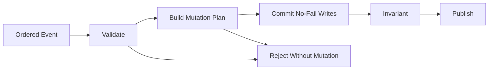
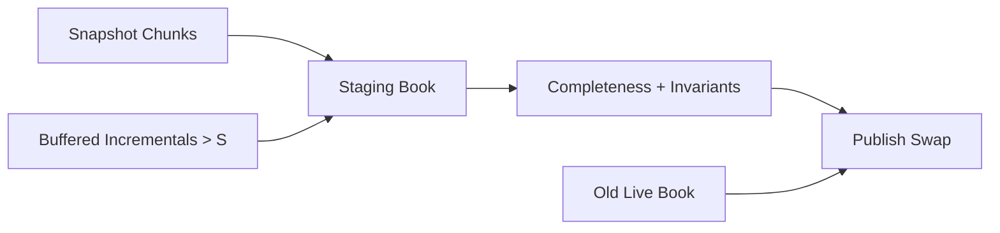

# 개요
Order book reconstruction engine은 순서가 검증된 market-data event를 현재 공개 book state로 바꾸는 component다.
```text
Sequenced Market Event
  → Validate
  → Plan
  → Commit
  → Check Invariant
  → Publish Book View
```
이 component는 exchange matching engine이 아니다. 참가자의 주문을 접수하거나 체결 상대를 결정하지 않고, venue가 공개한 event만 관찰해 표시 가능한 state를 재구성한다. 따라서 다음 값은 같다고 가정할 수 없다.
```text
공개 L3 queue
matching engine 내부 queue
hidden·reserve liquidity를 포함한 전체 interest
내 주문의 실제 fill probability
```
이 글에서는 price-time FIFO를 학습용 contract로 사용하지만, 이를 모든 거래소의 보편적인 matching rule로 일반화하지 않는다.

> Message semantics, priority, tick schedule, hidden interest와 snapshot 연결 규칙의 최종 기준은 대상 venue와 feed의 최신 specification이다.

# 학습 위치

| 항목 | 내용 |
| --- | --- |
| BFS Level | Level 2-M → Level 3-OB — Market-data State에서 독립 Order Book Component로 연결 |
| 엄격한 선수 글 | [[Low Latency Trading] Market Microstructure와 Limit Order Book](/posts/low-latency-market-microstructure/) |
| 엄격한 선수 글 | [[Low Latency Trading] Allocation-Free Binary Parser와 Feed Handler](/posts/low-latency-feed-handler/) |
| 엄격한 선수 글 | [[Low Latency Trading] Market Data Sequence와 Gap Recovery](/posts/low-latency-market-data-sequencing/) |
| 보강 글 | [[Low Latency Trading] Hot Path를 위한 Modern C++ 설계 원칙](/posts/low-latency-cpp-hot-path/) |
| 다음 단계 | [[Low Latency Trading] SPSC Ring Buffer와 Thread-per-Core 설계](/posts/low-latency-spsc-thread-per-core/) |

완료 기준은 다음과 같다.

> 동일한 ordered event log와 snapshot을 replay했을 때 L2·L3 state와 hash가 항상 같고, 잘못된 event는 부분 mutation 없이 거절되는가?

# 1. Reconstruction과 matching을 구분한다
Matching engine은 incoming order와 resting interest를 venue rule로 처리한다. Reconstruction engine은 그 결과로 발행된 market-data event를 적용한다.

| Matching engine | Reconstruction engine |
| --- | --- |
| Order entry를 받음 | Market data를 받음 |
| 실제 priority를 소유 | 공개된 순서를 추정·재구성 |
| Hidden state를 알 수 있음 | Feed가 공개한 state만 앎 |
| Execution을 생성 | Execution event를 반영 |
| Venue 내부 source of truth | Subscriber의 derived state |

Nasdaq TotalView-ITCH의 Add Order message도 새 주문이 displayable book에 추가됐음을 알린다. Feed에 Add가 없는 non-displayed order가 Trade message로 체결될 수 있으므로 ITCH의 모든 trade가 L3 order node를 가진다고 가정하면 안 된다.
# 2. Input contract
Book은 raw packet을 받지 않는다.
```cpp
struct OrderedEvent {
    std::uint64_t session_id; std::uint64_t sequence; MarketEvent event; };
```
호출자는 다음을 보장해야 한다.
```text
Session과 channel이 맞다.
Packet과 message boundary가 검증됐다.
Event field가 protocol type으로 decode됐다.
Sequence가 contiguous하다.
Duplicate는 제거됐다.
Book이 STALE인 동안 live publish가 차단됐다.
```
Book도 이를 맹신해 memory safety를 포기하지는 않지만 UDP gap recovery를 다시 구현하지 않는다. Unknown order와 quantity underflow는 sequencer의 성공 이후 발견되는 domain-state 오류로 분류한다.
# 3. L2와 L3 representation
## 3.1 L2: price-level state
L2는 일반적으로 가격별 aggregate quantity를 표현한다.
```text
Ask
100.20 → 90
100.10 → 40
---------------
 99.90 → 70
 99.80 → 30
Bid
```
최소 level state는 다음과 같다.
```cpp
struct L2Level {
    TickIndex price; std::uint64_t total_quantity; };
```
Price-level feed만 있다면 개별 order ID와 FIFO queue를 복원할 수 없다. Feed가 order count를 별도로 제공할 때만 optional field로 저장하고 aggregate quantity에서 추측하지 않는다. L2 update가 absolute quantity인지 delta인지, delete를 zero로 표현하는지는 feed specification을 따른다.
## 3.2 L3: order-level state
L3 reconstruction은 개별 displayed order를 추적한다.
```text
Price 100.10
  Order 501, remaining 20
  Order 508, remaining 15
  Order 512, remaining  5
Level aggregate = 40
```
필요한 관계는 두 개다.
```text
Order ID → Order Node
Price Level → FIFO of Order Nodes
```
L3에서 L2 aggregate를 매 조회마다 다시 합산할 수 있지만, hot path에서는 level total을 함께 유지해 O(1) update와 top-of-book read를 얻을 수 있다. 그 대신 node remaining과 level total이 어긋날 수 있으므로 invariant가 필요하다.
# 4. Price는 fixed-point contract다
Protocol raw price, display decimal과 internal tick index를 구분한다.
```text
Protocol raw price = 1,001,000
Protocol scale     = 4
Display price      = 100.1000
Tick size raw      = 100
Tick index         = instrument range 안의 정수 index
```
Binary floating-point를 price key로 쓰지 않는다. 같아야 할 가격이 다른 bit pattern이 되거나 tick validation이 모호해질 수 있다.
```cpp
#include <cstdint>
#include <limits>
#include <optional>

struct TickIndex {
    std::uint32_t value{}; friend bool operator==(TickIndex, TickIndex) = default; };
struct InstrumentDefinition {
    std::int64_t minimum_raw{}; std::int64_t maximum_raw{}; std::uint64_t tick_raw{};
    std::uint32_t maximum_tick_index{}; };
std::optional<TickIndex> to_tick_index(
    std::int64_t raw,
    const InstrumentDefinition& definition) noexcept {
    if (definition.tick_raw == 0 ||
        raw < definition.minimum_raw ||
        raw > definition.maximum_raw) {
        return std::nullopt;
    }
    const auto delta = static_cast<std::uint64_t>(raw) -
                       static_cast<std::uint64_t>(
                           definition.minimum_raw);
    if (delta % definition.tick_raw != 0) {
        return std::nullopt;
    }
    const auto index = delta / definition.tick_raw;
    if (index > definition.maximum_tick_index) {
        return std::nullopt;
    }
    return TickIndex{static_cast<std::uint32_t>(index)};
}
```
Signed 값을 unsigned로 변환한 뺄셈은 modulo arithmetic을 이용하며 `raw >= minimum_raw` 조건에서 차이를 표현한다. Production code는 configuration load 시 전체 range와 index width가 표현 가능한지도 검증한다. 가격 구간별 tick이 달라지는 venue에는 이 단일 tick mapping을 쓰면 안 된다. Piecewise tick table과 effective-date가 필요하다. 음수 가격이 가능한 상품도 있으므로 “price는 항상 양수”를 전역 invariant로 두지 않는다.
# 5. Side ordering
Bid와 ask의 better price 방향은 반대다.
```text
Bid: 큰 tick index가 better
Ask: 작은 tick index가 better
```
```cpp
enum class Side : std::uint8_t { Buy, Sell };
bool better(Side side, TickIndex lhs, TickIndex rhs) noexcept {
    return side == Side::Buy
        ? lhs.value > rhs.value
        : lhs.value < rhs.value;
}
```
Best price가 없을 수 있으므로 sentinel price를 정상 값처럼 사용하지 않는다.
```cpp
class BookTop {
public:
    std::optional<TickIndex> best_bid() const noexcept;
    std::optional<TickIndex> best_ask() const noexcept;
};
```
Locked/crossed state를 무조건 corruption으로 처리할지도 feed와 market phase를 기준으로 결정한다.
# 6. Core data model
Fixed-capacity 학습 skeleton은 stable integer handle을 사용한다.
```cpp
constexpr std::uint32_t NONE =
    std::numeric_limits<std::uint32_t>::max();
struct OrderHandle {
    std::uint32_t slot{}; std::uint32_t generation{}; };
struct OrderNode {
    std::uint64_t order_id{}; TickIndex price{}; std::uint64_t remaining{};
    std::uint32_t level_slot{NONE}; std::uint32_t previous{NONE}; std::uint32_t next{NONE};
    std::uint32_t generation{}; Side side{}; bool live{}; };
struct PriceLevel {
    TickIndex price{}; std::uint64_t total_quantity{}; std::uint32_t head{NONE}; std::uint32_t tail{NONE};
    std::uint32_t order_count{}; Side side{}; bool live{}; };
```
Pointer 대신 slot과 generation을 쓰면 preallocated array 이동이 없고 stale handle을 검출하기 쉽다. Generation wrap과 process restart 정책도 정해야 한다. 외부 consumer가 internal handle을 영구 identity로 저장하지 않게 한다.
# 7. Per-order index
Modify event는 order ID로 node를 찾아야 한다. 전체 node array를 매번 scan하면 active order 수에 비례한다.
```text
Order ID
  → fixed-capacity open-addressing index
  → {slot, generation}
  → OrderNode
```
Index entry는 empty, occupied와 tombstone을 구분한다. Order ID `0`을 empty sentinel로 쓰면 protocol이 0을 허용할 때 충돌하므로 state byte를 별도로 둔다.
```cpp
enum class EntryState : std::uint8_t {
    Empty,
    Occupied,
    Tombstone
};
struct IndexEntry {
    std::uint64_t order_id{}; OrderHandle handle{}; EntryState state{EntryState::Empty}; };
```
Open addressing은 allocation이 없고 locality가 좋지만 load factor와 tombstone이 커지면 probe가 길어진다. Maximum probe length, rebuild window와 full policy를 metric으로 관리한다. Index full에서 linear scan fallback으로 조용히 latency contract를 바꾸지 않는다.
# 8. Price-level index
Level lookup에는 여러 선택지가 있다.

| 구조 | 장점 | 비용·제약 |
| --- | --- | --- |
| Dense array by tick | O(1), locality 좋음 | 넓고 sparse한 range에 memory 낭비 |
| Dense array + bitmap | best 탐색 가속 | bit scan과 range 설계 필요 |
| Flat sorted vector | level 수가 작을 때 compact | insert 시 이동 |
| Balanced tree | sparse range와 ordered query | pointer/cache miss와 allocation 관리 |
| Hash + best tracker | average O(1) update | best 삭제 시 다음 price 탐색 필요 |

“항상 array가 빠르다” 또는 “tree가 느리다”로 결론 내리지 않는다. 상품의 price range, active level 수, update mix와 cache footprint를 측정한다. 이 글의 skeleton은 correctness baseline을 위해 fixed level array를 scan한다. Optimized implementation은 differential test를 유지한 채 dense ladder나 별도 index로 교체한다.
# 9. FIFO queue contract
학습 model은 같은 price에서 event arrival order로 FIFO를 만든다.
```text
Add 501 @ 100.10
Add 508 @ 100.10
Add 512 @ 100.10
head → 501 → 508 → 512 ← tail
```
Append는 다음 관계를 한 번에 갱신한다.
```text
old tail.next = new node
new.previous = old tail
new.next = NONE
level.tail = new node
empty였다면 level.head = new node
```
이 queue는 public feed event로 보이는 displayed order 순서다. Hidden, reserve refresh, participant allocation, size/pro-rata와 venue 내부 tie-break를 표현하지 못한다. Queue position을 fill 보장으로 사용하지 않는다.
# 10. Event별 state transition
## 10.1 Add
Add 전 precondition은 다음과 같다.
```text
Order ID가 index에 없다.
Quantity가 product 범위 안의 양수다.
Price가 유효 tick이다.
Order node capacity가 남아 있다.
Level이 있거나 새 level capacity가 남아 있다.
Index insert가 bounded probe 안에서 가능하다.
```
Commit은 node 확보, level append, aggregate 증가와 index insert를 수행한다. 어느 단계도 preflight 뒤 실패하지 않도록 operation을 나눈다. Duplicate Add를 기존 order update로 바꾸지 않는다. 같은 ID의 payload가 달라졌다면 sequence corruption 또는 decoder/version 문제다.
## 10.2 Execute
Nasdaq ITCH의 Order Executed message는 order가 전부 또는 일부 체결됐음을 알리고 executed shares를 제공한다.
```text
new remaining   = old remaining - executed
new level total = old level total - executed
```
`executed > remaining`이면 unsigned subtraction을 먼저 하지 않는다. Underflow를 발견하고 mutation 없이 실패한다. Remaining이 0이면 FIFO와 order index에서 node를 제거한다. Execution With Price의 execution price가 original display price와 다를 수 있다. 그 가격으로 resting node를 다른 level로 이동시키면 안 된다.
## 10.3 Cancel
Partial cancel은 canceled quantity만큼 remaining과 level aggregate를 줄인다.
```text
cancel quantity <= remaining
```
Nasdaq ITCH의 Cancel message는 display size에서 제거되는 share 수를 전달한다. Modify가 누적돼 display shares가 0이 되면 order는 dead state이므로 제거한다는 설명도 specification에 있다. 다른 feed의 Cancel이 “새 remaining quantity”를 전달할 수 있으므로 field 이름만 보고 delta라고 가정하지 않는다.
## 10.4 Delete
Delete는 remaining 전체를 제거한다.
```text
level.total -= order.remaining
unlink order
erase order index
release node
empty level이면 level index에서 제거
```
Delete event에 quantity가 없다고 0만 빼면 aggregate가 남는다.
## 10.5 Replace
Nasdaq ITCH Replace는 original order의 모든 remaining shares가 접근 불가능해졌음을 알리고, 새 order ID, 새 total displayed quantity와 price를 제공한다. Side, stock과 attribution은 original Add에서 유지해야 한다. 학습 engine의 transition은 다음과 같다.
```text
validate old ID exists
validate new ID absent
reserve destination level/index capacity
remove old node from queue and aggregate
erase old ID mapping
reuse or reserve node storage
set new ID, price와 total quantity
append destination FIFO tail
insert new ID mapping
```
이 모든 단계가 하나의 event commit이다. Old delete까지 한 뒤 new insert가 실패한 상태를 외부에 노출하면 안 된다. Replace가 실제 matching priority를 어떻게 바꾸는지는 venue rule을 확인한다. 이 skeleton은 new order reference를 받은 replacement를 destination FIFO tail에 두는 학습 정책을 사용한다.
# 11. Preflight, plan, commit
Event apply 도중 capacity를 발견하면 rollback이 복잡해진다.

Mutation plan은 pointer가 아니라 stable slot을 담는다.
```cpp
struct AddPlan {
    std::uint32_t node_slot{NONE}; std::uint32_t level_slot{NONE}; std::uint32_t index_slot{NONE};
    bool create_level{}; };
```
Preflight 이후 다른 thread가 같은 book을 수정하면 plan이 stale해진다. 따라서 기본 owner는 single writer이며, reader publish는 snapshot/view boundary로 분리한다. 여러 writer lock을 추가하는 것보다 event stream partition과 ownership을 먼저 설계한다.
# 12. 학습용 C++20 apply skeleton
다음 코드는 container 세부 구현을 생략하고 transactional ordering을 보여준다.
```cpp
enum class ApplyError : std::uint8_t {
    None,
    DuplicateOrder,
    InvalidIdentity,
    UnknownOrder,
    InvalidPrice,
    InvalidQuantity,
    QuantityUnderflow,
    CapacityExceeded,
    SideMismatch,
    InstrumentMismatch,
    InvariantFailure
};
struct AddEvent {
    std::uint64_t order_id{}; std::int64_t price_raw{}; std::uint64_t quantity{}; Side side{}; };
struct ReduceEvent {
    std::uint64_t order_id{}; std::uint64_t quantity{}; };
struct ReplaceEvent {
    std::uint64_t old_order_id{}; std::uint64_t new_order_id{}; std::int64_t new_price_raw{};
    std::uint64_t new_quantity{}; };
enum class ReductionKind : std::uint8_t { Execution, Cancellation };
using MutationPlan = std::uint32_t;
struct FixedOrderIndex {
    bool contains(std::uint64_t) const noexcept;
    std::optional<OrderHandle> find(std::uint64_t) const noexcept;
};
struct FixedNodePool {
    const OrderNode& checked(OrderHandle) const noexcept;
};
struct FixedLevelStore {
    const PriceLevel& checked(std::uint32_t) const noexcept;
};
class Book {
public:
    ApplyError add(const AddEvent& event) noexcept {
        if (event.quantity == 0) return ApplyError::InvalidQuantity;
        if (orders_.contains(event.order_id)) {
            return ApplyError::DuplicateOrder;
        }
        const auto price = to_tick_index(event.price_raw, definition_);
        if (!price) return ApplyError::InvalidPrice;
        const auto plan = prepare_add(event.order_id,
                                      event.side,
                                      *price); if (!plan) return ApplyError::CapacityExceeded;
        commit_add(*plan, event.order_id, event.side,
                   *price, event.quantity);
        return check_local_invariants(*plan)
            ? ApplyError::None
            : ApplyError::InvariantFailure;
    }
    ApplyError execute(const ReduceEvent& event) noexcept {
        return reduce(event, ReductionKind::Execution);
    }
    ApplyError cancel(const ReduceEvent& event) noexcept {
        return reduce(event, ReductionKind::Cancellation);
    }
    ApplyError erase(std::uint64_t order_id) noexcept {
        const auto handle = orders_.find(order_id); if (!handle) return ApplyError::UnknownOrder;
        const auto& node = nodes_.checked(*handle);
        if (!node.live || node.order_id != order_id) {
            return ApplyError::InvariantFailure;
        }
        const auto plan = prepare_erase(*handle); if (!plan) return ApplyError::InvariantFailure;
        commit_erase(*plan); return ApplyError::None;
    }
    ApplyError replace(const ReplaceEvent& event) noexcept {
        if (event.new_quantity == 0) return ApplyError::InvalidQuantity;
        if (event.old_order_id == event.new_order_id) {
            return ApplyError::InvalidIdentity;
        }
        const auto old_handle = orders_.find(event.old_order_id);
        if (!old_handle) return ApplyError::UnknownOrder;
        if (orders_.contains(event.new_order_id)) {
            return ApplyError::DuplicateOrder;
        }
        const auto price =
            to_tick_index(event.new_price_raw, definition_);
        if (!price) return ApplyError::InvalidPrice;
        const auto plan = prepare_replace(*old_handle,
                                          event.new_order_id,
                                          *price); if (!plan) return ApplyError::CapacityExceeded;
        commit_replace(*plan, event.new_order_id,
                       *price, event.new_quantity);
        return check_replace_invariants(*plan)
            ? ApplyError::None
            : ApplyError::InvariantFailure;
    }
private:
    std::optional<MutationPlan> prepare_add(
        std::uint64_t, Side, TickIndex) noexcept;
    std::optional<MutationPlan> prepare_erase(OrderHandle) noexcept;
    std::optional<MutationPlan> prepare_replace(
        OrderHandle, std::uint64_t, TickIndex) noexcept;
    std::optional<MutationPlan> prepare_reduce(
        OrderHandle, std::uint64_t, ReductionKind) noexcept;
    void commit_add(MutationPlan, std::uint64_t, Side,
                    TickIndex, std::uint64_t) noexcept;
    void commit_erase(MutationPlan) noexcept;
    void commit_replace(MutationPlan, std::uint64_t,
                        TickIndex, std::uint64_t) noexcept;
    void commit_reduce(MutationPlan) noexcept;
    bool check_local_invariants(MutationPlan) const noexcept;
    bool check_replace_invariants(MutationPlan) const noexcept;
    ApplyError reduce(const ReduceEvent& event,
                      ReductionKind kind) noexcept {
        if (event.quantity == 0) return ApplyError::InvalidQuantity;
        const auto handle = orders_.find(event.order_id);
        if (!handle) return ApplyError::UnknownOrder; const auto& node = nodes_.checked(*handle);
        const auto& level = levels_.checked(node.level_slot);
        if (event.quantity > node.remaining ||
            event.quantity > level.total_quantity) {
            return ApplyError::QuantityUnderflow;
        }
        const auto plan = prepare_reduce(*handle,
                                         event.quantity,
                                         kind); if (!plan) return ApplyError::InvariantFailure;
        commit_reduce(*plan); return ApplyError::None;
    }
    InstrumentDefinition definition_; FixedOrderIndex orders_; FixedNodePool nodes_;
    FixedLevelStore levels_; };
```
`prepare_*`는 capacity, index probe, handle generation, queue link와 aggregate 범위를 모두 확인한다. `commit_*`는 allocation하거나 실패를 반환하지 않는 bounded write만 수행한다. Invariant failure 뒤 계속 event를 적용하지 않는다. Book을 stale/failed로 전환하고 replay 또는 snapshot recovery를 시작한다.
# 13. Aggregate overflow도 먼저 검사한다
Add에서 level total과 book total을 증가시키기 전에 overflow를 검사한다.
```cpp
bool can_add(std::uint64_t current,
             std::uint64_t quantity) noexcept {
    return quantity <=
        std::numeric_limits<std::uint64_t>::max() - current;
}
```
Product maximum이 32-bit quantity보다 작더라도 여러 order의 합은 더 큰 width가 필요할 수 있다. “현실적으로 overflow하지 않는다”는 가정은 configuration validation과 test로 바꾼다. Signed overflow 뒤 검사하는 것은 C++ Undefined Behavior가 될 수 있다.
# 14. Invariant
L3와 cached L2를 함께 유지할 때 최소 invariant는 다음과 같다.
```text
1. Live Order ID는 index에 정확히 한 번 존재한다.
2. Index handle의 slot, generation과 node ID가 일치한다.
3. 각 live node는 정확히 한 live level에 속한다.
4. Node side와 level side가 같다.
5. Node price와 level price가 같다.
6. Remaining quantity는 0보다 크다.
7. Level total은 FIFO node remaining 합과 같다.
8. Level order_count는 FIFO node 수와 같다.
9. Head.previous와 tail.next는 NONE이다.
10. Queue link에는 cycle이나 orphan이 없다.
11. Empty level은 top-of-book index에 남지 않는다.
12. Best bid/ask는 해당 side의 better-order 정의와 일치한다.
```
Full invariant scan은 O(number of orders)이므로 every-event production hot path에 그대로 넣지 않을 수 있다. 다음 계층으로 나눈다.
```text
Local O(1) assertion: 매 event
Symbol-level scan: sampling 또는 debug build
Full book scan: test, replay checkpoint, snapshot swap 전
```
Sampling이 correctness를 대신하는 것은 아니다. Mutation operation 자체가 invariant를 보존하도록 구성하고 offline full scan으로 검증한다.
# 15. Unknown order와 underflow
Incremental L3 feed에서 모르는 ID의 execute/cancel/delete는 정상 no-op로 숨기지 않는다. 가능한 원인은 다음과 같다.
```text
Add message loss
잘못된 session 또는 channel
duplicate 처리 오류
snapshot splice 오류
decoder version mismatch
book index corruption
venue가 명시한 특별 lifecycle
```
기본 정책은 offending sequence에서 apply를 멈추고 affected book을 non-LIVE로 만드는 것이다. `cancel quantity > remaining`과 `execute quantity > remaining`도 같은 방식으로 다룬다. 단, venue가 bust/correction 같은 별도 event를 정의하면 그 state machine을 구현한다. Generic code가 음수 quantity로 되돌리는 규칙을 발명하지 않는다.
# 16. Replace의 atomicity
Replace는 두 ID와 두 price level을 건드릴 수 있어 가장 위험한 operation이다. 다음 failure를 commit 전에 모두 찾는다.
```text
old ID 없음
new ID 중복
new price invalid
new quantity invalid
destination level capacity 없음
new index slot 없음
old node/level link 불일치
aggregate overflow
```
Old node가 source level의 마지막 order라면 비게 될 source slot을 destination level로 재사용할 수 있다. 이 최적화도 mutation plan에 명시해야 한다. 중간 callback이나 reader가 old 제거와 new 추가 사이 state를 관찰하지 않도록 publish boundary를 event 뒤에 둔다.
# 17. Snapshot + incremental staging
Snapshot을 live book에 직접 덮어쓰지 않는다.

일반적인 절차는 다음과 같다.
```text
1. Staging book reset
2. Snapshot event를 staging에 적용
3. End marker와 completeness 확인
4. Snapshot reference sequence S 확인
5. S 이후 contiguous incremental replay
6. Full invariant와 expected sequence 확인
7. Live pointer/view를 한 번에 swap
8. Old book은 reader가 놓은 뒤 재사용
```
S가 inclusive인지 exclusive인지는 snapshot specification을 따른다. Snapshot이 L2만 제공하고 live engine이 L3를 요구하면 완전한 per-order queue를 복구할 수 없다. 그 차이를 임의 order로 채우지 않고 L2-only mode 또는 별도 L3 bootstrap을 사용한다. Cross-thread pointer swap에는 publish 전 state write와 reader read 사이 synchronization이 필요하다. `std::atomic<Book*>` 하나만 교체해도 old object lifetime 회수 문제는 별도로 남는다. Double/triple buffer, epoch 또는 single-thread handoff 중 하나를 설계한다.
# 18. L2와 L3를 함께 publish한다
Reader가 L2 best price와 L3 queue를 서로 다른 sequence에서 읽으면 internally torn view가 된다. Publish metadata를 함께 둔다.
```cpp
struct BookViewMetadata {
    std::uint64_t session{}; std::uint64_t last_sequence{}; std::uint64_t generation{}; bool live{}; };
```
Reader API는 다음 중 하나를 제공할 수 있다.
```text
owner thread 안에서 callback
immutable snapshot view
generation 확인이 가능한 read handle
SPSC로 복사한 compact top-of-book event
```
Mutable node pointer를 strategy가 보관하게 하지 않는다. 다음 event에서 node pool slot이 재사용되면 ABA와 stale reference가 생긴다.
# 19. Cache와 layout trade-off
Array of Structures는 한 order의 모든 field를 함께 사용할 때 단순하다. Structure of Arrays는 여러 node의 quantity나 price만 scan할 때 cache line 사용을 줄일 수 있다.
```text
AoS
[id, price, qty, links] [id, price, qty, links]
SoA
[id id id ...]
[price price price ...]
[qty qty qty ...]
[links links links ...]
```
Hot field와 cold field를 나누는 hybrid도 가능하다.
```text
Hot: remaining, level slot, next/previous
Cold: attribution, original timestamp, diagnostic fields
```
Node를 작게 만든다고 무조건 빨라지지는 않는다. 추가 indirection과 cache miss가 생길 수 있으므로 event mix로 측정한다. Per-symbol book을 한 thread가 소유하면 write locality와 false sharing을 줄이기 쉽다. 여러 symbol의 best quote를 한 cache line의 global table에 갱신하면 다른 core reader와 coherence traffic이 생길 수 있다.
# 20. Capacity와 reset
Fixed capacity는 failure를 없애지 않고 예측 가능하게 만든다.
```text
maximum active orders
maximum active levels
order-index load factor
maximum symbols per partition
snapshot staging capacity
```
상한은 historical average가 아니라 venue limit, observed peak, corporate action와 recovery burst를 고려한다. Capacity exceeded를 가장 오래된 order 제거로 처리하지 않는다. Book을 non-LIVE로 전환하고 alert와 recovery policy를 실행한다. Session reset은 array memory만 zero-fill하는 문제가 아니다. Index tombstone, free list, generation, level bitmap, totals, best cache와 publish metadata를 일관되게 재초기화한다.
# 21. Deterministic replay
Book engine의 input은 ordered typed event log다. Replay record에는 최소한 다음 값을 둔다.
```text
protocol/profile version
session과 channel
message sequence
typed event 또는 원본 payload hash
snapshot reference
apply result
book generation
state hash checkpoint
```
Wall clock, pointer address와 unordered iteration order를 state hash에 넣지 않는다. Canonical hash는 symbol, side, price와 FIFO 순서를 명시적으로 정렬해 계산한다.
```text
same input + same config
  → same apply result sequence
  → same invariant checkpoints
  → same L2/L3 canonical hash
```
# 22. Reference model과 differential test
먼저 느리지만 읽기 쉬운 reference model을 만든다.
```cpp
std::map<Price, std::deque<ReferenceOrder>, BidCompare> bids;
std::map<Price, std::deque<ReferenceOrder>, AskCompare> asks;
std::unordered_map<OrderId, ReferenceLocation> orders;
```
Reference model은 test process에서 allocation해도 된다. Optimized fixed-capacity book과 같은 event를 적용하고 매 step 비교한다.
```text
apply error
best bid/ask
level aggregate
FIFO order ID와 remaining
active order count
canonical hash
```
두 구현이 같은 bug를 공유하지 않도록 data structure와 code path를 다르게 유지한다. Specification example의 expected state도 별도 oracle로 사용한다.
# 23. Property test
Generator는 valid lifecycle과 invalid mutation을 따로 만든다.
## Valid property
```text
Add 후 lookup 가능
Partial reduce 후 old = reduced + remaining
Full execute/delete 후 ID 부재
Replace 후 old ID 부재, new ID 존재
Level total = node 합
같은 event replay의 hash 동일
Snapshot rebuild = incremental final state
```
## Invalid property
```text
Duplicate Add
Unknown execute/cancel/delete
Quantity underflow
Off-tick 또는 out-of-range price
Replace new ID collision
Index/level/order capacity 초과
Stale handle generation
Corrupted linked-list cycle
```
Invalid event 전후 canonical state가 byte-for-byte 또는 logical hash 기준으로 같아야 한다. Stateful property test는 random operation history를 줄여 최소 failing sequence를 찾아야 한다.
# 24. Snapshot test matrix

| Scenario | 기대 결과 |
| --- | --- |
| Empty snapshot | valid empty book 또는 spec error |
| Chunk 순서 정상 | staging만 변경 |
| Chunk loss | live swap 금지 |
| Duplicate chunk | spec 정책대로 reject/idempotent |
| Snapshot 중 incremental burst | bounded buffer |
| S 이하 incremental | discard 규칙 확인 |
| S+1부터 contiguous | staging replay |
| 중간 gap | STALE 유지 |
| Snapshot L2, engine L3 요구 | mode mismatch reject |
| Full invariant 실패 | old live book 유지, alert |

Snapshot swap 직전과 직후 reader가 반쪽 state를 관찰하지 않는 concurrency test도 필요하다.
# 25. Baseline benchmark
Correctness test와 같은 event generator로 baseline을 만든다.
```text
active orders: 1K / 10K / 100K / capacity 근처
active levels: dense / sparse
event mix: add / execute / cancel / delete / replace
price locality: same level 집중 / 넓은 이동
quantity: partial / full reduction
symbol count와 partition
snapshot rebuild size
```
측정값은 다음과 같다.
```text
cycles/event
p50, p99, p99.9 apply latency
events/s
L1/LLC miss
branch miss
TLB miss
index probe length
active/tombstone ratio
allocation count
book memory footprint
snapshot build와 swap duration
```
Best-price read만 반복하는 microbenchmark와 mixed update benchmark를 분리한다. 한 price와 한 order ID만 반복하면 cache와 branch predictor에 지나치게 유리하다. Optimized version은 reference model과 differential test를 통과한 뒤 baseline과 비교한다.
# 26. 실패 상태와 observability
Book failure는 counter 하나로 끝나지 않는다.
```text
state = LIVE / STALE / SNAPSHOT_LOADING / FAILED
last_applied_sequence
offending_sequence
error class
symbol 또는 partition
active orders/levels
capacity high-watermark
last valid state hash
```
Unknown order flood에서 order ID마다 log를 쓰지 않는다. 첫 bounded sample과 aggregate counter를 남기고 hot-path logging을 rate-limit한다. Book이 FAILED인데 last known price를 strategy에 정상 quote처럼 제공하지 않는다. Validity와 sequence watermark를 view에 포함한다.
# 27. 구현 순서
```text
1. Event semantics와 price/quantity type을 고정한다.
2. std::map + deque reference model을 만든다.
3. Add/execute/cancel/delete/replace example test를 작성한다.
4. L2 aggregate와 L3 FIFO invariant를 구현한다.
5. Fixed node pool과 per-order index로 교체한다.
6. Event preflight/commit을 분리한다.
7. Differential/property test를 통과한다.
8. Snapshot staging과 canonical hash를 추가한다.
9. Allocation 0회와 capacity failure를 검증한다.
10. Baseline 뒤 price-level index와 layout을 최적화한다.
```
처음부터 가장 복잡한 radix tree나 custom allocator를 만들지 않는다. Reference model이 있어야 optimized state의 의미를 계속 비교할 수 있다.
# 완료 기준
다음 질문에 code, replay와 benchmark 결과로 답할 수 있어야 한다. 1. Reconstruction engine과 matching engine의 차이는 무엇인가? 2. L2에서 잃는 정보와 L3에서도 알 수 없는 hidden state는 무엇인가? 3. Protocol raw price를 tick index로 바꿀 때 어떤 범위·나머지 검사를 하는가? 4. Bid와 ask의 best ordering을 같은 comparator로 어떻게 표현하는가? 5. Order ID index, level aggregate와 FIFO link가 어떤 invariant를 공유하는가? 6. Add/execute/cancel/delete/replace가 각각 어떤 field를 바꾸는가? 7. Replace old removal 뒤 new insert 실패를 어떻게 사전에 막는가? 8. Unknown order와 quantity underflow에서 state가 그대로임을 증명하는가? 9. Snapshot reference와 incremental을 staging book에서 어떻게 연결하는가? 10. Reader가 partial snapshot이나 half-replace를 보지 않는가? 11. Reference model과 optimized model의 canonical hash가 항상 같은가? 12. Active-order/level/event-mix matrix에서 baseline latency와 capacity가 공개됐는가?
# 정리
Order book은 price별 숫자 table이 아니라 ordered event가 만든 state다.
```text
Typed Event
  → ID·Price·Quantity 검증
  → Resource Preflight
  → No-Fail Commit
  → L3 FIFO + L2 Aggregate
  → Invariant
  → Sequence-tagged Publish
```
L3 node와 L2 aggregate를 함께 유지하면 빠른 read를 얻지만 이중 state의 일관성을 책임져야 한다. Fixed capacity와 stable handle은 비용을 bounded하게 만들지만 full, generation wrap과 reset 정책을 요구한다. 무엇보다 public reconstruction을 exchange 내부 matching state와 동일시하지 않아야 한다. Venue specification이 제공하는 정보 범위 안에서만 state와 queue 의미를 정의하고, replay·property·differential test로 그 정의를 지킨다.
# 참고 자료

- [Nasdaq TotalView-ITCH 5.0 Specification](https://www.nasdaqtrader.com/content/technicalsupport/specifications/dataproducts/NQTVITCHSpecification.pdf)
- [Nasdaq Equity 4 — Equity Trading Rules](https://listingcenter.nasdaq.com/rulebook/nasdaq/rules/Nasdaq%20Equity%204)
- [Nasdaq MoldUDP64 Protocol Specification](https://www.nasdaqtrader.com/content/technicalsupport/specifications/dataproducts/moldudp64.pdf)
- [C++ Working Draft](https://eel.is/c++draft/)
