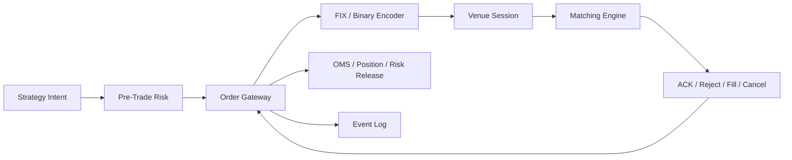
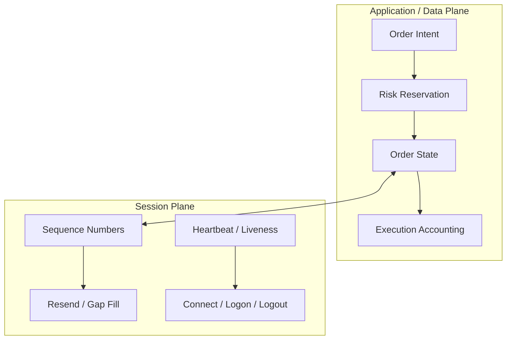
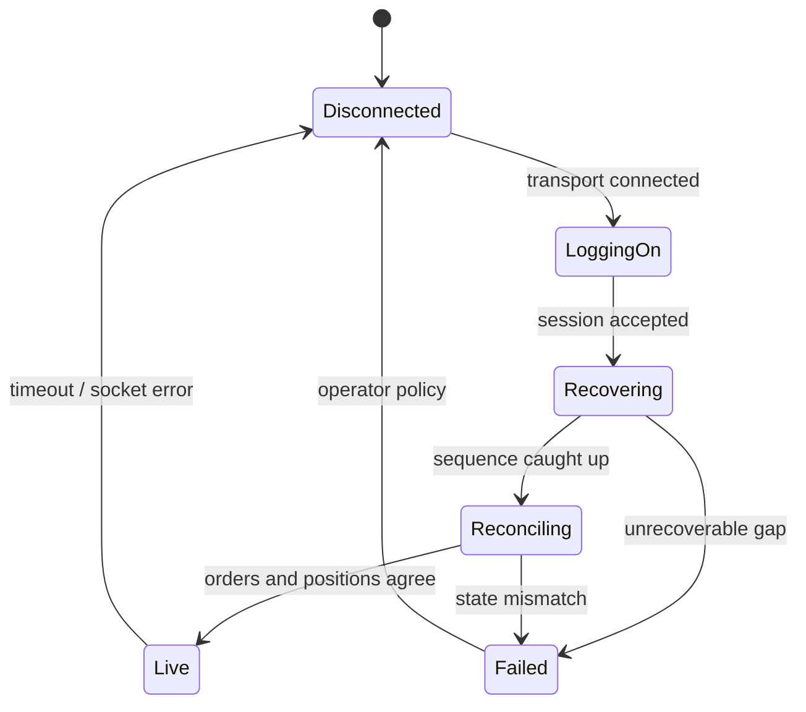

# 개요

Order gateway는 strategy가 만든 주문 의도를 거래소 protocol message로 바꾸는 encoder만이 아니다.

빠르게 보내는 것과 함께 다음 질문에 답하는 **주문·session state machine**이다.

- 이 주문은 risk 검사를 통과했는가?
- 아직 거래소가 수락하지 않은 주문과 이미 book에 들어간 주문을 어떻게 구분하는가?
- Cancel을 보낸 뒤 fill이 오면 어느 event를 유효하게 적용하는가?
- TCP 연결이 끊겼을 때 어떤 message가 거래소에 도착했는가?
- 재접속 뒤 sequence gap과 duplicate를 어떻게 복구하는가?
- Process restart 뒤 outstanding order와 position을 어떻게 재구성하는가?



이 글은 특정 거래소에 바로 접속하기 위한 인증 자료가 아니다.
FIX session의 공통 개념과 Nasdaq OUCH 같은 binary order-entry protocol에서 확인해야 할 경계를 학습용 model로 묶는다.

> 실제 message layout, state transition, throttle, cancel-on-disconnect와 recovery 절차의 최종 기준은 연결할 venue와 broker가 제공하는 최신 specification 및 certification test다.

# 학습 위치

| 항목 | 내용 |
| --- | --- |
| BFS Level | Level 2-P → Level 3-OG — Order-entry Protocol에서 독립 Order Gateway로 연결 |
| 선수 글 | [[Low Latency Trading] 초저지연 트레이딩 시스템 전체 구조](/posts/low-latency-trading-system-overview/) |
| 선수 글 | [[Low Latency Trading] Market Microstructure와 Limit Order Book](/posts/low-latency-market-microstructure/) |
| 선수 글 | [[Low Latency Trading] Fixed-Point Trading Numerics와 O(1) Pre-Trade Risk](/posts/low-latency-trading-numerics-risk/) |
| 함께 구현 | [[Low Latency Trading] Binary Event Log·Deterministic Replay와 Fault Injection](/posts/low-latency-event-log-replay/) |
| 다음 단계 | Exchange emulator와 feed-to-order 통합 |

완료 기준은 다음 한 문장으로 압축할 수 있다.

> 정상 ACK뿐 아니라 reject, partial fill, cancel-fill race, duplicate, sequence gap, disconnect와 restart를 같은 입력이면 같은 상태로 처리할 수 있는가?

# 1. 세 종류의 식별자를 분리한다

주문 gateway의 많은 버그는 모든 identifier를 `order_id` 하나로 부르는 데서 시작한다.

## 1.1 Client Order ID

Client가 주문 의도를 만들 때 부여하는 안정적인 식별자다.

```text
client_order_id = strategy/session/monotonic counter의 조합
```

요구 조건은 system마다 다르지만 보통 다음 성질이 필요하다.

- 정해진 uniqueness 범위 안에서 재사용하지 않는다.
- Replace와 cancel이 어느 원주문을 가리키는지 추적할 수 있다.
- Process restart 뒤에도 이미 사용한 범위를 알 수 있다.
- Log, risk reservation과 execution report를 같은 주문에 연결한다.

숫자가 작다는 이유만으로 process-local counter를 0부터 다시 시작하면 reconnect 또는 restart에서 충돌할 수 있다.

## 1.2 Venue Order ID

거래 장소가 주문을 수락한 뒤 부여하는 식별자다.

```text
Client order C42 --accepted--> Venue order V9917
```

ACK 전에는 venue ID가 없을 수 있다.
어떤 protocol의 cancel은 client token을 사용하고 다른 protocol은 venue ID를 요구할 수 있으므로 최신 specification을 확인해야 한다.

## 1.3 Session Sequence Number

FIX `MsgSeqNum` 같은 session message 순서다.
업무상 주문 번호가 아니며 하나의 session에서 송수신 message ordering과 recovery에 쓰인다.

```text
outbound session sequence: 101, 102, 103, ...
inbound session sequence : 801, 802, 803, ...
```

다음은 서로 다른 질문이다.

| 값 | 답하는 질문 |
| --- | --- |
| Client order ID | 우리 system의 어느 주문 의도인가? |
| Venue order ID | 거래소가 어느 live order로 인식하는가? |
| Session sequence | 연결상 어느 message가 빠지거나 중복됐는가? |
| Execution ID | 어느 체결 event를 이미 적용했는가? |

Session sequence가 복구됐다고 order state가 자동으로 대사되는 것은 아니다.
반대로 order ID가 일치한다고 session gap을 무시할 수도 없다.

# 2. Data Plane과 Session Plane

한 process에 있더라도 책임을 나누면 recovery reasoning이 쉬워진다.



Application plane은 주문의 업무 의미를 다룬다.

- New, replace와 cancel intent
- Accepted, rejected, filled와 canceled 상태
- Leaves quantity, cumulative quantity와 average price
- Risk reservation과 position 반영

Session plane은 transport 위의 대화를 유지한다.

- Logon과 logout
- 송수신 sequence
- Heartbeat와 liveness
- Resend request, duplicate 표시와 gap fill
- Reconnect와 session reset

두 plane은 연결되지만 같지 않다.
Session message를 재전송할지와 application order를 다시 제출할지는 별개의 결정이다.

# 3. 주문 상태는 Boolean이 아니다

`is_live`, `is_canceled` 두 개로는 현실의 경쟁 상태를 표현하기 어렵다.
학습용 최소 상태를 다음처럼 둘 수 있다.

```cpp
enum class OrderState : std::uint8_t {
    pending_new,
    live,
    pending_replace,
    pending_cancel,
    partially_filled,
    filled,
    canceled,
    rejected,
    unknown
};
```

`unknown`은 편의상 오류를 삼키는 상태가 아니다.
연결 단절 등으로 venue 결과를 확정할 수 없을 때 신규 주문을 막고 reconciliation을 시작하게 하는 안전 상태다.

## 3.1 New 주문

```text
Created
  → Risk Reserved
  → Pending New
      ├─ Accepted → Live
      ├─ Rejected → Rejected
      └─ Disconnect / Timeout → Unknown, then reconcile
```

Socket `send()` 성공은 거래소 수락이 아니다.
그것은 kernel 또는 user-space network stack이 byte를 받았다는 뜻에 가까우며, peer application의 처리 결과는 ACK 또는 recovery 절차로 확인해야 한다.

## 3.2 Partial Fill

Order quantity가 100이고 30이 체결됐다고 하자.

```text
order_qty = 100
cum_qty   = 30
leaves_qty= 70
```

최소 invariant는 다음과 같다.

```text
0 <= cum_qty <= order_qty
0 <= leaves_qty <= order_qty
cum_qty + leaves_qty = order_qty
```

Replace, cancel, bust 또는 correction을 지원하면 식이 더 복잡해질 수 있다.
어떤 field가 authoritative한지는 protocol 정의를 따른다.

## 3.3 Cancel과 Fill의 Race

Cancel 요청은 즉시 취소 완료를 뜻하지 않는다.

```text
t0  client sends Cancel
t1  matching engine executes remaining quantity
t2  client receives Fill
t3  client receives Cancel Reject or final Canceled event
```

따라서 `pending_cancel`에서도 fill을 유효하게 처리해야 한다.

```cpp
void on_fill(Order& order, Quantity last_qty) {
    if (is_terminal(order.state)) {
        // Duplicate인지 state corruption인지 execution ID와 protocol로 판정한다.
        report_unexpected_fill(order);
        return;
    }

    const auto state_before_fill = order.state;
    order.cum_qty = checked_add(order.cum_qty, last_qty);
    order.leaves_qty = checked_sub(order.leaves_qty, last_qty);
    if (order.leaves_qty.value() == 0) {
        order.state = OrderState::filled;
    } else if (state_before_fill != OrderState::pending_cancel &&
               state_before_fill != OrderState::pending_replace) {
        order.state = OrderState::partially_filled;
    }
}
```

실제 구현에서는 `execution_id`, correction/bust 의미와 venue의 cumulative field도 함께 검증한다.
단일 enum은 partially-filled 여부와 pending action을 동시에 표현하기 어려우므로 production model에서는 working status와 pending cancel/replace를 직교 field로 분리하는 편이 명확하다.

## 3.4 Replace의 의미

Replace가 같은 order의 field 변경인지 cancel-and-new인지, priority를 보존하는지는 venue마다 다르다.

확인할 항목은 다음과 같다.

- 원 order와 replacement의 ID 관계
- Quantity가 total인지 remaining인지
- Price 또는 quantity 변경 시 queue priority
- Replace reject 뒤 원 order가 여전히 live인지
- Replace 진행 중 fill을 어느 version에 귀속할지

공통 abstraction이 venue의 차이를 숨기면 state를 잘못 계산할 수 있다.

# 4. Gateway의 Outbound Commit Point

New intent를 처리하는 순서를 명시해야 한다.

```text
1. Immutable command 수신
2. Instrument/session 상태 확인
3. Pre-trade risk 검사와 reservation
4. Client order ID 할당
5. Local order state 생성
6. Protocol message bounds 검증과 encode
7. Event 기록 정책 적용
8. Session sequence 할당과 transmit
9. Pending ACK 추적
```

중요한 질문은 “언제 보냈다고 간주하는가?”다.

```text
intent accepted?
risk reserved?
event appended?
bytes queued?
ACK received?
```

이 다섯 시점은 다르다.
System은 각 시점을 별도 event와 timestamp로 기록해야 한다.

## 4.1 Journal을 무조건 동기식으로 쓰지는 않는다

모든 주문마다 storage `fsync`를 완료한 뒤 보내면 recovery boundary는 단순해질 수 있지만 latency 비용이 매우 클 수 있다.
반대로 network 전송 뒤 기록을 전혀 남기지 않으면 crash 후 불확실성이 커진다.

가능한 선택은 다음처럼 여러 가지다.

- 동기 durable journal 후 전송
- battery-backed 또는 persistent queue 사용
- append-only memory buffer를 별도 writer가 batch flush
- venue drop copy와 broker reconciliation을 포함한 복구 설계

정답은 latency budget, 규제·감사 요구, loss tolerance와 hardware에 따라 달라진다.
선택한 durability point와 crash window를 문서에 정확히 남겨야 한다.

# 5. Bounds-Checked Encoding

고정 길이 binary protocol도 field를 그냥 `memcpy`하는 것으로 끝나지 않는다.

```cpp
struct NewOrder {
    ClientOrderId id;
    InstrumentId instrument;
    Side side;
    Price price;
    Quantity quantity;
};

enum class EncodeError {
    buffer_too_small,
    invalid_instrument,
    invalid_price,
    invalid_quantity,
    field_out_of_range
};
```

Encoder의 contract 예시는 다음과 같다.

```text
precondition
  - risk-approved immutable command
  - protocol field range 안의 값
  - output span이 최대 message 길이 이상

postcondition
  - 정확한 byte 수 반환
  - 실패 시 partial message를 전송하지 않음
  - host object padding을 wire에 복사하지 않음
  - byte order와 text padding을 specification대로 적용
```

Wire struct에 `reinterpret_cast`해 값을 대입하는 방식은 alignment, padding, lifetime과 byte-order 문제를 만든다.
`std::span<std::byte>`와 명시적인 field writer를 두는 편이 검증하기 쉽다.

```cpp
bool write_u32_be(std::span<std::byte> out,
                  std::size_t offset,
                  std::uint32_t value) noexcept {
    if (offset > out.size() || out.size() - offset < 4) {
        return false;
    }
    out[offset + 0] = std::byte((value >> 24) & 0xffU);
    out[offset + 1] = std::byte((value >> 16) & 0xffU);
    out[offset + 2] = std::byte((value >> 8) & 0xffU);
    out[offset + 3] = std::byte(value & 0xffU);
    return true;
}
```

# 6. FIX Session에서 복구할 것

FIX family의 정확한 지원 범위는 version과 counterparty profile에 따라 다르다.
여기서는 session layer의 공통 개념만 다룬다.

## 6.1 Logon과 Session Identity

Logon 단계에서 보통 sender/target identity, heartbeat interval, sequence 정책과 authentication 관련 field를 협의한다.

검증할 항목은 다음과 같다.

- 누가 initiator이고 acceptor인가?
- Session 식별 범위는 거래일인가, 지속 session인가?
- 송신·수신 next sequence는 어디에 저장되는가?
- Reset 요청은 어느 조건에서만 허용되는가?
- TLS 또는 전용선 등 transport security 요구는 무엇인가?

Sequence reset은 “에러가 귀찮으니 1부터 시작”하는 버튼이 아니다.
양쪽 state와 업무 message의 대사 없이 reset하면 누락 또는 중복 주문을 숨길 수 있다.

## 6.2 Heartbeat와 Test Request

Heartbeat는 session liveness를 판단하는 도구이지 matching engine이 주문을 처리했다는 증거가 아니다.

일반적인 흐름은 다음과 같다.

```text
정해진 interval 동안 송신할 message가 없음
  → Heartbeat

정해진 시간 동안 peer traffic이 없음
  → Test Request
  → 대응 Heartbeat를 기다림
  → timeout이면 disconnect와 recovery
```

정확한 timer와 message 규칙은 합의한 FIX profile을 따른다.

## 6.3 Resend Request와 PossDup

Inbound sequence 40을 기대했는데 43이 오면 40~42의 gap을 처리해야 한다.

```text
expected = 40
received = 43
request missing range 40..42
buffer or gate later application messages
```

재전송 message는 원래 message와 동일한 업무 효과를 다시 내면 안 된다.
`PossDupFlag` 등 session metadata, original sending time과 application-level identifiers를 함께 사용해 duplicate를 판정한다.

다만 다음을 단순화하면 위험하다.

```text
PossDup=true → 무조건 버린다       // 아직 적용하지 않은 원본일 수 있음
같은 order ID → 무조건 같은 event  // replace나 correction일 수 있음
sequence가 큼 → 바로 적용          // 앞선 fill/reject가 누락됐을 수 있음
```

## 6.4 SequenceReset과 GapFill

모든 administrative message를 그대로 다시 보낼 필요가 없는 경우 gap-fill 의미를 사용할 수 있다.
그러나 SequenceReset의 normal gap-fill 용도와 recovery/exception 용도를 구분해야 한다.

Gateway는 다음을 log에 남긴다.

- 요청한 begin/end sequence
- 수신한 replay range
- duplicate 여부와 처리 결과
- gap-fill로 건너뛴 범위와 근거
- session이 다시 application traffic을 허용한 시점

# 7. Binary Order-Entry Session

Nasdaq OUCH 같은 binary order-entry protocol은 order entry에 특화된 고정 binary message를 제공한다.
일반적으로 enter, replace, cancel 요청과 accepted, rejected, executed, canceled 같은 응답을 다룬다.

학습할 때 FIX field를 이름만 바꿔 그대로 투영하지 않는다.

| 확인할 축 | 질문 |
| --- | --- |
| Framing | Length와 message type은 어디에 있는가? |
| Session | 별도 transport/session protocol과 어떻게 결합되는가? |
| Identifier | Token과 venue reference의 uniqueness 범위는? |
| State | 어느 응답이 terminal인가? |
| Replay | Reconnect 시 missed message를 어떻게 받는가? |
| Throttle | Message-rate 제한과 breach 결과는? |
| Disconnect | Open order가 유지되는가, 자동 취소되는가? |

ITCH가 market data protocol이고 OUCH가 order-entry protocol이라는 역할 구분도 중요하다.
두 protocol의 sequence 공간과 recovery를 한 counter로 합치지 않는다.

# 8. Disconnect는 세 가지 불확실성을 만든다

연결이 끊긴 순간 다음 세 범위를 구분한다.

```text
A. 거래소가 확실히 거절하거나 처리하지 않은 command
B. 거래소가 처리했고 결과도 확실히 받은 command
C. 전송 또는 처리 여부가 불확실한 command
```

가장 위험한 것은 C다.

## 8.1 Blind Replay를 하지 않는다

마지막 outbound New를 ACK 받지 못했다는 이유만으로 다시 보내면 duplicate live order가 생길 수 있다.

```text
Client send New C42
Venue accepts C42
ACK가 오는 중 연결 단절
Client reconnect 후 New C42 재전송
```

Venue가 client token의 duplicate를 거절한다는 보장이 있더라도 그 범위와 보존 기간을 확인해야 한다.
안전한 절차는 session replay, order query/drop copy 또는 broker reconciliation 등 제공되는 authoritative mechanism을 사용한다.

## 8.2 Recovery 동안 New를 Gate한다

보수적인 recovery state machine은 다음과 같다.



`Recovering`과 `Reconciling`에서는 기본적으로 신규 order release를 막는다.
Cancel을 허용할지, mass cancel을 보낼지, cancel-on-disconnect를 사용할지는 venue 기능과 위험 정책으로 정한다.

## 8.3 Cancel-on-Disconnect를 과신하지 않는다

일부 venue나 broker는 연결 단절 시 주문 취소 기능을 제공한다.
그러나 다음을 확인해야 한다.

- 어떤 session과 order에 적용되는가?
- Network partition을 어느 시점에 disconnect로 판정하는가?
- 이미 execution 중인 quantity에는 어떤 결과가 오는가?
- Gateway restart와 venue failover에서도 같은가?
- 취소 완료를 어느 channel에서 확인하는가?

이 기능은 reconciliation을 없애지 않는다.

# 9. Idempotency와 Deduplication

Session duplicate와 business duplicate를 각각 추적한다.

```cpp
struct InboundKey {
    SessionId session;
    std::uint64_t sequence;
};

struct ExecutionKey {
    VenueId venue;
    TradingDay day;
    ExecutionId execution;
};
```

가능한 invariant는 다음과 같다.

```text
한 inbound session sequence는 최대 한 번 state transition을 일으킨다.
한 execution ID는 최대 한 번 position과 cash를 바꾼다.
duplicate를 관찰했다는 사실 자체는 metric과 event log에 남긴다.
```

Dedup table의 보존 범위가 너무 짧으면 늦은 replay를 새 event로 오인한다.
무한히 보존하면 memory가 증가한다.
Session/day boundary와 venue의 uniqueness contract를 근거로 retention을 정한다.

# 10. Single Writer와 Bounded Handoff

주문 상태를 여러 thread가 직접 갱신하면 빠른 경로의 reasoning이 어려워진다.
한 가지 단순한 구조는 gateway core가 session과 order state의 single writer가 되는 것이다.

```text
Strategy/Risk core
    → bounded SPSC command ring
Gateway core: encode + session + order-state single writer
    → bounded SPSC event ring
OMS/Position core
```

장점은 다음과 같다.

- Order별 mutex가 필요하지 않을 수 있다.
- Event ordering이 명확해진다.
- Replay model과 live model을 같게 만들기 쉽다.
- Cache line ownership 이동을 제한할 수 있다.

그러나 queue는 무한 buffer가 아니다.

## 10.1 Command Queue Full

Order command queue가 찼을 때 선택지는 명시적이어야 한다.

- 즉시 reject하고 strategy에 알린다.
- 제한된 시간만 spin한 뒤 reject한다.
- Strategy 자체를 pause하고 kill-switch 정책을 평가한다.

새 order를 조용히 drop하면 안 된다.

## 10.2 Event Queue Full

Execution event를 버리면 position과 risk가 깨질 수 있다.
따라서 telemetry queue와 business event queue의 full policy가 달라야 한다.

```text
debug metric: policy에 따라 sample/drop 가능
fill/reject/cancel: lossless handoff 또는 즉시 안전 정지 필요
```

# 11. Risk Reservation과 Gateway State를 연결한다

Risk check와 send 사이에 다른 주문이 limit을 모두 사용하면 check-then-act race가 발생한다.

```text
check available limit
reserve exposure
release order
```

이 세 동작의 consistency model을 정해야 한다.
New가 reject되거나 cancel/fill로 leaves quantity가 줄면 정확히 한 번 reservation을 해제 또는 변환한다.

```text
Pending New: worst-case exposure reserved
Reject      : reservation release
Partial Fill: open-order reservation 감소, position exposure 증가
Cancel      : remaining reservation release
Fill        : remaining open exposure 0, position 반영
```

Duplicate execution이 reservation을 두 번 감소시키지 않도록 execution dedup과 같은 transaction boundary에서 갱신한다.

# 12. 최소 Order Model

아래 구조는 학습용 출발점이다.

```cpp
struct Order {
    ClientOrderId client_id;
    std::optional<VenueOrderId> venue_id;
    InstrumentId instrument;
    Side side;
    Price price;
    Quantity order_qty;
    Quantity cum_qty;
    Quantity leaves_qty;
    Money reserved_notional;
    OrderState state;
    std::uint32_t version;
};
```

핵심은 field 수보다 invariant다.

```cpp
bool valid(const Order& order) noexcept {
    const auto order_qty = order.order_qty.value();
    const auto cum_qty = order.cum_qty.value();
    const auto leaves_qty = order.leaves_qty.value();

    if (order_qty < 0 || cum_qty < 0 || leaves_qty < 0) {
        return false;
    }
    if (cum_qty > order_qty || leaves_qty > order_qty) {
        return false;
    }
    return leaves_qty == order_qty - cum_qty;
}
```

Subtraction 전에 nonnegative 범위와 `cum_qty <= order_qty`를 확인했으므로 이 비교는 signed overflow를 만들지 않는다.
Replace semantics가 total quantity를 바꾸면 version별 quantity invariant를 별도로 정의한다.

# 13. Error Policy

Gateway가 만나는 오류를 한 종류로 처리하지 않는다.

| 오류 | 예 | 일반적인 방향 |
| --- | --- | --- |
| Local validation | field range 초과 | 해당 command reject |
| Protocol decode | truncated/unknown message | session policy에 따라 disconnect·alert |
| Sequence gap | expected보다 큰 sequence | application gate 후 recovery |
| Duplicate | replay된 execution | dedup, metric, state 변화 없음 |
| Impossible state | filled 뒤 새로운 fill | freeze/reconcile, 조용히 무시 금지 |
| Queue saturation | business event ring full | fail-safe stop와 alert |
| Clock anomaly | interval clock 역행 | timestamp invalid 표시, risk policy 적용 |
| Storage failure | audit writer disk full | 사전 정의한 safe mode 또는 stop |

`log and continue`는 policy가 아니다.
계속할 때 state가 여전히 trustworthy한지 설명할 수 있어야 한다.

# 14. Test Matrix

## 14.1 정상 흐름

```text
New → Accepted → Fill
New → Accepted → Partial Fill → Fill
New → Rejected
New → Accepted → Cancel → Canceled
New → Accepted → Replace → Replaced → Fill
```

## 14.2 Race와 Duplicate

```text
Cancel sent → Fill → Cancel Reject
Cancel sent → Partial Fill → Canceled remaining
Duplicate Accepted
Duplicate Fill with same execution ID
Two distinct fills with same quantity and price
```

마지막 두 경우를 구분해야 한다.
Quantity와 price가 같아도 execution ID가 다르면 별도 fill일 수 있다.

## 14.3 Session Recovery

```text
Inbound sequence gap
Out-of-order replay response
PossDup message not previously applied
PossDup message already applied
GapFill over administrative range
Disconnect before send
Disconnect after peer accepted but before ACK
Restart with outstanding orders
```

## 14.4 Property

Event sequence를 무작위로 만들더라도 다음 invariant는 깨지면 안 된다.

- Quantity는 음수가 되지 않는다.
- 같은 execution은 position을 두 번 바꾸지 않는다.
- Terminal order는 protocol이 허용한 correction 외에는 다시 live가 되지 않는다.
- Risk reservation 합계는 outstanding exposure 계산과 일치한다.
- Recovery가 끝나기 전에는 신규 주문이 wire로 나가지 않는다.

# 15. 관측 지점

최소 timestamp와 counter를 정한다.

```text
t_intent_received
t_risk_completed
t_encode_started / completed
t_send_handoff
t_session_write
t_response_received
t_decode_completed
t_state_applied
```

Counter 예시는 다음과 같다.

- command accepted/rejected by reason
- ACK, reject, fill, cancel과 replace 수
- sequence gap, resend, duplicate와 reconciliation 수
- command/event queue depth와 high-water mark
- reconnect 횟수와 recovery duration
- outstanding order와 reserved exposure

Timestamp clock domain을 섞지 않고, hot path에서는 blocking log I/O를 하지 않는다.

# 16. 구현 순서

1. Network 없이 typed command와 execution event를 정의한다.
2. Order state reducer를 순수 함수에 가깝게 만들고 table test를 작성한다.
3. Fixed binary fixture를 bounds-check하며 decode한다.
4. Session sequence와 business ID dedup을 분리한다.
5. Fake transport로 partial write, disconnect와 reconnect를 주입한다.
6. Bounded SPSC queue와 full policy를 연결한다.
7. Binary event log로 입력과 state transition을 replay한다.
8. 마지막에 실제 counterparty simulator와 certification case를 연결한다.

처음부터 실제 socket과 timer를 섞으면 state-machine bug를 재현하기 어려워진다.

# 17. 실습 과제

## 과제 A — Order Reducer

`Order + Event -> Order + Effects` 형태의 reducer를 작성한다.

```text
Effects:
  reserve/release risk
  update position
  emit strategy event
  raise reconciliation alert
```

Cancel-fill race와 duplicate fill fixture를 포함한다.

## 과제 B — Session Emulator

다음을 설정 가능한 fake peer를 만든다.

- ACK 직전 disconnect
- Sequence 한 개 누락
- 이전 execution의 duplicate replay
- Heartbeat timeout
- Invalid message length

## 과제 C — Crash Boundary 표

Outbound pipeline의 각 두 단계 사이에서 process가 죽는다고 가정한다.

```text
risk reserve | state append | encode | socket handoff | venue accept | ACK apply
```

각 지점에서 restart 후 무엇을 local log만으로 알고, 무엇을 외부와 대사해야 하는지 표로 작성한다.

# 18. 체크리스트

- [ ] Client order, venue order, execution과 session sequence ID를 구분했다.
- [ ] Socket write와 venue acceptance를 구분했다.
- [ ] Cancel pending 상태의 fill을 처리한다.
- [ ] Duplicate 판단 근거와 retention 범위를 명시했다.
- [ ] Sequence gap 동안 application message를 gate한다.
- [ ] Reconnect 때 unacknowledged New를 무조건 재전송하지 않는다.
- [ ] Recovery 종료 전에 order와 position을 reconcile한다.
- [ ] Queue full에서 business event를 조용히 버리지 않는다.
- [ ] Risk reservation을 reject/fill/cancel에서 정확히 한 번 갱신한다.
- [ ] Crash window와 durability policy를 문서화했다.
- [ ] Venue specification과 certification test를 통과한다.

# 참고 자료

- [FIX Trading Community, FIX Session Layer](https://www.fixtrading.org/standards/fix-session-layer-online/)
- [FIX Trading Community, Order State Change Matrices](https://www.fixtrading.org/online-specification/order-state-changes/)
- [Nasdaq, OUCH 5.0 Specification](https://nasdaqtrader.com/content/technicalsupport/specifications/TradingProducts/Ouch5.0.pdf)
- [Nasdaq, OUCH 5.0 FAQ](https://nasdaqtrader.com/content/productsservices/trading/OUCH_5.0_FAQ.pdf)
- [IETF RFC 9293, Transmission Control Protocol](https://www.rfc-editor.org/rfc/rfc9293)

# 정리

Order gateway의 핵심은 message를 몇 ns 빨리 encode하는 데만 있지 않다.

```text
typed intent
  → atomic risk reservation
  → explicit outbound boundary
  → protocol/session sequence
  → ACK·fill·cancel state reducer
  → duplicate-safe recovery
  → order·position reconciliation
```

FIX와 binary protocol은 wire format이 다르지만 공통 질문은 같다.

- 무엇을 한 번만 적용해야 하는가?
- 무엇이 누락됐는가?
- 연결 단절 뒤 무엇을 확실히 아는가?
- 불확실한 동안 어떤 주문을 막는가?

이 질문에 test로 답할 수 있을 때 gateway는 빠른 encoder를 넘어 안전한 거래 component가 된다.
