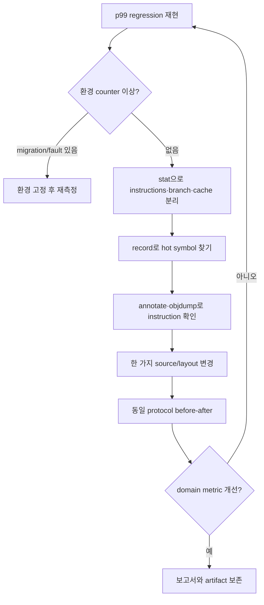

# 개요

성능 counter 하나는 병목의 이름이 아니다.
`cache-misses`가 늘었다고 cache가 유일한 원인인 것도 아니고 IPC가 높다고 latency가 좋은 것도 아니다.

병목 분석은 증거를 연결하는 반복 과정이다.

```text
현상 정의
  → 가설
  → 최소한의 측정
  → symbol과 hot instruction 확인
  → source·assembly·PMU 연결
  → 한 가지 변경
  → 같은 조건에서 재측정
```

이 글은 Linux `perf`, CPU PMU, ELF 도구와 compiler output을 이용해 이 loop를 재현하는 방법을 다룬다.
도구 사용법보다 무엇을 셌고 무엇을 세지 못했는지를 보고서에 남기는 것이 핵심이다.

# 선수 글과 BFS 위치

| 관계 | 글 |
| --- | --- |
| BFS Level | **Level 2-T — Measurement와 Profiler**, **Level 3-PV — Performance Validation** |
| 엄격한 선수 글 | [[Low Latency Trading] Latency를 올바르게 측정하는 방법](/posts/low-latency-measurement/) |
| CPU 배경 | [[Low Latency Trading] CPU Pipeline·Out-of-Order·Branch Prediction과 ABI](/posts/low-latency-cpu-pipeline-branch-abi/) |
| 실행 환경 | [[Low Latency Trading] Linux 실행 환경과 CPU 격리](/posts/low-latency-linux-execution/) |
| 실험 대상 | [[Low Latency Trading] SPSC Ring Buffer와 Thread-per-Core 설계](/posts/low-latency-spsc-thread-per-core/) |
| 다음 적용 | Hot component별 before-after performance validation report |

이 글은 counter를 latency distribution의 대체물로 사용하지 않는다.
먼저 end-to-end와 stage latency를 정한 뒤 PMU로 원인 가설을 좁힌다.

# 1. 질문을 측정 가능한 문장으로 바꾼다

다음 질문은 너무 넓다.

```text
왜 느린가?
```

대신 경계, workload와 비교 대상을 포함한다.

```text
동일한 10M synthetic event를 처리할 때
commit A보다 commit B의 book-update p99가 18% 증가했다.
두 binary는 같은 host의 CPU 6에 pin했고 input과 build mode는 같다.
```

이제 가설을 분리할 수 있다.

- instruction 수가 늘었는가?
- branch outcome 분포가 바뀌었는가?
- data layout으로 cache/TLB miss가 늘었는가?
- compiler가 inline 또는 vectorization 결정을 바꾸었는가?
- scheduler migration, interrupt나 frequency가 달랐는가?

한 번에 모든 event를 모으기보다 각 가설을 판별할 최소 set부터 시작한다.

# 2. 분석 가능한 release binary를 만든다

`-O0` debug build를 profile하면 실제 배포 hot path와 다른 code를 분석하게 된다.
최적화된 release code에 debug information을 남긴다.

```bash
c++ -std=c++20 -O3 -g -DNDEBUG -fno-omit-frame-pointer \
  -march=x86-64-v3 perf_demo.cpp -o perf_demo
```

각 option의 목적을 분리한다.

| Option | 목적 | 주의 |
| --- | --- | --- |
| `-O3` | 실제 optimization에 가까운 code | 배포 flag와 맞춰야 함 |
| `-g` | DWARF source·line 정보 | 실행 의미를 debug mode로 바꾸지 않음 |
| `-DNDEBUG` | assert 제거 | benchmark input 검증은 밖에서 수행 |
| `-fno-omit-frame-pointer` | frame-pointer call graph | register와 codegen 비용 가능 |
| `-march=...` | target ISA 지정 | 다른 host에서 illegal instruction 가능 |

`-g`는 일반적으로 optimization을 끄지 않는다.
다만 debug info 크기, link 시간과 packaging은 달라질 수 있다.

Profile build와 production build가 `-fno-omit-frame-pointer`에서만 다르다면 그 차이 자체를 측정한다.
가능하면 production에서도 일관된 unwind 정책을 사용하고 binary hash와 flags를 보고서에 남긴다.

# 3. Symbol과 debug info를 보존한다

`perf report`가 주소만 보여주면 먼저 symbol pipeline을 점검한다.

```bash
file ./perf_demo
readelf -S ./perf_demo
readelf -Ws ./perf_demo | less
readelf -n ./perf_demo
nm -nC ./perf_demo | less
```

확인할 항목은 다음과 같다.

- ELF가 예상 architecture와 build type인가?
- `.symtab`, `.dynsym`, `.debug_*` section이 있는가?
- Build ID가 있는가?
- C++ symbol demangling이 되는가?
- 분석 중인 binary와 실행한 binary가 같은가?

배포 artifact를 strip한다면 debug file을 분리해 Build ID로 매칭할 수 있다.

```bash
objcopy --only-keep-debug perf_demo perf_demo.debug
strip --strip-debug perf_demo
objcopy --add-gnu-debuglink=perf_demo.debug perf_demo
```

실제 packaging에서는 executable과 debug artifact의 hash, Build ID와 보관 위치를 함께 관리한다.
분석 binary를 새 build로 덮어쓰면 기존 `perf.data`의 address를 잘못 symbolicate할 수 있다.

# 4. Frame pointer와 call graph 방식

Sampling은 현재 instruction만 수집할 수도 있고 call chain을 함께 수집할 수도 있다.
Frame pointer 방식은 비교적 단순하지만 모든 frame이 frame pointer convention을 따라야 한다.

```bash
perf record -F 999 -g --call-graph fp -- ./perf_demo
```

중간 library 하나가 frame pointer를 생략하면 call chain이 끊기거나 부정확해질 수 있다.
DWARF unwind 방식도 있다.

```bash
perf record -F 999 -g --call-graph dwarf,16384 -- ./perf_demo
```

DWARF 방식은 더 많은 sample data와 unwind 비용을 만들 수 있다.
LBR call stack은 지원 CPU와 kernel/perf 조건에서 대안이지만 depth와 event 제약이 있다.
방식, stack size와 누락 비율을 결과에 기록한다.

# 5. perf 사용 가능성을 먼저 확인한다

모든 host에서 hardware PMU를 사용자에게 허용하지는 않는다.

```bash
uname -a
perf --version
cat /proc/sys/kernel/perf_event_paranoid
cat /proc/sys/kernel/kptr_restrict
perf list | less
```

`perf_event_paranoid`의 정확한 의미와 허용 범위는 실행 중인 kernel 문서를 기준으로 확인한다.
높은 값에서는 system-wide, kernel sample 또는 hardware event access가 제한될 수 있다.
Container는 host PMU, capability, seccomp와 cgroup 제한을 추가로 받는다.

권한 오류가 나면 값을 몰래 낮추지 않는다.
운영자에게 필요한 최소 범위와 측정 목적을 요청하거나 허용된 user-space event와 timing으로 범위를 줄인다.
Cloud VM에서는 PMU virtualization이 없거나 event subset만 제공될 수 있다.

```bash
perf stat -- true
perf stat -e cycles,instructions -- ./perf_demo
```

`<not supported>`, `<not counted>`와 permission error를 성공 결과처럼 해석하지 않는다.

# 6. perf stat으로 넓게 시작한다

`perf stat`은 구간 전체의 counting 결과를 준다.

```bash
taskset -c 6 perf stat -r 10 \
  -e task-clock,context-switches,cpu-migrations,page-faults \
  -- ./perf_demo 20000000
```

먼저 scheduling과 실행 환경 이상을 확인한다.

- `cpu-migrations`가 0인가?
- 예상치 못한 context switch가 많은가?
- measurement window 안에 major/minor fault가 들어왔는가?
- task-clock과 elapsed time 관계가 예상과 같은가?

그 뒤 core event를 작은 group으로 측정한다.

```bash
taskset -c 6 perf stat -r 10 \
  -e cycles,instructions,branches,branch-misses \
  -- ./perf_demo 20000000
```

Cache 후보도 별도 run으로 본다.

```bash
taskset -c 6 perf stat -r 10 \
  -e cache-references,cache-misses \
  -- ./perf_demo 20000000
```

여러 run 사이 workload가 deterministic하고 환경이 안정적이어야 비교할 수 있다.
Event group이 동시에 schedule되어야 비율 의미가 있는 경우 brace group을 사용할 수 있으나 available counter 수를 넘으면 측정이 실패할 수 있다.

```bash
perf stat -e '{cycles,instructions,branches,branch-misses}' -- ./perf_demo
```

# 7. Cycles, instructions와 IPC

IPC는 보통 다음 비율이다.

```text
IPC = retired instructions / core cycles
```

높으면 무조건 좋다는 지표가 아니다.

- Vectorization으로 instruction이 줄면서 IPC도 낮아질 수 있다.
- Memory stall 동안 cycles가 늘면 IPC가 낮아질 수 있다.
- 더 많은 쓸모없는 instruction을 실행해 IPC가 높아질 수도 있다.
- SMT에서는 sibling과 resource를 공유해 해석이 달라진다.
- `cycles` event의 정확한 clock domain과 halt counting은 PMU 정의에 따른다.

먼저 wall time 또는 domain latency가 개선되었는지 본다.
그 다음 total work가 같은지 확인하고 cycles와 instructions의 변화로 가설을 좁힌다.

```text
latency ↓, cycles ↓, instructions ≈  → stall 감소 후보
latency ↓, instructions ↓           → code path/optimization 후보
latency ↑, migrations/context switch ↑ → 환경 교란 후보
```

이 표는 출발점이지 자동 진단 규칙이 아니다.

# 8. Cache metric을 정확히 이름 붙인다

Generic `cache-misses`가 어느 level의 어떤 access를 세는지는 PMU와 perf mapping에 의존한다.
다음 항목을 구분해야 한다.

- L1 data load miss
- L1 instruction miss
- Last-level cache reference/miss
- Demand access와 hardware prefetch
- Retired load와 speculative request
- Local memory와 remote NUMA access
- Coherence miss와 capacity/conflict miss

`perf list cache`와 CPU vendor event reference에서 실제 event 설명을 확인한다.

```bash
perf list cache
perf stat -e L1-dcache-loads,L1-dcache-load-misses \
  -- ./perf_demo 20000000
```

Event가 `perf list`에 보인다고 현재 CPU에서 정확히 지원된다는 뜻은 아닐 수 있다.
Kernel alias mapping, hybrid PMU type와 model별 erratum을 확인한다.

Miss count만 보지 말고 request 수와 비율, 전체 cycles에 미칠 수 있는 비중을 함께 본다.
Out-of-order execution과 overlapping miss 때문에 `miss × 고정 latency = 전체 stall`은 성립하지 않는다.

# 9. Branch metric

`branches`와 `branch-misses`는 보통 retired branch 계열을 대상으로 하지만 정확한 정의는 event를 확인한다.

```bash
perf stat -e branches,branch-misses -- ./perf_demo 20000000
```

Miss rate는 다음처럼 계산할 수 있다.

```text
branch miss rate = branch-misses / branches
```

분기 수가 적으면 miss rate가 높아도 전체 영향은 작을 수 있다.
반대로 hot loop의 작은 miss rate도 event 수가 매우 많으면 중요할 수 있다.

Input distribution을 고정하지 않으면 predictor가 받은 history가 달라진다.
Sorted synthetic input만으로 production의 side, price와 message-type 분포를 대표하지 않는다.

# 10. TLB와 page event

TLB 후보는 data와 instruction, load와 store, walk complete와 miss를 구분한다.

```bash
perf list tlb
perf stat -e dTLB-loads,dTLB-load-misses \
  -- ./perf_demo 20000000
```

Generic alias가 없는 CPU에서는 model-specific event가 필요하다.
Page fault는 TLB miss가 아니다.

- Page fault는 OS가 mapping이나 protection을 처리하는 사건이다.
- TLB miss는 page table walk가 cache된 translation을 채울 수 있으며 fault 없이 끝날 수 있다.

Huge page 변경 전후에는 page size, first touch, NUMA placement와 memory footprint를 함께 기록한다.

# 11. PMU event는 CPU model별 계약이다

Raw event encoding은 CPU-specific이다.
다른 microarchitecture의 event number를 복사하면 지원되지 않거나 다른 사건을 셀 수 있다.

```bash
lscpu
cat /sys/devices/cpu/caps/pmu_name 2>/dev/null || true
perf list --details | less
```

Raw syntax의 형태는 다음과 같지만 숫자는 예시조차 target manual 없이 사용하지 않는다.

```text
perf stat -e rEVENT_UMASK ...
perf stat -e cpu/event=0xNN,umask=0xMM/ ...
```

Intel, AMD와 Arm은 event naming, qualifier와 precise support가 다르다.
같은 vendor도 family/model/stepping과 erratum에 따라 달라진다.
Hybrid Intel CPU는 `cpu_core`와 `cpu_atom`처럼 PMU type이 나뉠 수 있으므로 실행 core와 event type을 맞춘다.

Raw event를 보고서에 쓸 때 다음 metadata를 저장한다.

```text
vendor / family / model / stepping
microcode
kernel and perf version
event symbolic name
raw encoding and qualifiers
vendor definition URL/version
counter scope: user/kernel, thread/CPU/cgroup
```

# 12. Multiplexing과 scaling

Hardware counter 수보다 많은 event를 동시에 요청하면 kernel이 time multiplexing할 수 있다.
`perf stat`은 enabled time과 running time을 이용해 count를 scaling할 수 있다.

```bash
perf stat -e cycles,instructions,branches,branch-misses,cache-misses \
  -- ./perf_demo 20000000
```

출력의 running 비율이 낮으면 서로 다른 phase를 번갈아 관찰한 extrapolation이 된다.
Workload phase가 일정하지 않으면 scaled ratio가 크게 왜곡될 수 있다.

대응 방법은 다음과 같다.

1. Event를 가설별 작은 set으로 나눈다.
2. 같은 input과 duration으로 여러 번 반복한다.
3. 반드시 동시에 필요한 event만 group으로 묶는다.
4. 다른 profiler와 NMI watchdog이 counter를 쓰는지 확인한다.
5. enabled/running 비율을 보고서에 기록한다.

한 run에 event를 많이 담는 것은 더 정확한 분석이 아니다.

# 13. perf record로 위치를 찾는다

`stat`이 전체 현상을 보이면 `record`로 sample 위치를 찾는다.

```bash
taskset -c 6 perf record \
  -e cycles:u -F 999 -g --call-graph fp \
  -- ./perf_demo 20000000
```

여기서 `:u`는 user-space event만 세려는 modifier다.
Kernel time이 문제 범위에 포함되면 제외하지 않는다.
Frequency mode `-F`의 실제 달성 frequency는 throttling과 kernel 제한의 영향을 받는다.

Period mode도 사용할 수 있다.

```bash
perf record -e cycles:u -c 1000003 -g -- ./perf_demo 20000000
```

Prime-like period는 workload의 주기와 우연히 동기화되는 위험을 줄이는 한 방법일 뿐 bias를 제거하는 보장은 아니다.

# 14. perf report 읽기

Interactive TUI 또는 text output으로 hot symbol을 본다.

```bash
perf report
perf report --stdio --sort comm,dso,symbol
```

`Overhead`는 sample 비율이지 함수의 wall time을 직접 측정한 값이 아니다.
Inclusive와 self cost, call graph mode와 event를 구분한다.

확인 순서는 다음과 같다.

1. 예상 process와 DSO가 맞는가?
2. `[unknown]` 비율이 큰가?
3. main hot symbol이 예상 component인가?
4. kernel/library가 예상보다 큰가?
5. call chain이 중간에서 끊기지 않는가?
6. source/line과 binary Build ID가 맞는가?

JIT, generated code, dlopen된 object와 container mount namespace는 symbol 수집에 별도 설정이 필요할 수 있다.

# 15. perf annotate로 instruction을 본다

Hot symbol을 찾은 뒤 source와 assembly별 sample 분포를 본다.

```bash
perf annotate --stdio --symbol='run_kernel'
perf annotate --stdio --source
```

Source line 하나가 여러 instruction으로 바뀌고 instruction 하나가 여러 inline source와 연결될 수 있다.
Sample이 한 line에 몰렸다는 이유만으로 그 statement가 원인이라고 단정하지 않는다.

다음을 함께 본다.

- load/store address pattern
- conditional branch와 target
- dependency chain
- vector/scalar instruction
- call이 남았는지 inline되었는지
- spill/reload와 stack traffic
- loop unroll과 code size

Annotate의 sample location은 다음 절의 skid 때문에 실제 원인 instruction과 어긋날 수 있다.

# 16. Sampling, skid와 precise event

Counting overflow가 발생한 instruction과 interrupt handler가 register를 저장한 instruction 사이에 CPU가 더 진행할 수 있다.
이 차이를 skid라고 한다.
따라서 sample IP가 항상 event를 일으킨 정확한 instruction은 아니다.

일부 CPU/event는 precise sampling을 지원한다.
Intel의 PEBS, AMD의 IBS 계열과 Arm의 SPE 등 mechanism과 의미는 서로 다르다.
`precise_ip` modifier 요청 형태는 perf event syntax로 표현될 수 있다.

```bash
perf record -e cycles:upp -c 100003 -- ./perf_demo 20000000
```

하지만 모든 event가 precise를 지원하지 않고 `p` 단계의 의미와 가용성도 PMU에 의존한다.
Unsupported 요청은 실패하거나 낮은 precision으로 처리될 수 있으므로 `perf list`와 실행 결과를 확인한다.

PEBS가 있어도 다음이 자동으로 해결되지는 않는다.

- 잘못 선택한 event 의미
- compiler가 이동시킨 code
- speculative와 retired event 혼동
- 부족한 sample 수
- phase bias
- 잘못된 symbol/debug 정보

인접 instruction과 data flow를 묶어 해석한다.

# 17. Sample 수와 confidence

Sampling은 통계다.
짧은 benchmark에서 sample 몇 개로 line-level 비율을 비교하지 않는다.

```bash
perf report --stdio | head -n 40
perf script | wc -l
```

측정 시간을 늘리거나 반복하되 production과 다른 thermal/frequency phase를 만들지 확인한다.
Sampling frequency를 너무 높이면 overhead와 throttling이 늘 수 있다.

Before와 after 각각 여러 run을 수행하고 run 간 분포를 보존한다.
Sample 비율의 작은 차이보다 domain metric의 effect size와 안정성을 우선한다.

# 18. Compiler output 생성

Source에서 compiler가 만든 assembly를 직접 저장한다.

```bash
c++ -std=c++20 -O3 -g -DNDEBUG -march=x86-64-v3 \
  -S -masm=intel perf_demo.cpp -o perf_demo.s
```

Optimization record도 compiler가 지원하는 형식으로 생성할 수 있다.

```bash
clang++ -std=c++20 -O3 -g -Rpass=loop-vectorize \
  -Rpass-missed=loop-vectorize perf_demo.cpp -o perf_demo

g++ -std=c++20 -O3 -g -fopt-info-vec-optimized \
  -fopt-info-vec-missed perf_demo.cpp -o perf_demo
```

Compiler version마다 option과 remark 형식이 다를 수 있으므로 공식 manual을 확인한다.
Remark는 결정 이유의 단서이지 실제 binary 검증을 대신하지 않는다.

# 19. 최종 linked binary를 disassemble한다

`.s` file은 compile unit 단계 결과다.
LTO, linker relaxation, PLT와 final address를 보려면 linked binary를 확인한다.

```bash
objdump -drwC -Mintel ./perf_demo | less
objdump -dC --source --line-numbers ./perf_demo | less
readelf -hSWn ./perf_demo | less
```

Architecture가 AArch64면 `-Mintel`을 쓰지 않고 해당 binutils target의 문법을 따른다.
`llvm-objdump`를 사용할 때도 option과 output 차이를 기록한다.

Source assembly와 final binary가 다르면 perf가 실행한 machine code를 최종 근거로 삼는다.

# 20. Runnable example

다음 program은 predictable scan과 data-dependent branch를 선택해 실행한다.
결과 checksum을 출력해 compiler가 loop를 제거하지 못하게 한다.

```cpp
#include <algorithm>
#include <cstdint>
#include <cstdlib>
#include <iostream>
#include <numeric>
#include <random>
#include <string_view>
#include <vector>

[[gnu::noinline]]
std::uint64_t run_kernel(const std::vector<std::uint32_t>& values,
                         std::uint32_t threshold,
                         std::size_t rounds) {
  std::uint64_t sum = 0;
  for (std::size_t r = 0; r < rounds; ++r) {
    for (std::uint32_t value : values) {
      if (value >= threshold) {
        sum += static_cast<std::uint64_t>(value) * 3u;
      }
    }
  }
  return sum;
}

int main(int argc, char** argv) {
  const std::size_t count = 1u << 20;
  const std::size_t rounds = argc > 1
      ? static_cast<std::size_t>(std::strtoull(argv[1], nullptr, 10))
      : 100;
  const bool sorted = argc > 2 && std::string_view(argv[2]) == "sorted";

  std::vector<std::uint32_t> values(count);
  std::mt19937 generator(42);
  std::uniform_int_distribution<std::uint32_t> distribution(0, 1023);
  for (auto& value : values) {
    value = distribution(generator);
  }
  if (sorted) {
    std::sort(values.begin(), values.end());
  }

  const auto checksum = run_kernel(values, 512, rounds);
  std::cout << checksum << '\n';
}
```

Build와 smoke test는 다음과 같다.

```bash
c++ -std=c++20 -O3 -g -DNDEBUG -fno-omit-frame-pointer \
  -Wall -Wextra -Wpedantic perf_demo.cpp -o perf_demo
./perf_demo 2
./perf_demo 2 sorted
```

두 mode는 결과 checksum은 같지만 branch history와 compiler transformation에 따라 실행 특성이 다를 수 있다.
현재 compiler가 branch를 vectorized branchless code로 바꾸면 branch-miss 실험이 되지 않을 수도 있다.
반드시 assembly를 확인하고, 필요하면 vectorization 유무를 별도 variant로 명시한다.

# 21. Example 측정 순서

권한과 event 지원을 확인한 뒤 다음을 실행한다.

```bash
taskset -c 6 perf stat -r 7 \
  -e cycles,instructions,branches,branch-misses \
  -- ./perf_demo 100

taskset -c 6 perf stat -r 7 \
  -e cycles,instructions,branches,branch-misses \
  -- ./perf_demo 100 sorted
```

그 다음 hot 위치를 수집한다.

```bash
taskset -c 6 perf record -e cycles:u -F 999 -g \
  -- ./perf_demo 300
perf report --stdio --sort dso,symbol
perf annotate --stdio --symbol='run_kernel(std::vector<unsigned int'
```

Template와 ABI에 따라 demangled symbol 문자열이 다를 수 있다.
먼저 `perf report`나 `nm -C`에서 정확한 symbol을 복사한다.

마지막으로 compiler output과 final binary를 연결한다.

```bash
c++ -std=c++20 -O3 -g -DNDEBUG -S -masm=intel \
  perf_demo.cpp -o perf_demo.s
objdump -drwC -Mintel ./perf_demo | less
```

# 22. 가설 loop의 실제 형태

예를 들어 commit B에서 p99와 cycles가 늘었다고 하자.



가설 문장은 반증 가능해야 한다.

```text
나쁜 가설: cache가 나쁘다.
좋은 가설: AoS 변경으로 hot loop의 bytes/load가 늘어
          L1D miss와 cycles/event가 증가했다.
```

가설에 맞는 반증 조건도 미리 적는다.
예를 들어 layout을 되돌려도 miss와 latency가 유지되면 원인 가설을 폐기한다.

# 23. Source line과 assembly를 연결하는 질문

Hot loop에서 다음을 순서대로 묻는다.

1. Compiler가 loop를 남겼는가?
2. Inlining 때문에 symbol 경계가 사라졌는가?
3. 조건문이 branch, conditional move 또는 vector mask 중 무엇이 되었는가?
4. Load address가 contiguous인가, gather인가, pointer chain인가?
5. Loop-carried dependency가 있는가?
6. Bounds check나 exception path가 hot code에 남았는가?
7. Register pressure로 stack spill이 생겼는가?
8. Code size 증가가 instruction cache에 영향을 줄 수 있는가?

Instruction 수만 줄이는 변경이 dependency chain을 길게 만들 수도 있다.
Assembly는 CPU pipeline model과 함께 해석하고 결과는 PMU와 latency로 검증한다.

# 24. Observer effect

Profiler는 관찰 대상에 영향을 준다.

- Sampling interrupt가 hot thread를 중단한다.
- Call stack 수집과 unwind가 CPU와 memory를 쓴다.
- 높은 frequency가 `perf.data` I/O를 늘린다.
- `perf stat` event 수가 많으면 multiplexing한다.
- Debug/frame-pointer build가 code layout과 register allocation을 바꿀 수 있다.
- Logging이 cache, syscall과 scheduler behavior를 바꾼다.

Observer effect를 정량화한다.

```bash
taskset -c 6 ./perf_demo 300
taskset -c 6 perf stat -- ./perf_demo 300
taskset -c 6 perf record -F 99 -- ./perf_demo 300
taskset -c 6 perf record -F 999 -- ./perf_demo 300
```

각 mode의 elapsed와 domain latency 차이를 비교한다.
Low-overhead counting으로 현상을 확인하고 필요한 짧은 구간에 sampling을 적용한다.

# 25. Pinning과 reproducibility

`taskset`만으로 모든 환경 변수를 고정하지는 못한다.

```bash
lscpu -e=CPU,NODE,SOCKET,CORE,ONLINE
taskset -pc $$
cat /sys/devices/system/cpu/cpu6/cpufreq/scaling_governor 2>/dev/null
cat /proc/interrupts
```

보고서에는 다음을 남긴다.

- CPU model, topology와 microcode
- selected CPU와 NUMA node
- kernel, perf, compiler와 libc/libstdc++ version
- governor, turbo/boost와 observed frequency
- SMT와 sibling workload
- IRQ와 background service 상태
- input hash, seed, size와 warm-up
- commit, build flags와 binary Build ID
- command line과 environment
- 반복 횟수와 raw result

첫 run만 느리다면 page fault, dynamic linking, cache warming과 branch predictor state를 의심한다.
Warm-up을 숨기지 말고 cold-start와 steady-state 중 무엇을 측정하는지 선언한다.

# 26. System-wide와 per-thread scope

기본 `perf stat -- program`은 해당 workload scope를 중심으로 센다.
특정 CPU 전체를 관찰하는 system-wide mode는 다른 task와 interrupt를 포함할 수 있고 추가 권한이 필요하다.

```bash
sudo perf stat -a -C 6 -e cycles,instructions -- sleep 10
```

이 명령은 예시이며 무조건 `sudo`를 실행하라는 뜻이 아니다.
운영 정책과 최소 권한을 확인한다.

Per-thread count와 per-CPU count는 질문이 다르다.

- Application code만 비교: process/thread scope 후보
- IRQ와 kernel work까지 core budget 분석: per-CPU scope 후보
- Container별 noisy neighbor: cgroup scope 후보

Scope를 섞은 before-after 비교는 피한다.

# 27. Kernel과 user-space 경계

Event modifier로 user와 kernel을 구분할 수 있다.

```text
cycles:u   user-space만 요청
cycles:k   kernel-space만 요청
```

하지만 system call latency가 문제인데 `:u`만 보면 원인을 제외한다.
반대로 application loop만 보려는데 kernel noise를 포함하면 비교가 흐려질 수 있다.

Question boundary에 따라 scope를 고르고 명령에 그대로 남긴다.
Kernel symbol은 `kptr_restrict`, debug symbol package와 권한의 영향을 받는다.

# 28. Before-after report template

좋은 보고서는 결론뿐 아니라 재현 경로를 보존한다.

```markdown
## Question
Commit B의 book update p99 regression 원인은 무엇인가?

## Environment
CPU/model/microcode, kernel, perf, compiler, CPU pin, NUMA, flags

## Workload
Input hash, count, seed, warm-up, duration, repetitions

## Hypothesis
추가 lookup이 instruction과 L1D miss를 늘렸다.

## Commands
실행한 perf stat/record/objdump 명령 원문

## Results
raw latency distribution, counts, enabled/running, sample count

## Evidence
hot symbol, annotated instruction, source diff

## Change
한 가지 변경과 correctness test

## Before vs After
effect size, run distribution, counter 변화, overhead

## Limits
권한, unsupported event, multiplexing, skid, production 차이

## Decision
채택/기각과 rollback threshold
```

# 29. 비교 표 예시

값에는 단위와 분모를 붙인다.

| Metric | Before | After | Delta | 해석 |
| --- | ---: | ---: | ---: | --- |
| p50 | 기록 | 기록 | % | domain metric |
| p99.9 | 기록 | 기록 | % | tail 확인 |
| cycles/event | 기록 | 기록 | % | total work 정규화 |
| instructions/event | 기록 | 기록 | % | code path 후보 |
| IPC | 기록 | 기록 | % | 단독 판정 금지 |
| branch misses/kEvent | 기록 | 기록 | % | 입력 분포 고정 |
| L1D misses/kEvent | 기록 | 기록 | % | event 정의 첨부 |
| migrations/run | 기록 | 기록 | 절대값 | 환경 이상 |
| counter running % | 기록 | 기록 | pp | multiplex quality |

퍼센트만 쓰면 작은 denominator를 숨길 수 있다.
Raw count, normalized count와 run별 분포를 함께 보관한다.

# 30. 실패하는 분석 패턴

## Counter shopping

수십 event 중 원하는 방향으로 움직인 것만 고르면 false discovery가 쉽다.
가설과 primary metric을 측정 전에 적는다.

## One-run benchmark

한 번의 fastest result는 재현성을 보여주지 않는다.
Warm-up과 반복 정책을 고정하고 전체 run을 보존한다.

## Percentage without denominator

Branch miss가 50% 줄어도 10개에서 5개라면 전체 latency 의미는 작을 수 있다.
Event/event와 cycles/event를 함께 본다.

## Generic event를 universal meaning으로 사용

동일한 `cache-misses` 명령도 CPU와 kernel mapping이 다를 수 있다.
Event definition과 CPU identity를 붙인다.

## Annotate line을 범인으로 확정

Skid, inline, source mapping과 dependency를 무시한 결론이다.
인접 assembly와 precise 지원 여부를 확인한다.

## Production과 다른 build 측정

`-O0`, 다른 ISA, 다른 allocator나 logging build 결과를 production에 바로 적용하지 않는다.

# 31. 흔한 오해

## 오해 1: IPC가 높으면 빠르다

IPC는 throughput 단서다.
완료 시간, instruction 수와 workload가 함께 있어야 한다.

## 오해 2: cache miss 하나는 항상 수백 cycle이다

Cache level, overlap, memory-level parallelism, prefetch와 NUMA에 따라 다르다.
단순 곱으로 stall을 계산하지 않는다.

## 오해 3: perf sample은 정확한 원인 instruction이다

Skid와 sampling bias가 있다.
Precise event도 지원 범위와 의미를 확인해야 한다.

## 오해 4: raw event는 Linux 어디서나 같다

Raw encoding은 CPU model-specific이며 hybrid PMU와 erratum도 고려해야 한다.

## 오해 5: event를 많이 넣을수록 좋다

Counter가 부족하면 multiplexing과 scaling uncertainty가 커진다.

## 오해 6: `-g`는 debug build다

Debug information 생성과 optimization level은 독립적인 선택이다.

## 오해 7: frame pointer면 call graph가 항상 완전하다

Library와 runtime의 모든 frame도 같은 convention을 따라야 하며 tail call, signal과 unwind edge case가 있다.

# 32. 완료 기준

다음을 만족하면 Level 2-T를 완료한 것으로 본다.

- 최적화와 debug info를 함께 가진 binary를 만들 수 있다.
- symbol, Build ID와 frame-pointer 상태를 확인할 수 있다.
- `perf stat`, `record`, `report`, `annotate`의 질문 차이를 설명할 수 있다.
- cycles, instructions와 IPC를 domain metric과 함께 해석할 수 있다.
- cache, branch, TLB event의 실제 정의를 찾을 수 있다.
- multiplexing의 enabled/running 비율을 보고할 수 있다.
- sampling skid와 precise event의 한계를 설명할 수 있다.

다음을 만족하면 Level 3-PV 산출물을 완료한 것으로 본다.

- 재현 가능한 regression 하나를 정의했다.
- 반증 가능한 가설과 primary metric을 미리 적었다.
- hot symbol에서 final machine instruction까지 연결했다.
- 한 가지 변경만 적용하고 correctness test를 통과했다.
- before-after latency distribution과 PMU count를 여러 run으로 비교했다.
- observer effect와 profiling limitation을 정량적으로 기록했다.
- raw data, command, binary Build ID와 report를 보관했다.

# 33. 연습 문제

1. `-O0 -g`와 `-O3 -g`의 `run_kernel` assembly를 비교하라.
2. Frame pointer build와 omit build의 wall time과 call graph를 비교하라.
3. Random과 sorted input에서 branch event와 latency를 비교하라.
4. Compiler가 branch를 vector mask로 바꾸었는지 확인하라.
5. `perf stat` event를 한 개씩 추가하며 running 비율을 기록하라.
6. Cache generic alias의 실제 PMU mapping을 현재 CPU에서 찾아라.
7. User-only와 user+kernel cycles 차이를 설명하라.
8. Sampling frequency 99, 999, 4999 Hz의 overhead와 sample 수를 비교하라.
9. Frame-pointer와 DWARF call graph의 data 크기와 누락을 비교하라.
10. `objdump`, `readelf`, `nm`이 각각 답하는 질문을 적어라.
11. CPU migration을 허용한 run과 pin한 run의 분포를 비교하라.
12. Cold start와 warm steady-state를 별도 보고하라.
13. Unsupported raw event를 사용했을 때 실패를 탐지하는 script를 설계하라.
14. SPSC padding 전후를 same-core, same-socket, cross-socket에서 profile하라.
15. 분석 결과를 before-after template으로 작성하고 한계를 세 문장 이상 적어라.

# 34. 실행 checklist

## Build

- [ ] production과 같은 optimization, ISA와 LTO 조건인가?
- [ ] debug info와 Build ID를 보관했는가?
- [ ] frame pointer/unwind 정책을 기록했는가?
- [ ] 실행 binary hash를 기록했는가?

## Environment

- [ ] CPU model, microcode와 topology를 기록했는가?
- [ ] CPU와 NUMA affinity를 확인했는가?
- [ ] governor, boost, SMT와 IRQ 조건을 기록했는가?
- [ ] page fault와 migration을 점검했는가?

## Counter

- [ ] event가 현재 PMU에서 지원되는가?
- [ ] event 정의와 user/kernel scope가 명확한가?
- [ ] multiplex enabled/running 비율을 확인했는가?
- [ ] raw encoding의 vendor reference를 저장했는가?

## Sampling

- [ ] sample 수가 충분한가?
- [ ] frequency/period와 overhead를 기록했는가?
- [ ] call graph 방식과 누락을 기록했는가?
- [ ] skid와 precise support를 고려했는가?

## Report

- [ ] latency distribution이 primary result에 있는가?
- [ ] 한 번에 한 변경만 비교했는가?
- [ ] raw output과 command를 보관했는가?
- [ ] 반증된 가설도 기록했는가?
- [ ] production으로 일반화할 수 없는 차이를 적었는가?

# 35. 공식 참고 자료

- [Linux kernel: perf events and tool security](https://docs.kernel.org/admin-guide/perf-security.html)
- [Linux kernel: perf event ring buffer](https://docs.kernel.org/next/userspace-api/perf_ring_buffer.html)
- [perf-stat(1) manual](https://man7.org/linux/man-pages/man1/perf-stat.1.html)
- [perf-record(1) manual](https://man7.org/linux/man-pages/man1/perf-record.1.html)
- [perf-report(1) manual](https://man7.org/linux/man-pages/man1/perf-report.1.html)
- [perf-annotate(1) manual](https://man7.org/linux/man-pages/man1/perf-annotate.1.html)
- [perf_event_open(2) manual](https://man7.org/linux/man-pages/man2/perf_event_open.2.html)
- [GCC: Debugging Options](https://gcc.gnu.org/onlinedocs/gcc/Debugging-Options.html)
- [GCC: Optimize Options](https://gcc.gnu.org/onlinedocs/gcc/Optimize-Options.html)
- [Clang: Users Manual](https://clang.llvm.org/docs/UsersManual.html)
- [GNU Binutils: objdump](https://sourceware.org/binutils/docs/binutils/objdump.html)
- [GNU Binutils: readelf](https://sourceware.org/binutils/docs/binutils/readelf.html)
- [Intel Performance Monitoring Events](https://perfmon-events.intel.com/)
- [AMD Performance Monitoring Documentation](https://www.amd.com/en/developer.html)
- [Arm Performance Monitoring Unit Architecture](https://developer.arm.com/documentation/ihi0091/latest/)

# 마무리

`perf`는 병목을 자동으로 판결하지 않는다.
`stat`으로 현상을 분해하고 `record/report`로 hot symbol을 찾고 `annotate/objdump`로 실행 instruction을 확인하는 증거 사슬을 제공한다.

좋은 performance validation은 CPU model과 event 정의, build와 input, counter quality와 observer effect를 함께 보존한다.
Latency distribution이 개선되었고 correctness가 유지되며 같은 protocol에서 재현될 때만 최적화를 채택한다.
