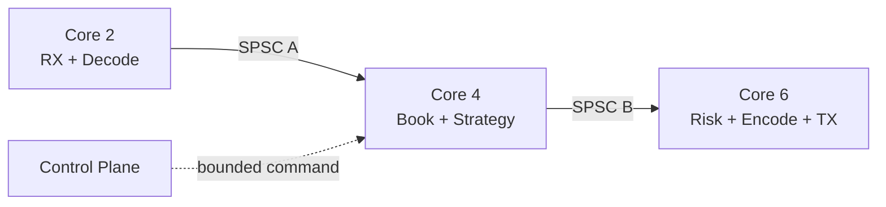

# 개요

초저지연 파이프라인에서 queue는 단순한 container가 아니다.
두 thread 사이의 ownership 이전 규약이며 overload가 드러나는 경계다.

```text
Producer core                         Consumer core
domain event 작성
  → slot lifetime 시작
  → publish head       ───────────→  head 관찰
                                     event 처리
  ←─────────── reclaim tail          slot lifetime 종료
다음 event로 slot 재사용
```

이 글은 정확히 producer 하나와 consumer 하나만 있는 bounded SPSC ring을 다룬다.
`head`와 `tail`의 writer를 하나씩 고정하면 compare-and-exchange 없이도 slot을 넘길 수 있다.
그러나 memory order, 객체 lifetime, full policy와 shutdown 중 하나라도 빠지면 빠르지만 틀린 queue가 된다.

목표는 다음 두 단계를 연결하는 것이다.

- Level 2-X에서 acquire-release SPSC의 correctness를 설명하고 검증한다.
- Level 3-HP에서 queue를 thread-per-core run-to-completion 파이프라인에 배치한다.

# 선수 글과 BFS 위치

| 관계 | 글 |
| --- | --- |
| BFS Level | **Level 2-X — C++ Memory Model**, **Level 3-HP — Hot-path Pipeline** |
| 엄격한 선수 글 | [[C언어] Atomic Operation 4. Memory Order 이해하기](/posts/c-atomic-operation-4/) |
| 엄격한 선수 글 | [[Low Latency Trading] Hot Path를 위한 Modern C++ 설계 원칙](/posts/low-latency-cpp-hot-path/) |
| 함께 읽기 | [[Low Latency Trading] Cache-Friendly Data Layout과 Memory Pool](/posts/low-latency-cache-layout-memory-pool/) |
| 실행 환경 | [[Low Latency Trading] Linux 실행 환경과 CPU 격리](/posts/low-latency-linux-execution/) |
| 적용 전 단계 | [[Low Latency Trading] L2·L3 Order Book Reconstruction Engine](/posts/low-latency-order-book-engine/) |
| 다음 글 | [[Low Latency Trading] perf·PMU와 Compiler Output으로 병목 찾기](/posts/low-latency-perf-pmu/) |

# 1. SPSC 계약을 먼저 적는다

SPSC는 Single Producer, Single Consumer다.
정확한 계약은 다음과 같다.

1. queue가 살아 있는 동안 `push` 계열은 동일한 producer thread 하나만 호출한다.
2. `pop` 계열은 동일한 consumer thread 하나만 호출한다.
3. producer만 `head`를 쓴다.
4. consumer만 `tail`을 쓴다.
5. producer는 publish 전까지 해당 slot을 독점한다.
6. consumer는 publish를 관찰한 뒤 reclaim 전까지 해당 slot을 독점한다.
7. 관리 thread는 두 worker가 종료된 뒤에만 queue를 파괴한다.

`single`은 동시 호출 수가 우연히 하나라는 뜻이 아니다.
생애 전체에서 writer 역할을 하나로 고정한다는 뜻이다.
Producer 역할을 다른 thread로 넘기려면 기존 호출이 끝났고 happens-before가 성립하는 별도 handoff가 필요하다.

다음 사용은 계약 위반이다.

```cpp
// 금지: 두 producer가 동시에 또는 교대로 외부 동기화 없이 호출한다.
ring.try_push(a); // producer A
ring.try_push(b); // producer B
```

`head.fetch_add()`로 바꾸는 것만으로 MPSC가 되지 않는다.
여러 producer가 예약한 slot의 publish 순서, 실패 복구와 per-slot ready 상태가 추가로 필요하다.
이 글의 증명과 구현을 MPSC에 일반화하지 않는다.

# 2. 왜 bounded power-of-two ring인가

Capacity가 `N`인 ring은 고정된 slot을 재사용한다.

```text
logical cursor:  14  15  16  17  18
physical index:   6   7   0   1   2    when N = 8
index = cursor & (N - 1)
```

`N`이 2의 거듭제곱이면 modulo 대신 mask로 physical index를 구할 수 있다.
더 중요한 장점은 hot path의 allocation과 capacity 변화가 없다는 점이다.

```cpp
static_assert(N >= 2);
static_assert(std::has_single_bit(N));
static constexpr std::size_t mask = N - 1;
```

Bounded queue는 overload를 없애지 않는다.
Capacity 한계에서 overload를 명시적으로 드러낸다.
Unbounded queue는 backlog를 memory 사용량과 늦은 latency로 옮길 뿐이다.

# 3. Cursor와 invariant

이 글에서는 monotonically increasing unsigned cursor를 사용한다.

- `head`: 다음에 producer가 생성할 logical position
- `tail`: 다음에 consumer가 제거할 logical position
- 점유 수: unsigned arithmetic의 `head - tail`
- empty: `head == tail`
- full: `head - tail == N`

항상 다음 invariant를 유지한다.

```text
0 <= unsigned(head - tail) <= N
```

한 slot을 비워 두는 설계도 가능하지만 이 구현은 cursor 차이로 full과 empty를 구분해 `N`개를 모두 쓴다.

Cursor가 `uint64_t` 최대값을 넘으면 unsigned arithmetic은 modulo 2^64로 정의된다.
Mask indexing과 bounded distance는 wrap 뒤에도 동작한다.
단, producer가 consumer보다 `N`보다 많이 앞설 수 없고 cursor 차이가 표현의 모호한 반 범위를 넘지 않는다는 invariant가 전제다.
실제 서비스에서 2^64회 handoff까지 걸리는 시간도 계산해 운영 가정을 문서화한다.

# 4. Head와 tail의 소유권

각 cursor는 한 thread만 갱신한다.

| 값 | writer | reader | 의미 |
| --- | --- | --- | --- |
| `head` | producer | consumer | 여기 전 slot까지 publish됨 |
| `tail` | consumer | producer | 여기 전 slot까지 파괴되어 재사용 가능 |

Producer가 자기 `head`를 반복해서 atomic load할 필요는 없다.
Local cursor를 보관하고 publish할 때만 atomic에 store할 수 있다.
Consumer도 같은 방식으로 local `tail`을 유지할 수 있다.

반대편 cursor는 stale해도 안전한 방향으로 cache할 수 있다.

- Producer가 stale `tail`을 보면 실제보다 일찍 full이라고 판단할 뿐 overwrite하지 않는다.
- Consumer가 stale `head`를 보면 실제보다 일찍 empty라고 판단할 뿐 미완성 slot을 읽지 않는다.

False negative는 허용되지만 false positive는 허용되지 않는다.
필요할 때 acquire load로 상대 cursor cache를 갱신한다.

# 5. Producer에서 consumer로 publish

Producer는 slot 안의 평범한 non-atomic `T`를 먼저 생성한다.
그 뒤 `head.store(next, release)`로 publish한다.

Consumer는 `head.load(acquire)`가 그 release 또는 release sequence의 값을 읽은 뒤 slot에 접근한다.

```text
Producer                              Consumer
construct T in slot
ordinary writes
head.store(next, release)  ───────→  head.load(acquire)
                                      read T
```

Release 이전의 slot write는 acquire 이후의 slot read보다 happens-before다.
따라서 slot field 자체를 atomic으로 만들 필요가 없다.
핵심은 consumer가 acquire로 published head를 확인하기 전에 slot을 읽지 않는 것이다.

`head.store(relaxed)`로 낮추면 compiler와 CPU에 publication ordering을 요구하지 못한다.
x86에서 우연히 통과하는 시험은 C++ correctness 증명이 아니다.

# 6. Consumer에서 producer로 reclaim

반대 방향도 필요하다.
Consumer는 값을 옮겨 낸 뒤 object를 파괴하고 `tail.store(next, release)`한다.
Producer는 full 경계에서 `tail.load(acquire)`로 reclaim을 관찰한다.

```text
Consumer                              Producer
read or move T
destroy T
tail.store(next, release)  ───────→  tail.load(acquire)
                                      construct next T in same storage
```

이 edge는 producer가 consumer의 마지막 read와 destructor가 끝나기 전에 같은 storage를 덮지 않게 한다.
Trivially destructible type만 시험하면 이 절반의 protocol을 놓치기 쉽다.

# 7. Acquire-release 증명 요약

Slot 하나의 세대를 `g`라고 하자.

1. Producer가 `slot[g]`의 lifetime을 시작하고 field를 쓴다.
2. Producer가 `head`를 release store한다.
3. Consumer가 그 값을 acquire load한다.
4. 1은 3 이후의 consumer access보다 happens-before다.
5. Consumer가 값을 읽고 `slot[g]`를 destroy한다.
6. Consumer가 `tail`을 release store한다.
7. Producer가 다음 세대 전에 그 값을 acquire load한다.
8. 5는 다음 세대의 construct보다 happens-before다.

따라서 서로 다른 세대의 lifetime이 겹치지 않고 같은 세대의 write와 read도 race하지 않는다.

자기 cursor를 relaxed로 읽고 쓰는 최적화는 역할별 program order와 상대 cursor의 acquire-release edge를 보존하는 범위에서만 한다.
먼저 명백한 구현을 검증하고 assembly와 benchmark가 필요성을 보일 때 최적화한다.

# 8. Cache line padding과 false sharing

Producer는 `head`를 자주 쓰고 consumer는 `tail`을 자주 쓴다.
두 atomic이 같은 coherence block에 있으면 서로 다른 주소여도 line ownership이 core 사이를 왕복할 수 있다.

```text
나쁜 후보
[ head | tail | metadata ........ ]  one cache line

분리 후보
[ head | padding ................ ]
[ tail | padding ................ ]
```

C++17의 `std::hardware_destructive_interference_size`는 false sharing을 피하기 위한 구현 제공 상수다.
하지만 다음 caveat가 있다.

- 모든 표준 library가 동일한 값을 제공하지 않는다.
- compile target option에 따라 값이나 ABI 경고가 달라질 수 있다.
- 실제 coherence granularity와 항상 같다는 portable guarantee가 아니다.
- Type layout, array 배치와 allocator alignment까지 확인해야 한다.

배포 target이 고정된 프로젝트는 검증한 cache-line 상수를 build configuration으로 둘 수 있다.
어느 경우든 `sizeof`, `alignof`, runtime address와 대상 CPU 문서를 함께 확인한다.

Padding은 queue object 내부 false sharing만 줄인다.
Queue 여러 개를 array에 붙이거나 다른 hot counter를 바로 옆에 두면 경계에서 다시 공유될 수 있다.

# 9. Object lifetime은 byte 복사와 다르다

미리 확보한 raw storage에 `T`가 항상 살아 있는 것은 아니다.
Push 성공 시 `std::construct_at`으로 lifetime을 시작하고 pop 시 `std::destroy_at`으로 끝낸다.

```cpp
struct Slot {
  alignas(T) std::byte bytes[sizeof(T)];
};
```

Pointer를 다시 얻을 때는 storage를 `T*`로 바꾸고 `std::launder`를 사용한다.
`memcpy`만으로 모든 non-trivial `T`의 lifetime을 관리할 수 있다고 가정하지 않는다.

Constructor가 예외를 던지면 head를 publish하지 않았으므로 queue 상태는 그대로다.
반면 pop 중 move assignment가 예외를 던지면 소비 정책이 복잡해진다.
Hot-path queue는 보통 payload의 move/destructor를 `noexcept`로 제한하거나 callback 소비 API를 설계한다.

# 10. C++20 reference implementation

다음 구현은 교육용으로 완결된 bounded SPSC queue다.
한 producer와 한 consumer 계약은 runtime에서 감지하지 않고 API 문서로 강제한다.

```cpp
#include <array>
#include <atomic>
#include <bit>
#include <cassert>
#include <cstddef>
#include <cstdint>
#include <memory>
#include <new>
#include <type_traits>
#include <utility>

template <class T, std::size_t Capacity>
class SpscRing {
  static_assert(Capacity >= 2);
  static_assert(std::has_single_bit(Capacity));
  static_assert(std::is_nothrow_move_assignable_v<T>);
  static_assert(std::is_nothrow_destructible_v<T>);

  struct Slot {
    alignas(T) std::byte data[sizeof(T)];
  };

  static constexpr std::size_t mask_ = Capacity - 1;
  static constexpr std::size_t line_ = 64; // target에서 검증할 build 상수

  T* raw_ptr(std::uint64_t pos) noexcept {
    auto* raw = slots_[static_cast<std::size_t>(pos) & mask_].data;
    return reinterpret_cast<T*>(raw);
  }

  T* live_ptr(std::uint64_t pos) noexcept {
    return std::launder(raw_ptr(pos));
  }

  alignas(line_) std::atomic<std::uint64_t> head_{0};
  std::uint64_t producer_head_{0};
  std::uint64_t producer_tail_cache_{0};

  alignas(line_) std::atomic<std::uint64_t> tail_{0};
  std::uint64_t consumer_tail_{0};
  std::uint64_t consumer_head_cache_{0};

  alignas(line_) std::array<Slot, Capacity> slots_{};

 public:
  SpscRing() = default;
  SpscRing(const SpscRing&) = delete;
  SpscRing& operator=(const SpscRing&) = delete;

  ~SpscRing() {
    // producer와 consumer가 join된 뒤에만 호출해야 한다.
    while (consumer_tail_ != head_.load(std::memory_order_relaxed)) {
      std::destroy_at(live_ptr(consumer_tail_));
      ++consumer_tail_;
    }
  }

  template <class... Args>
  bool try_emplace(Args&&... args) {
    const auto head = producer_head_;
    if (head - producer_tail_cache_ == Capacity) {
      producer_tail_cache_ = tail_.load(std::memory_order_acquire);
      if (head - producer_tail_cache_ == Capacity) {
        return false;
      }
    }

    // lifetime 시작 전 storage이므로 launder하지 않은 pointer를 사용한다.
    std::construct_at(raw_ptr(head), std::forward<Args>(args)...);
    producer_head_ = head + 1;
    head_.store(producer_head_, std::memory_order_release);
    return true;
  }

  bool try_push(const T& value) {
    return try_emplace(value);
  }

  bool try_push(T&& value) {
    return try_emplace(std::move(value));
  }

  bool try_pop(T& out) noexcept {
    const auto tail = consumer_tail_;
    if (tail == consumer_head_cache_) {
      consumer_head_cache_ = head_.load(std::memory_order_acquire);
      if (tail == consumer_head_cache_) {
        return false;
      }
    }

    T* value = live_ptr(tail);
    out = std::move(*value);
    std::destroy_at(value);
    consumer_tail_ = tail + 1;
    tail_.store(consumer_tail_, std::memory_order_release);
    return true;
  }

  static constexpr std::size_t capacity() noexcept {
    return Capacity;
  }
};

struct Event {
  std::uint64_t sequence{};
  std::int64_t price_ticks{};
  std::uint32_t quantity{};
};

static_assert(std::is_nothrow_move_assignable_v<Event>);

int main() {
  SpscRing<Event, 8> queue;
  Event out{};

  assert(!queue.try_pop(out));
  for (std::uint64_t i = 0; i < 8; ++i) {
    assert(queue.try_emplace(Event{i, 1000 + static_cast<std::int64_t>(i), 10}));
  }
  assert(!queue.try_emplace(Event{9, 1009, 10}));

  for (std::uint64_t i = 0; i < 8; ++i) {
    assert(queue.try_pop(out));
    assert(out.sequence == i);
  }
  assert(!queue.try_pop(out));
}
```

이 예제의 `64`는 portable truth가 아니다.
실제 제품에서는 target별 configuration 또는 검증된 `hardware_destructive_interference_size` wrapper를 사용한다.

# 12. Overflow와 backpressure policy

Full은 구현 세부가 아니라 business와 safety policy다.

| 정책 | 적합할 수 있는 곳 | 위험 |
| --- | --- | --- |
| spin/retry | 짧은 일시적 imbalance | core 소모, upstream stall 전파 |
| drop newest | 재생 가능한 telemetry | 최신 event 손실 |
| drop oldest | 명시적 snapshot stream | sequence와 lifetime 파괴 가능 |
| block/wait | cold path, lossless batch | tail latency와 scheduler 개입 |
| spill | audit/background | I/O와 ordering 복잡도 |
| fail-safe | 주문·risk 경계 | 거래 중단, 운영 절차 필요 |

Market-data incremental update를 조용히 drop하면 order book이 틀릴 수 있다.
Sequence gap을 표시하고 해당 book을 stale로 전환한 뒤 recovery해야 한다.

Order intent나 risk decision을 drop하면 의미가 더 심각하다.
대개 신규 주문을 fail-closed로 차단하고 alarm, cancel/kill 절차를 실행한다.

어떤 정책이든 다음 counter를 둔다.

- queue full 횟수
- drop 횟수와 최초 sequence
- 최대 관찰 depth
- full 지속 시간
- fail-safe 진입 원인
- recovery 성공·실패

# 13. Drop-oldest를 이 API에 억지로 넣지 않는다

Producer가 full일 때 `tail`을 직접 움직이면 tail의 single-writer invariant가 깨진다.
아직 consumer가 읽는 slot을 파괴할 수도 있다.

따라서 producer-side drop-oldest는 이 SPSC 구현의 작은 옵션이 아니다.
Per-slot state나 별도 synchronization을 가진 다른 algorithm이며 새로 증명해야 한다.
Drop이 필요하면 새 item 거부, stream-level snapshot 전환 또는 consumer와 합의된 protocol을 사용한다.

# 14. Spin, pause와 wait

Polling consumer는 empty일 때 반복해서 확인한다.
가장 단순한 loop는 다음과 같다.

```cpp
Event event{};
while (running) {
  if (queue.try_pop(event)) {
    handle(event);
  } else {
    cpu_relax();
  }
}
```

`cpu_relax()`는 architecture별 hint다.
x86의 `PAUSE`, AArch64의 `YIELD` 같은 instruction이 후보지만 동일한 latency나 power 효과를 보장하지 않는다.

```cpp
inline void cpu_relax() noexcept {
#if defined(__x86_64__) || defined(__i386__)
  __builtin_ia32_pause();
#elif defined(__aarch64__)
  asm volatile("yield" ::: "memory");
#else
  std::atomic_signal_fence(std::memory_order_seq_cst);
#endif
}
```

무한 busy spin은 전용 core라는 운영 계약이 있을 때만 정당화하기 쉽다.
SMT sibling의 resource와 power/frequency에도 영향을 줄 수 있다.

Hybrid wait는 일정 횟수 spin한 뒤 `std::this_thread::yield`, futex, semaphore 또는 `atomic::wait`로 내려갈 수 있다.
Wake-up latency와 scheduler jitter가 생기므로 hot/cold phase를 분리해 측정한다.
`atomic::wait`를 쓰려면 wait 대상 값 갱신과 `notify_one` protocol을 별도로 정확히 설계한다.

# 15. Batching

Consumer가 한 번 head를 acquire한 뒤 관찰된 구간을 batch로 처리하면 atomic traffic과 loop overhead를 줄일 수 있다.
Producer도 여러 slot을 만든 뒤 마지막 head로 한 번 publish할 수 있다.

```text
batch size 증가
  → cursor publication 비용/message 감소
  → throughput 증가 가능
  → 첫 message의 queueing latency 증가 가능
```

Batch에는 두 제한을 함께 둔다.

- 최대 item 수
- 최대 대기 시간 또는 cycle budget

`while (!empty)`로 무제한 drain하면 지속 부하에서 downstream timer, control command와 shutdown을 굶길 수 있다.
Run-to-completion loop는 batch budget 후 control plane을 확인한다.

# 16. Shutdown은 sentinel 하나로 끝나지 않는다

종료 목표는 producer가 마지막 item을 publish하고 consumer가 모두 drain한 뒤 둘 다 멈추는 것이다.
다음 state를 구분한다.

```text
OPEN → CLOSING → DRAINED → JOINED
```

권장 순서는 다음과 같다.

1. Control plane이 신규 input admission을 막는다.
2. Producer가 이미 받은 input을 처리한다.
3. Producer가 마지막 head release publication을 마친다.
4. Producer가 `closed.store(true, release)`한다.
5. Consumer가 closed를 acquire로 관찰한다.
6. Consumer가 head를 다시 acquire하고 queue가 empty임을 확인한다.
7. Consumer가 종료하고 관리 thread가 두 thread를 join한다.
8. Join 뒤 queue를 파괴한다.

Consumer가 empty를 한 번 본 직후 producer가 마지막 item을 publish할 수 있다.
그러므로 `empty || closed`가 아니라 **closed를 관찰한 뒤 다시 empty**를 확인해야 한다.

Payload sentinel은 domain value와 충돌하고 full queue에 넣지 못할 수 있다.
별도 close flag나 명시적 control channel이 더 분명하다.

# 17. Thread-per-Core와 run-to-completion

Thread-per-core는 component마다 무조건 thread 하나를 만든다는 뜻이 아니다.
Hot state와 execution ownership을 특정 core의 긴 수명 thread에 고정하는 설계다.



각 stage는 받은 event 하나에 필요한 연산을 그 core에서 끝내는 run-to-completion을 우선한다.
공유 mutable state와 lock handoff를 줄이고 warm cache를 유지할 수 있다.

하지만 stage를 너무 잘게 나누면 queue hop, publication과 cache-line migration이 늘어난다.
Book update와 strategy가 같은 state를 반복해서 읽는다면 같은 core에 합치는 편이 나을 수 있다.
분리는 independent progress, overload isolation이나 CPU budget이 실제로 필요할 때 측정으로 결정한다.

# 18. Ownership map을 문서로 만든다

Thread-per-core 설계에는 자료구조마다 owner를 적는다.

| State | Writer | Reader | 전달 방법 |
| --- | --- | --- | --- |
| decoder scratch | RX core | RX core | 전달하지 않음 |
| normalized event | RX core | Book core | SPSC value handoff |
| order book | Book core | Book core | 외부 직접 참조 금지 |
| order intent | Book core | Gateway core | SPSC value handoff |
| session state | Gateway core | Gateway core | control snapshot만 발행 |
| metrics shard | 각 owner | reporter | 주기적 snapshot |

다른 thread가 owner state를 const reference로 읽는 것도 lifetime과 cache coherence를 공유한다.
관찰자는 immutable snapshot이나 message를 받게 한다.

# 19. NUMA와 first touch

CPU affinity만 고정해도 memory locality가 자동으로 맞지는 않는다.
Page가 어느 NUMA node에 배치되는지는 first-touch policy와 allocator에 영향을 받는다.

Queue slot을 관리 thread가 먼저 모두 쓰면 관리 thread node에 page가 놓일 수 있다.
Producer와 consumer가 다른 socket에 있으면 cursor뿐 아니라 payload line도 interconnect를 건넌다.

확인 항목은 다음과 같다.

- `lscpu -e=CPU,NODE,SOCKET,CORE`
- `/sys/devices/system/node/`
- `numactl --hardware`
- thread affinity와 IRQ/RSS mapping
- queue allocation과 first-touch 주체
- SMT sibling 배치

가능하면 통신이 많은 stage를 같은 NUMA node의 physical core에 둔다.
Cross-socket partition이 필요하면 더 큰 batch와 fewer handoff가 나은지 측정한다.
`numactl` 결과는 container/cgroup과 cpuset 제한 안에서 해석한다.

# 21. Correctness test matrix

먼저 작은 capacity와 deterministic input으로 경계를 공격한다.

| Test | 검증 내용 |
| --- | --- |
| initial empty | 첫 pop 실패 |
| fill exactly N | N개 성공, N+1 실패 |
| FIFO | sequence가 정확히 증가 |
| wrap many times | physical index 재사용 |
| alternating | push/pop 반복 |
| burst imbalance | full 뒤 drain과 재개 |
| non-trivial T | ctor/dtor 횟수 일치 |
| throwing ctor | publish되지 않음 |
| concurrent checksum | 유실·중복·재정렬 없음 |
| close while empty | 정상 종료 |
| close after final burst | 마지막 item까지 drain |

Sanitizer build도 별도로 수행한다.

```bash
c++ -std=c++20 -O1 -g -fsanitize=address,undefined \
  -fno-omit-frame-pointer spsc_test.cpp -pthread -o spsc_asan
./spsc_asan

c++ -std=c++20 -O1 -g -fsanitize=thread \
  spsc_test.cpp -pthread -o spsc_tsan
./spsc_tsan
```

TSan 통과는 algorithm의 전체 memory-model proof를 대신하지 않는다.
TSan이 지원하지 않는 platform primitive나 inline assembly는 false report와 blind spot을 만들 수 있다.

# 22. Concurrent sequence test

실제 두 thread로 수백만 sequence를 넘겨 유실, 중복과 순서를 확인한다.

```cpp
#include <atomic>
#include <cassert>
#include <cstdint>
#include <thread>

void concurrent_test() {
  constexpr std::uint64_t count = 2'000'000;
  SpscRing<Event, 1024> queue;
  std::atomic<bool> start{false};

  std::thread producer([&] {
    while (!start.load(std::memory_order_acquire)) {}
    for (std::uint64_t i = 0; i < count; ++i) {
      Event e{i, static_cast<std::int64_t>(i), 1};
      while (!queue.try_push(e)) {
        cpu_relax();
      }
    }
  });

  std::thread consumer([&] {
    start.store(true, std::memory_order_release);
    Event e{};
    for (std::uint64_t expected = 0; expected < count;) {
      if (queue.try_pop(e)) {
        assert(e.sequence == expected);
        ++expected;
      } else {
        cpu_relax();
      }
    }
  });

  producer.join();
  consumer.join();
}
```

Test harness가 queue보다 느려지는 것을 피하려고 hot loop 안에서 logging하지 않는다.
Failure 정보를 per-thread buffer에 저장하고 join 뒤 출력한다.

# 24. Benchmark 질문을 분리한다

하나의 `ops/s` 숫자로 설계를 평가하지 않는다.

1. Single-thread loop overhead baseline은 얼마인가?
2. 두 core handoff의 one-way latency distribution은 어떤가?
3. Sustained throughput은 얼마인가?
4. Producer 또는 consumer가 느릴 때 full/empty 비율은 어떤가?
5. Padding 전후 coherence event와 throughput은 어떻게 변하는가?
6. Same-core SMT, same socket와 cross-socket 배치 차이는 어떤가?
7. Batch size가 p50, p99.9와 throughput을 어떻게 바꾸는가?

Throughput benchmark는 steady-state를 보고 latency benchmark는 event별 timestamp 또는 ping-pong boundary를 명확히 한다.
두 목적을 한 loop에서 동시에 측정하면 timestamp overhead가 throughput을 바꿀 수 있다.

# 25. Benchmark protocol

결과와 함께 다음을 기록한다.

```text
CPU model / microcode
kernel / compiler / standard library
compile flags and binary hash
producer CPU / consumer CPU / NUMA node
SMT, turbo, governor and thermal state
capacity / payload size / batch size
warm-up / measured duration / repetitions
full, empty and drop counts
p50 / p99 / p99.9 / max or throughput
```

Compiler가 benchmark를 제거하지 못하게 결과 checksum을 관찰 가능하게 만든다.
측정 thread의 stdout, allocation과 syscall은 measurement window 밖으로 옮긴다.

상세한 latency protocol은 [[Low Latency Trading] Latency를 올바르게 측정하는 방법](/posts/low-latency-measurement/)을 따른다.
Counter와 assembly 분석은 다음 글인 [[Low Latency Trading] perf·PMU와 Compiler Output으로 병목 찾기](/posts/low-latency-perf-pmu/)에서 이어진다.

# 27. 흔한 오해

## 오해 1: `volatile`이면 thread-safe다

`volatile`은 C++ thread synchronization을 제공하지 않는다.
Atomic cursor와 올바른 memory order가 필요하다.

## 오해 2: x86에서는 relaxed도 안전하다

C++ compiler ordering까지 포함한 portable proof가 없고 다른 ISA로 옮길 수도 있다.
Target-specific 완화는 source, compiler와 ISA를 함께 증명하고 회귀 시험할 별도 작업이다.

## 오해 3: lock-free면 wait-free다

Queue operation이 lock을 쓰지 않아도 full/empty spin은 무한히 지속될 수 있다.
System scheduling과 상대 thread progress도 필요하다.

## 오해 4: 큰 capacity가 안전하다

큰 queue는 burst를 흡수하지만 stale event와 tail latency를 숨긴다.
Capacity는 허용 backlog 시간과 rate로 산정한다.

## 오해 5: padding은 64만 붙이면 끝난다

실제 target의 coherence granularity, object address, adjacent object와 array stride를 확인해야 한다.

## 오해 6: thread-per-core는 queue를 많이 두는 설계다

핵심은 state ownership과 predictable progress다.
불필요한 stage 분리는 handoff 비용만 늘린다.

## 오해 7: SPSC에 producer를 하나 더 붙여도 가끔만 쓰면 된다

호출 빈도와 무관하게 head single-writer invariant를 깨므로 undefined behavior와 slot corruption 가능성이 생긴다.

# 28. 완료 기준

다음을 모두 만족하면 Level 2-X 학습을 완료한 것으로 본다.

- head와 tail의 유일한 writer를 말할 수 있다.
- 두 release/acquire edge를 happens-before로 증명할 수 있다.
- full과 empty를 cursor invariant로 설명할 수 있다.
- non-trivial `T`의 lifetime 시작과 종료 위치를 찾을 수 있다.
- wraparound와 bounded distance 전제를 설명할 수 있다.
- full policy를 domain별로 문서화할 수 있다.
- deterministic, concurrent, sanitizer test를 실행할 수 있다.

다음을 만족하면 Level 3-HP 산출물을 완료한 것으로 본다.

- 각 hot state의 owner core와 전달 queue를 표로 만들었다.
- thread와 memory의 NUMA 배치를 기록했다.
- overload에서 drop, block 또는 fail-safe 동작을 시험했다.
- closed 이후 final drain과 join을 시험했다.
- batch size별 throughput과 tail latency를 비교했다.
- same-socket와 cross-socket 결과를 재현 가능한 보고서로 남겼다.

# 31. 참고 자료

- [C++ draft: atomics.order](https://eel.is/c++draft/atomics.order)
- [C++ reference: `std::memory_order`](https://en.cppreference.com/w/cpp/atomic/memory_order)
- [C++ reference: `std::construct_at`](https://en.cppreference.com/w/cpp/memory/construct_at)
- [C++ reference: `std::hardware_destructive_interference_size`](https://en.cppreference.com/w/cpp/thread/hardware_destructive_interference_size)
- [Linux man-pages: `pthread_setaffinity_np(3)`](https://man7.org/linux/man-pages/man3/pthread_setaffinity_np.3.html)
- [Intel 64 and IA-32 Architectures Optimization Reference Manual](https://www.intel.com/content/www/us/en/developer/articles/technical/intel-sdm.html)
- [Arm Architecture Reference Manual](https://developer.arm.com/documentation/ddi0487/latest/)

# 마무리

SPSC ring의 속도는 single-writer ownership에서 나온다.
Producer는 slot을 만든 뒤 head로 publish하고 consumer는 slot을 파괴한 뒤 tail로 reclaim한다.
두 방향의 release/acquire가 object lifetime을 연결하며 padding, batching과 polling은 그 correctness 위에서만 최적화다.

Thread-per-core 설계의 목적도 thread 수가 아니라 ownership을 분명히 하는 데 있다.
Queue full과 shutdown을 정상 운영 상태로 설계하고 CPU·NUMA 배치와 tail latency까지 측정해야 독립 hot-path component가 완성된다.
