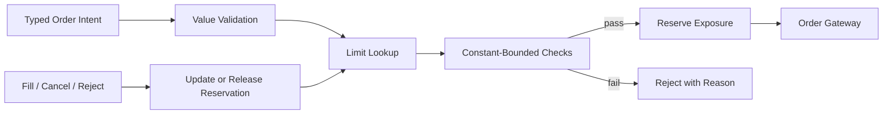
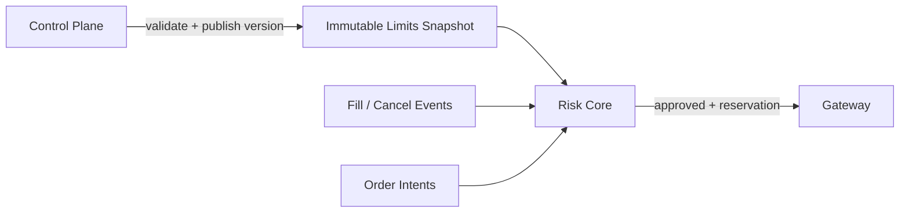

# 개요

초저지연 주문 경로의 숫자는 단순한 `double`이나 `int64_t`가 아니다.

```text
가격 12345
```

이 값만으로는 다음을 알 수 없다.

- 123.45 USD인가, 12,345 KRW인가?
- Exchange tick으로 몇 개인가?
- 원주 수량인가, lot 수인가?
- Contract multiplier와 FX rate를 적용했는가?
- 반올림 방향은 무엇인가?
- 곱셈이 integer 범위를 넘지 않는가?

Risk gate도 단순한 `if (quantity < limit)`가 아니다.
한 주문이 wire로 나가기 전에 가격, 수량, notional, position, message rate, market-data freshness와 kill switch를 **일관된 snapshot**에서 판정하고 exposure를 예약해야 한다.



이 글의 `O(1)`은 “무조건 한 CPU cycle”이라는 뜻이 아니다.
Instrument/account별 미리 계산한 state를 bounded lookup으로 읽고, 주문마다 portfolio 전체나 open-order list를 순회하거나 remote service를 호출하지 않는다는 설계 목표다.

# 학습 위치

| 항목 | 내용 |
| --- | --- |
| BFS Level | Level 2-R — Trading Numerics, Level 3-RK — Pre-Trade Risk |
| 선수 글 | [[Low Latency Trading] Hot Path를 위한 Modern C++ 설계 원칙](/posts/low-latency-cpp-hot-path/) |
| 선수 글 | [[Low Latency Trading] Market Microstructure와 Limit Order Book](/posts/low-latency-market-microstructure/) |
| 적용 글 | [[Low Latency Trading] Order Gateway와 FIX·Binary Session Recovery](/posts/low-latency-order-gateway-session/) |
| 다음 단계 | OMS, position, reconciliation과 global risk |

완료 기준은 다음과 같다.

> 단위가 다른 값을 compile time에 섞지 않고, overflow·rounding을 명시하며, 동시에 들어오는 주문이 같은 limit을 이중 사용하지 않게 예약할 수 있는가?

# 1. 숫자에 단위를 넣는다

아래 함수는 compile되지만 의미가 안전하지 않다.

```cpp
std::int64_t notional(std::int64_t a, std::int64_t b) {
    return a * b;
}
```

`a`와 `b`에 price, quantity, lot size, multiplier 중 무엇이 들어가도 compiler가 막지 않는다.

## 1.1 Strong Type

최소한 domain이 다른 숫자를 서로 다른 type으로 만든다.

```cpp
#include <cstdint>

class PriceTicks {
public:
    explicit constexpr PriceTicks(std::int64_t value) : value_{value} {}
    [[nodiscard]] constexpr std::int64_t value() const noexcept {
        return value_;
    }
private:
    std::int64_t value_;
};

class Quantity {
public:
    explicit constexpr Quantity(std::int64_t value) : value_{value} {}
    [[nodiscard]] constexpr std::int64_t value() const noexcept {
        return value_;
    }
private:
    std::int64_t value_;
};

class MoneyMinor {
public:
    explicit constexpr MoneyMinor(std::int64_t value) : value_{value} {}
    [[nodiscard]] constexpr std::int64_t value() const noexcept {
        return value_;
    }
private:
    std::int64_t value_;
};
```

그러면 다음 실수를 우연히 허용하지 않는다.

```cpp
void send_order(PriceTicks price, Quantity quantity);

// send_order(quantity, price); // compile error
```

같은 기초 type을 쓴다고 같은 단위가 아니다.

| Type | 예시 의미 |
| --- | --- |
| `PriceTicks` | 해당 instrument의 최소 가격 증분 개수 |
| `PriceMinor` | 통화의 고정 소수 scale로 표현한 가격 |
| `Quantity` | 실제 주문 단위 수량 |
| `Lots` | 거래소 lot 개수 |
| `MoneyMinor` | USD cent, KRW won 등 통화별 minor unit |
| `Position` | 부호 있는 보유 수량 |
| `Rate` | 별도 scale을 가진 비율 |

`MoneyMinor`만으로는 USD와 KRW 같은 서로 다른 통화를 compile time에 구분하지 못한다.
통화까지 정적으로 막으려면 currency-tagged type을 사용하고, runtime instrument를 지원하면 currency와 scale metadata를 값의 contract에 포함해 연산마다 검증한다.

# 2. Tick, Lot과 Scale

Instrument reference data가 숫자의 해석을 결정한다.

```cpp
struct InstrumentRules {
    std::int32_t price_scale_digits; // decimal point 뒤 고정 digit 수
    std::int64_t tick_size_minor;    // price minor units
    std::int64_t lot_size;
    std::int64_t contract_multiplier;
    Currency currency;
};
```

예를 들어 price minor unit이 0.01이고 tick size가 0.05라면 유효 가격은 다음 조건을 만족한다.

```text
price_minor % 5 == 0
```

Quantity가 lot 단위라면 다음과 같다.

```text
quantity % lot_size == 0
```

하지만 odd lot을 허용하거나 price band별 tick이 달라지는 market도 있다.
따라서 전역 상수 하나로 모든 instrument를 검증하지 않는다.

## 2.1 Decimal Text를 Parse할 때

Wire 또는 configuration의 `"123.45"`를 binary floating point로 읽은 뒤 100을 곱하면 representation과 rounding 문제가 생길 수 있다.

정해진 scale의 decimal parser는 다음 절차를 명시할 수 있다.

```text
1. sign 검사
2. integer digits를 checked accumulate
3. decimal point 뒤 digit 수 검사
4. 부족한 자리는 0으로 채움
5. scale보다 많은 digit은 reject하거나 명시된 rounding 적용
6. 최종 범위 검사
```

Configuration과 venue field가 허용한 소수 자리수를 넘었다면 조용히 truncate하지 않는다.

# 3. Floating Point를 무조건 금지하는 것이 아니다

Order price, quantity, fee와 limit처럼 exact decimal contract가 중요한 값은 fixed-point integer가 reasoning하기 쉽다.
그러나 모든 계산을 integer로 바꿔야 한다는 뜻은 아니다.

Research statistic, model score와 일부 analytics에는 floating point가 자연스러울 수 있다.
경계를 정한다.

```text
research/model domain
  floating-point score
       ↓ explicit conversion policy
execution domain
  ticks / lots / fixed-point money
```

변환 지점에서 다음을 결정한다.

- NaN과 infinity reject
- 허용 범위
- Tick 방향 rounding
- Buy와 sell의 보수적 방향
- 변환 오차 metric

# 4. Signed Integer Overflow는 검사가 아니다

C++에서 signed integer overflow에 의존하면 안 된다.

```cpp
std::int64_t value = price * quantity;
if (value < 0) {
    // 이미 overflow가 발생했다면 늦었다.
}
```

곱하기 전에 범위를 검사하거나 더 넓은 중간 type을 사용한 뒤 원래 범위로 좁힌다.
Compiler builtin 또는 표준 library 지원 범위는 toolchain과 언어 version에 맞춘다.

## 4.1 Portable한 양수 곱셈 검사

Price와 quantity를 검증해 양수만 허용한다면 다음처럼 검사할 수 있다.

```cpp
#include <cstdint>
#include <limits>
#include <optional>

std::optional<std::int64_t>
checked_mul_nonnegative(std::int64_t lhs, std::int64_t rhs) noexcept {
    if (lhs < 0 || rhs < 0) {
        return std::nullopt;
    }
    if (lhs != 0 && rhs > std::numeric_limits<std::int64_t>::max() / lhs) {
        return std::nullopt;
    }
    return lhs * rhs;
}
```

일반 signed 범위 전체를 지원하면 `min * -1` 같은 경계도 처리해야 한다.
Risk hot path에서는 domain을 먼저 좁히고 검증된 arithmetic helper만 사용하면 상태 공간을 줄일 수 있다.

## 4.2 Notional 계산 순서

단순 주식 예시는 다음과 같다.

```text
notional_minor = price_minor × quantity
```

파생상품이나 다른 상품은 다음 요소가 추가될 수 있다.

```text
price × quantity × contract_multiplier × currency_conversion
```

곱셈 순서마다 overflow 가능성과 scale이 다르다.
중간 표현 범위, divide/round 순서와 limit의 통화를 문서화한다.

# 5. Rounding은 Business Rule이다

다음 값이 tick 사이에 있다고 하자.

```text
raw price = 100.023
tick      = 0.01
```

가능한 결과는 100.02 또는 100.03이다.
어느 쪽이 맞는지는 사용 목적에 달려 있다.

| 목적 | 보수적 선택의 예 |
| --- | --- |
| Buy limit order | 의도한 maximum을 넘지 않도록 아래 tick |
| Sell limit order | 의도한 minimum 아래로 내려가지 않도록 위 tick |
| Worst-case buy notional | Exposure를 작게 보지 않도록 위 방향 |
| Fee reserve | 부족하게 예약하지 않도록 위 방향 |
| Accounting | 명시된 market/accounting rule |

이 표는 보편적 venue rule이 아니라 policy 예시다.
Order generation과 risk estimation이 서로 다른 rounding contract를 쓸 수 있으므로 함수 이름에 의도를 넣는다.

```cpp
PriceTicks floor_to_tick(PriceMinor, TickSize);
PriceTicks ceil_to_tick(PriceMinor, TickSize);
MoneyMinor worst_case_buy_notional(Order, InstrumentRules);
```

# 6. Risk Gate의 입력 Snapshot

Risk 결과는 주문 하나만으로 결정되지 않는다.

```cpp
struct RiskContext {
    LimitsVersion limits_version;
    MarketVersion market_version;
    PositionVersion position_version;
    SessionState session_state;
    bool kill_switch_active;
    bool market_data_fresh;
};
```

Hot path에서 서로 다른 시점의 pointer를 제각각 읽으면 논리적으로 존재하지 않은 혼합 snapshot을 만들 수 있다.

```text
old limits + new position + old market price
```

한 가지 방법은 immutable, versioned configuration snapshot을 atomic하게 publish하고, mutable exposure는 single-writer core가 관리하는 것이다.



# 7. Pre-Trade Check의 최소 집합

실제 규칙은 상품, 거래 장소, broker와 관할 규정에 따라 달라진다.
학습용 gateway는 다음 범주를 분리한다.

## 7.1 Static Validation

- 알려진 instrument인가?
- Side와 order type 조합이 허용되는가?
- Quantity가 양수이며 lot rule을 만족하는가?
- Price가 양수이며 tick rule을 만족하는가?
- Protocol field 범위에 들어가는가?

## 7.2 Per-Order Limit

- 최대 order quantity
- 최대 order notional
- 최소/최대 허용 price
- Market/reference price 대비 price collar

## 7.3 Aggregate Exposure

- Instrument position limit
- Account gross/net exposure
- Outstanding buy/sell quantity
- Open order count
- Credit 또는 capital limit

## 7.4 Rate와 Capacity

- Order message rate
- Cancel/replace rate
- Session throttle 여유
- Gateway command queue capacity

## 7.5 System State

- Kill switch가 꺼져 있는가?
- Market data가 fresh하고 book이 `LIVE`인가?
- Order-entry session이 `LIVE`인가?
- Reference data와 limits version이 유효한가?
- Clock health와 required dependency가 정상인가?

# 8. O(1)의 정확한 의미

잘못된 risk 구현은 주문마다 다음 작업을 할 수 있다.

```text
all open orders scan
all positions aggregate
database query
remote risk service RPC
dynamic allocation
```

Latency뿐 아니라 burst에서 queueing과 availability 문제가 된다.

대신 미리 유지한 aggregate를 직접 조회한다.

```cpp
struct InstrumentExposure {
    std::int64_t position;
    std::int64_t open_buy_qty;
    std::int64_t open_sell_qty;
    std::int64_t reserved_buy_notional;
    std::int64_t reserved_sell_notional;
    std::uint32_t open_order_count;
};
```

Aggregate 자체도 representation limit을 넘을 수 있으므로 승인·fill·release 때 모든 갱신에 checked add/subtract를 적용하고, configuration limit이 표현 범위 안인지 publication 전에 검증한다.

Instrument ID를 dense index로 normalize했다면 bounded array access가 가능하다.

```cpp
auto& exposure = exposures[instrument_index];
```

Hash lookup을 써도 평균 복잡도만 보고 끝내지 않는다.
Rehash, collision, allocator와 adversarial input 가능성을 제어한다.

> `O(1)`은 memory locality, cache miss, contention과 branch cost가 0이라는 뜻도 아니다. Complexity와 latency distribution을 함께 측정한다.

# 9. Check와 Reserve는 하나의 논리 동작이다

두 주문이 동시에 같은 잔여 limit을 검사한다고 하자.

```text
available = 100

Order A checks 80 → pass
Order B checks 80 → pass
Order A reserves 80
Order B reserves 80
total 160 → breach
```

`check` 뒤 나중에 `reserve`하면 안 된다.

## 9.1 Single-Writer Risk Core

가장 이해하기 쉬운 방법 중 하나는 account/instrument exposure를 한 risk core만 쓰는 것이다.

```text
Strategy threads
  → bounded command rings
Risk core
  → validate + check + reserve in event order
  → approved command ring
Gateway core
```

이 구조는 순서를 명확하게 하지만 하나의 core가 처리할 수 있는 capacity와 routing을 측정해야 한다.
Account 또는 shard별 single writer로 확장할 때 global limit의 consistency 문제를 다시 설계한다.

## 9.2 Atomic Reservation

공유 atomic aggregate를 CAS로 갱신하는 방식도 가능하다.
하지만 여러 limit을 동시에 바꿔야 하면 rollback과 snapshot consistency가 복잡해진다.

```text
quantity limit pass
notional CAS success
position CAS fail
→ notional rollback은 누구와 어떤 순서로 하는가?
```

Lock-free라는 이름만으로 더 안전하거나 빠르다고 가정하지 않는다.

# 10. Worst-Case Exposure를 예약한다

New buy order를 승인할 때 아직 fill되지 않았다고 exposure가 0은 아니다.

```text
position exposure
+ outstanding order exposure
+ new order worst-case exposure
<= limit
```

Reservation state는 order lifecycle과 연결된다.

| Event | Open-order reservation | Position/accounting |
| --- | --- | --- |
| New approved | 증가 | 변화 없음 |
| New rejected | 해제 | 변화 없음 |
| Partial fill | leaves만큼으로 감소 | filled quantity 반영 |
| Full fill | 0 | 전체 fill 반영 |
| Cancel confirmed | remaining 해제 | 기존 fill 유지 |
| Replace up local 승인·전송 | 기존 reservation에 증가분을 먼저 예약 | 기존 fill 유지 |
| Replace accepted | replacement의 새 worst-case로 확정 | 기존 fill 유지 |
| Replace rejected | 원 order의 reservation 유지, 임시 증가분만 해제 | 기존 fill 유지 |
| Disconnect unknown | 임의 해제 금지 | reconcile 필요 |

Cancel을 **전송**했다는 이유로 reservation을 먼저 해제하면 cancel-fill race에서 limit을 초과할 수 있다.
거래소가 canceled state를 확인했거나 authoritative reconciliation이 끝난 뒤 remaining reservation을 해제한다.
Replace도 exposure를 늘리는 요청은 wire 전송 전에 증가분을 예약하고, exposure를 줄이는 요청은 accepted 결과를 확인하기 전에 감소분을 해제하지 않는다.

# 11. Price Collar와 Stale Data

Reference price 기반 검사는 reference가 fresh할 때만 의미가 있다.

```text
lower <= order_price <= upper
```

Reference 후보는 venue rule에 따라 last trade, best bid/offer, midpoint, auction price 또는 별도 reference price일 수 있다.

## 11.1 가격 0과 Empty Book

Book이 비었다고 reference를 0으로 두면 모든 정상 주문을 reject하거나 잘못된 범위를 만들 수 있다.
`optional<Price>`처럼 unavailable을 값 0과 구분한다.

## 11.2 Freshness

```cpp
bool is_fresh(MonoTime now,
              MonoTime last_update,
              Duration maximum_age) noexcept;
```

Interval은 monotonic clock으로 계산한다.
Sequence gap, recovery 중인 book과 session 전환도 `stale` 또는 `not_live`의 원인이 된다.

Market data가 stale할 때 정책을 rule별로 정한다.

- New 주문 fail-closed
- Risk-reducing cancel 허용
- Replace가 risk를 줄이는 경우만 허용할지 검토
- Operator alert와 kill switch escalation

# 12. Rate Limit은 Burst를 포함한다

초당 평균만 제한하면 짧은 burst가 venue throttle과 local queue를 넘을 수 있다.
Token bucket은 한 가지 선택이다.

```text
tokens = min(capacity,
             tokens + elapsed × refill_rate)

if tokens >= cost:
    tokens -= cost
    pass
else:
    reject or defer by explicit policy
```

Hot path 구현에서는 floating point 대신 fixed-point token 또는 정수 time quantum을 쓸 수 있다.

주의할 항목은 다음과 같다.

- New, cancel, replace의 cost가 같은가?
- Risk-reducing cancel을 rate limit 때문에 막아도 되는가?
- Venue와 local bucket의 time window가 같은가?
- Clock jump가 token을 무한 충전하지 않는가?
- Deferred order가 stale해지지 않는가?

Trading order는 일반 web request처럼 무기한 queueing하면 의미가 변한다.
대부분은 즉시 명시적 reject가 더 다루기 쉽다.

# 13. Fail-Open과 Fail-Closed 표를 만든다

모든 dependency failure에서 같은 정책을 쓸 수는 없다.

| 조건 | New | Cancel | 기본 근거 예시 |
| --- | --- | --- | --- |
| Kill switch active | 차단 | 허용 또는 mass cancel | Exposure 축소 |
| Market data stale | 차단 | 허용 | Price check 불가 |
| Limits snapshot invalid | 차단 | 허용 | Limit 증명 불가 |
| Order session down | 전송 불가 | recovery policy | Wire unavailable |
| Audit business queue full | safe stop | 별도 안전 경로 | Event loss 금지 |
| Telemetry queue full | sample/drop 가능 | 동일 | 업무 state와 분리 |
| Position unknown | 차단 | 허용 검토 | Worst-case 계산 불가 |

이 표는 system별 threat model과 규정에 맞게 검토해야 한다.
“Latency를 위해 fail-open” 같은 포괄적 예외를 두지 않는다.

# 14. Kill Switch

Kill switch는 UI의 Boolean 하나가 아니다.

```text
scope: strategy / account / session / venue / global
action: block new / block replace / mass cancel / disconnect
source: operator / automatic breach / external controller
state: requested / active / canceling / confirmed
```

확인할 질문은 다음과 같다.

- 활성화가 모든 order-producing core에 언제 보이는가?
- 이미 queue 안에 있는 command도 차단하는가?
- Cancel은 계속 허용하는가?
- Venue mass-cancel 결과를 어떻게 확인하는가?
- Restart 뒤 kill 상태를 어떻게 복원하는가?
- 해제에는 누가 어떤 승인 절차를 사용하는가?

Versioned immutable state를 publish하고 gateway가 send 직전에도 generation을 확인하면 오래된 승인 command가 뒤늦게 나가는 위험을 줄일 수 있다.

# 15. Configuration Publication

Limit 변경은 control-plane 작업이지만 hot path correctness에 직접 영향을 준다.

```text
parse
  → schema/range validation
  → cross-field invariant validation
  → approval/audit
  → immutable snapshot build
  → atomic publication
  → old snapshot reclamation
```

각 decision event에 limits version을 기록한다.

```cpp
struct RiskAuditEvent {
    DecisionCode code;
    LimitsVersion limits_version;
    MarketVersion market_version;
    MoneyMinor computed_notional;
    MoneyMinor reserved_after;
};
```

그러면 사후에 “왜 이 주문이 승인됐는가?”를 당시 state로 replay할 수 있다.

# 16. 간단한 Risk Decision Model

```cpp
enum class RejectReason : std::uint8_t {
    none,
    kill_switch,
    session_not_live,
    stale_market_data,
    invalid_tick,
    invalid_lot,
    quantity_limit,
    notional_overflow,
    order_notional_limit,
    position_limit,
    rate_limit,
    capacity_limit
};

struct RiskDecision {
    bool approved;
    RejectReason reason;
    MoneyMinor reservation;
    LimitsVersion limits_version;
};
```

Reject reason을 문자열 formatting하기 위해 hot path에서 allocation할 필요는 없다.
Enum code를 event ring으로 넘기고 cold path에서 rendering한다.

## 16.1 Evaluation 순서

싼 검사를 앞에 둔다고 correctness가 바뀌면 안 된다.
일반적인 예시는 다음과 같다.

```text
kill/session state
→ static field validation
→ checked notional calculation
→ per-order limits
→ aggregate exposure
→ rate/capacity
→ reservation commit
```

Reject reason priority가 운영상 중요하면 specification으로 고정한다.
Compiler와 branch prediction을 위해 순서를 바꾸기 전에 결과 의미와 timing side effect를 검증한다.

# 17. Regulatory Context를 분리한다

예를 들어 미국의 SEC Rule 15c3-5는 market access를 제공하는 broker-dealer의 financial·regulatory risk-management control에 관한 요구를 둔다.
Preset credit/capital threshold, erroneous order 방지 등의 주제가 포함된다.

그러나 이 예시를 전 세계 모든 시장과 모든 참여자에게 그대로 적용하면 안 된다.

- 관할 국가와 법인 역할
- Broker, dealer, exchange member와 sponsored access 관계
- 상품과 trading venue
- 최신 법령, SRO/venue rule과 broker 계약

을 법무·준법 담당자와 확인해야 한다.

> 이 글은 system design 학습 자료이며 법률 또는 규제 자문이 아니다.

# 18. Test Matrix

## 18.1 숫자 경계값

```text
minimum valid tick
one unit below/above tick boundary
minimum/maximum quantity
zero and negative input
maximum representable multiplication
one step beyond multiplication range
decimal with too many digits
currency/scale mismatch
```

## 18.2 State Transition

```text
approve → reject ACK → reservation release
approve → partial fill → cancel → release leaves
approve → cancel sent → fill → cancel reject
replace up/down quantity
duplicate fill
disconnect with unknown live state
```

## 18.3 Concurrency와 Burst

```text
two orders compete for last available limit
limit update while intents arrive
kill switch while approved commands are queued
rate bucket at exact boundary
queue reaches full capacity
```

## 18.4 Property Test

무작위 event sequence에서 다음 invariant를 검사한다.

```text
reserved exposure >= 0
open-order reservation == sum of authoritative leaves exposure
position == initial/snapshot position + unique execution·correction의 signed effect 합
approved order의 notional <= 당시 order limit
kill generation 이후의 new command는 wire에 없음
```

# 19. Benchmark

Risk benchmark는 승인 경로 한 개의 평균 시간만 재면 부족하다.

```text
workload mix:
  70% pass
  10% price reject
  10% aggregate-limit reject
  5% rate reject
  5% stale/kill state
```

기록할 값은 다음과 같다.

- p50, p99, p99.9, max
- Orders per second와 burst duration
- Cache/branch event
- Input ring과 output ring depth
- Retry 또는 CAS failure 수
- Reject reason distribution
- Limit publication 중 tail 변화

항상 같은 decision 결과와 final exposure가 나오는지도 benchmark 검증에 포함한다.

# 20. 구현 순서

1. Price, quantity, money와 position strong type을 만든다.
2. Decimal parse, tick/lot validation과 checked arithmetic을 test한다.
3. Per-order rule을 순수 함수로 구현한다.
4. Exposure aggregate와 order lifecycle reservation을 연결한다.
5. Single-thread deterministic reducer를 완성한다.
6. Immutable limits publication과 version log를 붙인다.
7. Bounded ring으로 strategy와 gateway에 연결한다.
8. Kill, stale data, queue full과 disconnect fault를 주입한다.
9. Correctness test를 유지한 채 perf/PMU로 병목을 측정한다.

# 21. 실습 과제

## 과제 A — Fixed-Point Calculator

세 instrument를 서로 다른 tick, lot, currency scale과 multiplier로 정의한다.
Text order를 parse해 다음 결과를 출력한다.

```text
normalized ticks
normalized quantity
worst-case notional
rounding decision
reject reason
```

## 과제 B — Reservation Ledger

New, reject, partial fill, cancel과 duplicate fill event를 받아 다음 aggregate를 갱신한다.

```text
position
open buy/sell quantity
reserved notional
open order count
```

매 event 뒤 전체 order map을 느리게 scan한 reference model과 결과를 비교한다.
Production path는 aggregate O(1), test oracle은 scan 방식으로 두면 좋은 differential test가 된다.

## 과제 C — Fault Table

각 dependency failure에 대해 다음을 채운다.

```text
detect signal
new-order policy
cancel policy
alert
recovery condition
audit event
```

# 22. 체크리스트

- [ ] Price, quantity, money, lots와 ticks를 다른 type으로 표현했다.
- [ ] Decimal scale과 rounding 방향을 명시했다.
- [ ] Signed overflow가 일어나기 전에 검사한다.
- [ ] Instrument별 tick, lot, multiplier와 currency를 적용한다.
- [ ] O(1) check에서 open orders 또는 portfolio 전체를 scan하지 않는다.
- [ ] Check와 reservation이 하나의 일관된 동작이다.
- [ ] Cancel 전송만으로 remaining reservation을 해제하지 않는다.
- [ ] Duplicate fill이 position을 두 번 바꾸지 않는다.
- [ ] Stale market data와 unknown position에서 policy가 명시됐다.
- [ ] New와 risk-reducing cancel의 failure policy를 구분했다.
- [ ] Limit snapshot과 decision에 version을 기록한다.
- [ ] Kill switch가 queued command와 restart를 다룬다.
- [ ] 관할 규정과 venue rule을 별도로 검토한다.

# 참고 자료

- [ISO C++ Working Draft Index, N5055](https://www.open-std.org/jtc1/sc22/wg21/docs/papers/2026/n5055.html)
- [SEI CERT C++ Coding Standard, Avoid signed integer overflow](https://wiki.sei.cmu.edu/confluence/pages/viewpage.action?pageId=88046682)
- [SEC, Risk Management Controls for Brokers or Dealers with Market Access](https://www.sec.gov/rules-regulations/2011/06/risk-management-controls-brokers-or-dealers-market-access)
- [SEC, Responses to Frequently Asked Questions Concerning Rule 15c3-5](https://www.sec.gov/rules-regulations/staff-guidance/trading-markets-frequently-asked-questions/divisionsmarketregfaq-0)
- [FIX Trading Community, Order State Change Matrices](https://www.fixtrading.org/online-specification/order-state-changes/)

# 정리

초저지연 risk의 출발점은 branch를 줄이는 일이 아니라 숫자와 state의 의미를 고정하는 일이다.

```text
strong types
  → explicit scale/tick/lot/rounding
  → checked arithmetic
  → versioned state snapshot
  → constant-bounded checks
  → atomic reservation
  → fill/cancel/reject reconciliation
```

`O(1)` aggregate는 빠르기 위해 필요하지만 correctness를 자동으로 보장하지 않는다.
Order lifecycle과 같은 순서로 reservation을 갱신하고, uncertainty에서는 exposure를 임의로 해제하지 않으며, 모든 decision을 당시 version과 함께 replay할 수 있어야 한다.
