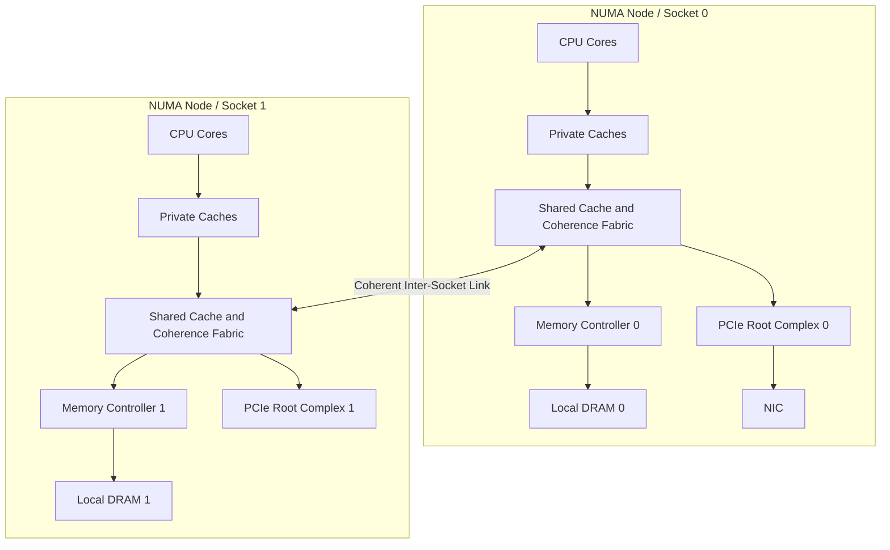
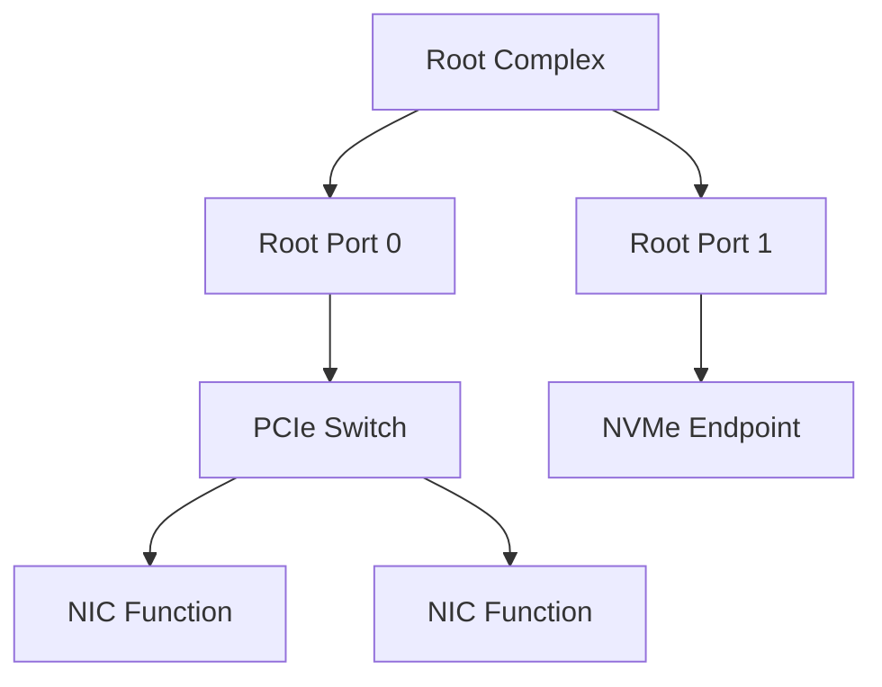
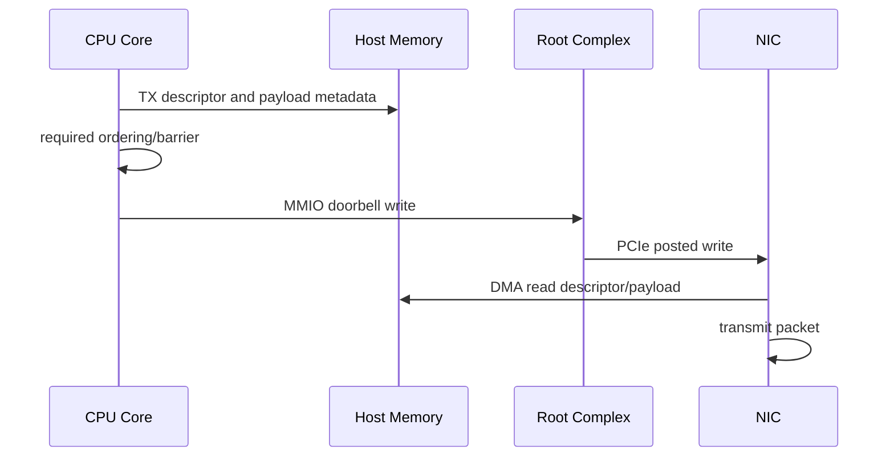

# 개요

“CPU bus가 느리다”는 말만으로는 초저지연 system의 병목을 설명할 수 없다.

현대 server에서 core, cache, memory와 NIC는 하나의 공유 전선에 매달려 있지 않다.
여러 종류의 on-die interconnect, cache-coherence logic, memory controller, socket 간 link와 PCIe hierarchy가 transaction을 전달한다.

```text
CPU load
  → private cache
  → shared-cache/coherence domain
  → memory controller
  → DRAM

NIC receive
  → PCIe hierarchy
  → root complex
  → host memory
  → CPU cache hierarchy
```

어느 구간을 거치는지는 CPU model, socket과 NUMA topology, address placement, device 연결 위치와 cache state에 따라 달라진다.

따라서 이 글의 목표는 특정 CPU block diagram을 외우는 것이 아니다.

> 한 load, cache-line ownership 이동, MMIO doorbell과 NIC DMA가 어느 topology를 지나며 어디에서 contention과 queueing을 만날 수 있는지 설명하고 측정할 수 있는가?

“Bus”라는 한 단어를 실제 transaction path로 바꾸는 것이 목표다.

# 학습 위치

| 항목 | 내용 |
| --- | --- |
| BFS Level | Level 2-HD — CPU/Memory와 Device I/O 연결 |
| 선수 글 | [[CPU] Memory Access와 Cache Hierarchy](/posts/cpu-memory-cache-hierarchy/) |
| 선수 글 | [[Memory] NUMA 구조와 Local·Remote Memory](/posts/numa-memory-architecture/) |
| 선수 글 | [[Low Latency Trading] CPU Pipeline·Out-of-Order·Branch Prediction과 ABI](/posts/low-latency-cpu-pipeline-branch-abi/) |
| 다음 글 | [[Device I/O] CPU는 Device와 어떻게 통신하는가](/posts/cpu-device-communication/) |
| 측정 글 | [[Low Latency Trading] perf·PMU와 Compiler Output으로 병목 찾기](/posts/low-latency-perf-pmu/) |

이 글을 읽은 뒤에는 다음 네 경로를 각각 그릴 수 있어야 한다.

1. Local DRAM load
2. Remote NUMA load
3. NIC RX DMA와 CPU consume
4. CPU의 TX descriptor write와 MMIO doorbell

# 1. 고전적인 Bus 그림의 한계

초기 학습에서는 bus를 다음 세 묶음으로 설명하기도 한다.

```text
address bus
data bus
control bus
```

주소, data와 operation 의미를 전달한다는 개념을 익히기에는 유용하다.
그러나 현대 server의 latency와 bandwidth를 분석하기에는 지나치게 단순하다.

```text
Core 0 ─┐
Core 1 ─┼─ 하나의 공유 Bus ─ Memory / Device
Core 2 ─┤
Core 3 ─┘
```

이 그림은 다음 차이를 숨긴다.

- Core별 private cache와 TLB
- 여러 cache slice와 coherence agent
- 여러 memory controller와 DRAM channel
- Socket별 local memory
- Socket 사이 coherent link
- 여러 PCIe root port와 switch
- Request, response, snoop와 completion의 독립 흐름
- 각 지점의 buffer, arbitration과 flow control

현대 구조를 설명할 때는 `bus`, `interconnect`와 `fabric`이 문서마다 다르게 쓰일 수 있다.
이름보다 **어떤 transaction을 어느 endpoint 사이에서 운반하는가**를 먼저 확인한다.

# 2. 용어를 분리한다

## 2.1 Interconnect 또는 Fabric

Core, cache, memory controller와 I/O agent 사이에서 request와 data를 전달하는 연결 구조를 가리킨다.

구현은 다음 중 하나 또는 조합일 수 있다.

- Shared bus
- Point-to-point link
- Ring
- Mesh
- Crossbar
- Hierarchical fabric

Ring이나 mesh라는 이름만으로 latency를 계산할 수는 없다.
Routing, hop, frequency, queue, traffic class와 destination state가 필요하다.

## 2.2 Uncore

`uncore`는 주로 Intel 문서와 Linux PMU 이름에서 자주 만나는 용어다.
대체로 execution core 밖에 있으면서 package 안의 공유 기능을 담당하는 부분을 가리킨다.

특정 Intel Xeon generation의 문서에서는 다음과 같은 component가 uncore monitoring 대상에 포함될 수 있다.

- Cache/Home Agent
- Integrated Memory Controller
- Inter-socket link 관련 unit
- Power Control Unit
- I/O 관련 unit

정확한 구성과 counter 이름은 CPU model마다 다르다.
AMD와 Arm platform은 다른 이름과 topology를 사용할 수 있으므로 `uncore`를 모든 CPU의 고정 block 이름으로 일반화하지 않는다.

## 2.3 Root Complex

PCIe hierarchy와 host CPU/memory system을 연결하는 쪽이다.
한 server에 여러 root port와 여러 PCI domain이 있을 수 있다.

## 2.4 Transaction

단순한 byte 이동보다 넓은 개념이다.

```text
request
  + address 또는 routing 정보
  + operation type
  + ordering 속성
  + data payload 또는 response
  + error/flow-control 상태
```

CPU cache miss, coherence request, MMIO write와 PCIe DMA는 모두 transaction을 만들 수 있지만 같은 protocol과 규칙을 사용하는 것은 아니다.

# 3. 전체 Topology 지도

개념적인 dual-socket trading server를 단순화하면 다음과 같다.



이 그림도 모든 hardware를 그대로 나타내지는 않는다.

- Shared cache가 하나의 물리 block이 아닐 수 있다.
- Memory controller와 root complex 연결 구조가 제품마다 다르다.
- Chiplet 기반 CPU에서는 die 사이 link가 추가될 수 있다.
- Device DMA와 cache의 상호작용도 platform coherence model에 따라 다르다.

그래서 vendor block diagram과 OS가 노출한 실제 topology를 함께 확인해야 한다.

# 4. Local DRAM Load 경로

Core가 virtual address를 load한다고 하자.

```text
Load instruction
  → address translation
  → L1 data cache lookup
  → L2 lookup
  → shared cache/coherence lookup
  → memory controller request
  → DRAM command/data
  → cache line fill
  → waiting instruction receives data
```

모든 단계가 항상 직렬로 한 번씩 발생한다는 뜻은 아니다.

- TLB hit라면 page-table walk가 없다.
- L1/L2 hit라면 shared cache나 DRAM까지 가지 않는다.
- Hardware prefetch가 demand보다 먼저 line을 가져올 수 있다.
- Out-of-order core가 다른 독립 instruction을 진행할 수 있다.
- 다른 cache가 최신 data를 가지고 있으면 coherence 경로가 관여할 수 있다.

따라서 DRAM latency와 application load latency를 같은 값으로 놓지 않는다.

## 4.1 Cache Miss도 목적지가 다르다

마지막 private cache에서 miss가 발생한 뒤에도 결과는 여러 가지다.

```text
shared cache hit
remote cache에서 data 또는 ownership 전달
local DRAM access
remote NUMA DRAM access
prefetch request와 병합
outstanding miss queue에서 대기
```

`cache-misses` counter 하나만 보고 “DRAM이 느리다”고 결론 내릴 수 없는 이유다.

# 5. Shared Cache와 Coherence Fabric

여러 core가 같은 physical memory를 cache할 수 있으므로 cache-line 상태와 write ownership을 조정해야 한다.

```text
Core A wants to write line X
  → ownership request
  → other cached copies invalidate or downgrade
  → Core A obtains writable state
  → store becomes visible according to architecture rules
```

여기서 두 문제를 구분한다.

| 문제 | 질문 |
| --- | --- |
| Cache coherence | 같은 cache line 사본과 write ownership을 어떻게 관리하는가? |
| Memory ordering | 여러 memory operation이 다른 observer에게 어떤 순서로 보이는가? |

Coherent interconnect가 있다고 C++ data race가 사라지거나 모든 operation이 source 순서로 보이는 것은 아니다.

## 5.1 Home Agent와 Directory 개념

많은 scalable coherence design은 특정 address의 coherence 상태를 추적하거나 request를 조정할 지점을 둔다.
문서에서는 home agent, caching agent, directory 등 다른 이름을 사용할 수 있다.

학습용 질문은 다음과 같다.

- 이 address의 coherence home은 어떻게 정해지는가?
- 어느 cache 또는 memory controller로 request를 routing하는가?
- Snoop가 broadcast되는가, directory 정보로 대상이 좁혀지는가?
- Data와 ownership response가 같은 경로를 사용하는가?

정답은 microarchitecture별이다.
특정 generation의 home-agent 동작을 보편적인 C++ memory model 설명으로 사용하지 않는다.

## 5.2 LLC Slice

논리적으로 하나의 last-level cache처럼 보여도 내부적으로 여러 slice에 분산될 수 있다.
Physical address의 일부를 이용한 hash 또는 vendor-specific mapping이 slice를 고를 수 있다.

```text
Core 위치와 LLC slice 위치가 다름
  → on-die fabric traversal
```

하지만 application이 portable C++에서 slice를 직접 선택한다고 가정하면 안 된다.
먼저 working set, access pattern, core placement와 counter로 문제를 확인한다.

# 6. Cache-Line Bouncing도 Interconnect Traffic이다

두 core가 같은 line을 번갈아 write하면 data가 DRAM까지 매번 내려가지 않더라도 ownership transaction이 반복될 수 있다.

```text
Core 0 writes cursor A
  → line ownership to Core 0

Core 1 writes cursor B on same line
  → line ownership to Core 1

repeat
```

서로 다른 변수여도 같은 cache line에 있으면 false sharing이다.

초저지연 queue에서는 다음 배치를 확인한다.

- Producer-owned cursor
- Consumer-owned cursor
- Read-mostly cached copy
- Queue slot payload
- Statistics counter

Padding은 target의 coherence-line granularity와 object layout을 확인한 뒤 적용한다.
`alignas(64)` 하나가 모든 CPU에서 자동으로 최적이라는 뜻은 아니다.

관련 구현은 다음 글에서 다룬다.

- [[Low Latency Trading] Cache-Friendly Data Layout과 Memory Pool](/posts/low-latency-cache-layout-memory-pool/)
- [[Low Latency Trading] SPSC Ring Buffer와 Thread-per-Core 설계](/posts/low-latency-spsc-thread-per-core/)

# 7. Memory Controller와 DRAM Channel

Integrated Memory Controller는 memory request를 DRAM command로 scheduling한다.

```text
CPU/IO requests
  → memory-controller queues
  → channel/rank/bank scheduling
  → DRAM read/write
```

Memory bandwidth는 CPU package 전체에 하나의 숫자로만 존재하지 않는다.

- Controller 수
- Channel 수
- DIMM population
- Memory data rate
- Read/write mix
- Address mapping
- Bank-level parallelism
- Refresh와 power state
- 다른 core와 device의 traffic

이 실제 bandwidth와 tail latency에 영향을 줄 수 있다.

## 7.1 Latency와 Bandwidth를 구분한다

| 상황 | 주로 보는 값 |
| --- | --- |
| Dependency가 긴 pointer chasing | 개별 access latency |
| 큰 contiguous scan | sustained bandwidth |
| 여러 core의 동시 scan | controller/channel contention |
| NIC DMA와 CPU scan 동시 실행 | I/O와 core traffic의 간섭 |

한 thread의 작은 pointer chase가 느리다고 memory bandwidth가 포화된 것은 아니다.
반대로 aggregate bandwidth가 높아도 한 dependent load의 tail은 나쁠 수 있다.

## 7.2 Queueing이 Tail을 만든다

Service time이 변하지 않아도 request arrival이 capacity에 가까워지면 controller와 interconnect queue에서 기다리는 시간이 늘 수 있다.

```text
observed latency
  = service time
  + routing/arbitration
  + queue wait
  + retry 또는 protocol effect
```

이 식은 개념 분해다.
각 항을 단순히 독립된 고정 숫자로 더할 수 있다는 의미는 아니다.

# 8. Remote NUMA Load 경로

Socket 0의 core가 Socket 1 memory에 있는 line을 읽는다고 하자.

```text
Core on Node 0
  → local coherence fabric
  → inter-socket coherent link
  → Node 1 home/cache/memory path
  → response crosses link
  → Core on Node 0
```

Local access보다 hop과 shared resource가 추가될 수 있다.
그러나 remote access 비용을 고정된 비율로 외우지 않는다.

- CPU generation
- Socket topology
- Cache hit 위치
- Inter-socket link utilization
- Memory placement
- Page migration
- Workload concurrency

에 따라 달라진다.

## 8.1 Remote Memory와 Remote Cache

“Remote NUMA access”가 항상 remote DRAM까지 간다는 뜻도 아니다.
필요한 line이 어느 cache에 있고 어떤 coherence state인지에 따라 경로가 달라질 수 있다.

실험에서는 다음을 별도로 만든다.

```text
local CPU + local memory
local CPU + remote memory
remote writer + shared read
cross-node false sharing
```

# 9. Multi-Socket Link

Intel UPI, AMD의 socket/die 연결과 다른 architecture의 coherent link는 구체적인 protocol과 topology가 다르다.

공통적으로 확인할 질문은 다음과 같다.

- Socket이 몇 개의 link로 어떻게 연결되는가?
- CPU-to-CPU와 CPU-to-memory traffic이 어떤 link를 공유하는가?
- Link speed와 width는 무엇인가?
- Coherence request와 data response가 어느 방향으로 흐르는가?
- 한 remote node로 가기 위해 중간 socket을 거치는가?
- Link power-management와 frequency가 latency에 영향을 주는가?

Marketing bandwidth 숫자만으로 application latency를 계산하지 않는다.
Protocol overhead, direction, utilization과 request mix가 빠져 있기 때문이다.

# 10. PCIe는 하나의 Device Bus가 아니다

PCIe는 point-to-point serial link를 계층적으로 연결한다.



같은 CPU socket에 연결된 두 device라도 같은 root port나 switch uplink를 공유할 수 있다.
반대로 다른 PCI domain에 속할 수 있다.

## 10.1 BDF

Linux에서 PCI function은 보통 다음 형태로 식별한다.

```text
domain:bus:device.function
0000:3b:00.0
```

BDF는 OS가 topology와 function을 식별하는 주소다.
물리 slot 번호, NUMA node와 일대일로 같다고 가정하지 않는다.

## 10.2 Link Width와 Speed

PCIe link는 negotiated speed와 lane width를 가진다.

```text
capability: device가 지원하는 최대 조건
status    : 현재 협상된 조건
```

`x16 capable`인 NIC가 실제로 `x8`로 동작할 수 있다.
또한 raw link rate를 application payload bandwidth로 그대로 사용하면 안 된다.
Encoding, packet header, flow control, transaction 크기와 direction의 영향을 받는다.

# 11. PCIe Transaction의 세 범주

PCIe Transaction Layer Packet은 큰 범주에서 다음처럼 구분할 수 있다.

| 범주 | 응답 관계의 핵심 |
| --- | --- |
| Posted request | 별도의 completion을 요구하지 않는 request |
| Non-posted request | 나중에 completion이 필요한 request |
| Completion | 앞선 non-posted request에 대한 결과 |

일반적인 memory write와 read를 이해할 때 다음 그림이 출발점이 된다.

```text
Memory Write
  → posted request

Memory Read
  → non-posted request
  → completion with data
```

모든 request type과 ordering rule을 이 두 줄로 일반화해서는 안 된다.
정확한 attribute, ordering, atomic operation과 error behavior는 해당 PCIe specification과 device 문서를 따른다.

## 11.1 Read는 Round Trip이다

MMIO read 또는 device의 host-memory read에는 request와 completion 왕복이 필요할 수 있다.
Dependent read를 많이 만들면 outstanding request 수, completion latency와 path contention의 영향을 받을 수 있다.

## 11.2 Posted Write의 의미

CPU가 MMIO write instruction을 완료했다고 device가 command를 이미 실행했다는 뜻은 아니다.

```text
CPU/driver issued write
  → architecture and bridge buffering
  → PCIe posted write
  → endpoint receives doorbell
  → device fetches descriptors
  → device processes command
```

Linux PCI driver documentation도 MMIO write posting을 별도로 다룬다.
어떤 readback 또는 flush가 필요한지는 architecture, mapping과 driver API contract에 따라 판단한다.
임의의 register를 읽어 portable flush를 만든다고 가정하지 않는다.

# 12. MMIO와 Doorbell 경로

CPU가 NIC TX queue의 tail doorbell을 쓴다고 하자.



핵심 순서는 다음과 같다.

```text
descriptor가 device에게 보일 준비
  happens-before
doorbell로 새 tail 알림
```

필요한 accessor와 barrier는 OS, driver framework, CPU architecture와 DMA coherence model에 따라 다르다.
User-space C++의 `volatile`만으로 이 contract를 만들 수 없다.

자세한 software interface는 다음 글에서 이어진다.

- [[Device I/O] CPU는 Device와 어떻게 통신하는가](/posts/cpu-device-communication/)

# 13. DMA 경로

DMA는 device가 CPU instruction으로 payload를 복사하지 않고 host memory를 읽거나 쓰는 방식이다.

## 13.1 NIC RX

```text
Packet arrives at NIC
  → NIC selects RX queue
  → descriptor identifies host buffer
  → NIC DMA writes packet/metadata
  → NIC updates completion state
  → CPU discovers completion
  → CPU reads packet data
```

여기에도 두 종류의 path가 있다.

```text
I/O path:
NIC → PCIe → Root Complex → Host Memory/Coherence Domain

CPU path:
Core → Cache/Coherence Fabric → Packet Buffer
```

NIC의 DMA 완료와 CPU가 cache에서 최신 payload를 올바른 순서로 관찰하는 문제는 platform DMA API와 driver contract를 따라야 한다.

## 13.2 NIC TX

```text
CPU writes payload and TX descriptor
  → ordering
  → doorbell
  → NIC DMA reads descriptor/payload
  → NIC transmits
  → NIC writes completion
```

Doorbell write 수를 줄이기 위한 batching은 throughput을 높일 수 있지만 첫 packet의 대기 시간을 늘릴 수 있다.
따라서 burst size를 평균 throughput만으로 선택하지 않는다.

관련 세부 경로는 다음 글에서 다룬다.

- [[Device I/O] Interrupt와 Polling, DMA는 어떻게 연결되는가](/posts/interrupt-polling-dma/)
- [[Low Latency Trading] Market Data가 NIC에서 Application까지 오는 길](/posts/low-latency-network-path/)

# 14. IOMMU는 물리 Topology를 없애지 않는다

IOMMU는 device-visible DMA address를 physical memory와 protection domain에 mapping할 수 있다.

```text
Device DMA address
  → IOMMU translation/protection
  → physical memory destination
```

IOMMU가 있다고 다음 비용이 사라지는 것은 아니다.

- NIC와 root complex의 위치
- DMA target page의 NUMA node
- PCIe switch와 uplink 공유
- Memory-controller contention
- CPU가 buffer를 읽을 때의 cache/NUMA path

Translation cache miss와 invalidation도 별도 비용이 될 수 있지만 실제 지원 counter와 workload로 확인해야 한다.

# 15. DMA Coherence를 CPU Coherence와 혼동하지 않는다

모든 platform에서 device DMA가 CPU cache와 완전히 동일한 방식으로 coherent하다고 가정하면 안 된다.

확인할 contract는 다음과 같다.

- Platform이 coherent DMA를 제공하는가?
- Streaming mapping과 coherent mapping의 차이는 무엇인가?
- CPU와 device 사이 ownership 전환에 어떤 sync API가 필요한가?
- Descriptor와 payload ordering을 어떤 barrier가 보장하는가?
- Device가 cache 또는 LLC에 직접 영향을 주는 기능이 있는가?

Linux driver에서는 generic C++ atomic 대신 DMA mapping API와 architecture-aware barrier/accessor를 사용한다.

# 16. NIC·CPU·Memory Locality Chain

초저지연 trading server의 한 RX queue를 다음 묶음으로 본다.

```text
NIC port/function
  → PCIe root port and NUMA node
  → RX queue
  → IRQ or polling CPU
  → packet memory pool
  → feed-handler core
  → order-book state
  → downstream SPSC ring
```

각 항목을 따로 pinning하면 전체 path가 맞지 않을 수 있다.

## 16.1 잘 맞는 예

```text
NIC on Node 0
RX memory on Node 0
polling core on Node 0
feed-handler state first-touched on Node 0
```

## 16.2 어긋난 예

```text
NIC on Node 0
RX memory on Node 1
polling core on Node 1
book writer on Node 0
```

두 번째 구성이 항상 느리다고 단정하기보다 실제 DMA path, cache behavior와 handoff 횟수를 측정한다.
하지만 remote link와 ownership 이동이 추가될 가능성을 topology 가설로 세울 수 있다.

# 17. Interconnect Contention의 형태

## 17.1 Memory Bandwidth 경쟁

여러 core가 큰 array를 scan하거나 NIC DMA와 memory copy가 동시에 실행되면 같은 controller/channel bandwidth를 경쟁할 수 있다.

## 17.2 Coherence 경쟁

Shared writable cache line이 core 사이를 이동한다.
DRAM bandwidth가 낮아도 tail latency가 커질 수 있다.

## 17.3 PCIe Uplink 경쟁

여러 endpoint가 같은 switch uplink나 root-port resource를 공유할 수 있다.

## 17.4 Request Queue 경쟁

Read, write, snoop와 completion이 내부 queue와 arbitration을 만날 수 있다.

## 17.5 Power와 Frequency

Core frequency와 uncore/interconnect frequency가 별도로 관리되는 제품도 있다.
Power-management 설정을 바꾸기 전에 target platform 문서, thermal/power 영향과 운영 정책을 확인한다.

# 18. Bandwidth 숫자를 읽는 법

다음 숫자는 서로 다르다.

```text
theoretical link rate
encoded link payload capacity
protocol payload bandwidth
memory-controller bandwidth
application useful bandwidth
```

예를 들어 PCIe의 negotiated speed와 lane width만 곱한 값은 다음을 포함하지 않는다.

- Encoding과 protocol overhead
- TLP header와 link-layer overhead
- Payload size
- Flow control
- Read completion round trip
- Direction별 traffic
- Device와 host의 implementation limit

DRAM data rate도 DIMM, channel population과 controller scheduling을 무시한 application 보장값이 아니다.

> Specification peak는 capacity 상한을 이해하는 출발점이고, application histogram은 실제 결론이다.

# 19. Linux에서 Topology 관찰하기

아래 명령은 read-only 관찰 예시다.
설치 여부, option과 출력은 distribution과 tool version에 따라 다르다.

## 19.1 CPU와 NUMA

```bash
lscpu
lscpu -e=CPU,CORE,SOCKET,NODE,CACHE,ONLINE
numactl --hardware
```

확인할 항목:

- CPU, core와 socket mapping
- NUMA node별 CPU
- Node별 memory 크기와 distance
- Online/offline CPU

## 19.2 Hardware Topology

`hwloc`이 설치돼 있다면 다음 명령을 사용할 수 있다.

```bash
lstopo-no-graphics
```

Cache, NUMA node와 PCI device의 상대 위치를 한 번에 보기 좋다.
Firmware 정보가 부정확하면 OS topology도 부정확할 수 있으므로 중요한 배치는 server vendor 자료와 교차 확인한다.

## 19.3 PCIe Tree

```bash
lspci -Dtv
lspci -Dnn
lspci -s 0000:3b:00.0 -vv
```

관찰할 항목:

- Domain과 BDF
- Parent bridge와 switch hierarchy
- Link capability와 negotiated status
- NUMA locality
- MSI/MSI-X capability

Root 권한이 없으면 일부 상세 정보가 제한될 수 있다.

## 19.4 sysfs

```bash
device=0000:3b:00.0
readlink -f /sys/bus/pci/devices/$device
cat /sys/bus/pci/devices/$device/numa_node
cat /sys/bus/pci/devices/$device/local_cpus
cat /sys/bus/pci/devices/$device/local_cpulist
```

실제 BDF로 `device`를 바꾼다.
`numa_node`가 `-1`이면 locality가 없다는 뜻이 아니라 kernel이 node를 알지 못할 수 있다는 뜻이다.

## 19.5 NIC Queue와 IRQ

```bash
ethtool -i eth0
ethtool -l eth0
ethtool -x eth0
grep -iE 'eth0|mlx|ice|ixgbe|i40e' /proc/interrupts
```

Interface 이름과 driver pattern은 환경에 맞게 바꾼다.
Queue 수가 많다고 하나의 multicast flow가 자동으로 여러 queue에 분산되는 것은 아니다.

# 20. PMU와 Uncore Counter

Core PMU는 instruction, cycle, cache와 branch event를 제공할 수 있다.
Interconnect와 memory-controller traffic은 별도의 package/socket PMU가 제공할 수 있다.

먼저 현재 kernel과 CPU가 노출한 event를 확인한다.

```bash
perf list
perf list | grep -iE 'uncore|imc|cha|upi|fabric|memory'
ls /sys/bus/event_source/devices/
```

Linux `perf list` 문서가 설명하듯 일부 uncore PMU는 core 하나가 아니라 socket 전체를 측정한다.
이 경우 한 CPU에 event를 bind하더라도 같은 socket의 여러 core traffic이 함께 집계될 수 있다.

AMD의 공식 uProf 문서도 core PMC와 L3·Data Fabric 계열 uncore PMC를 구분하고, 정확한 event는 processor-specific PPR에서 확인하도록 안내한다.
즉 `uncore`라는 상위 분류가 보이더라도 Intel event 이름을 AMD system에 옮겨 쓰지 않는다.

지원되는 Intel Xeon system의 예시는 다음과 비슷할 수 있다.

```bash
perf stat -a -C 0 -I 1000 \
  -e 'uncore_imc_0/cas_count_read/' \
  -e 'uncore_imc_0/cas_count_write/' \
  -- sleep 10
```

이 event 이름을 다른 CPU에 그대로 복사하지 않는다.

- PMU 존재 여부
- Event alias
- Unit 수
- CPU/socket mask
- Counter scaling과 multiplexing
- Count 단위와 errata

를 `perf list`, sysfs format과 해당 CPU의 official uncore monitoring manual에서 확인한다.

## 20.1 Counter는 Path의 증거 중 하나다

다음처럼 여러 증거를 연결한다.

```text
latency tail 증가
  + remote NUMA placement
  + inter-socket traffic counter 증가
  + local placement에서 회복
  = remote path contention 가설 강화
```

Counter 하나만으로 causality를 확정하지 않는다.

# 21. 실험 1 — Local과 Remote Memory

목표는 CPU와 memory placement만 바꿔 dependent access와 bandwidth workload를 비교하는 것이다.

## 21.1 조건

- CPU model과 topology 기록
- CPU frequency/power 설정 기록
- Working set을 cache보다 충분히 크게 설정
- First touch 또는 `numactl` policy 기록
- 같은 binary와 input 사용
- Background workload 확인

## 21.2 실행 형태

```bash
numactl --cpunodebind=0 --membind=0 ./memory_bench
numactl --cpunodebind=0 --membind=1 ./memory_bench
```

Node 1이 없는 machine에서 그대로 실행하지 않는다.
Container/cgroup policy가 binding을 제한할 수도 있다.

## 21.3 두 workload를 분리한다

```text
random dependent pointer chase
  → latency sensitivity

sequential multi-stream scan
  → bandwidth sensitivity
```

기록할 값:

- p50, p99, p99.9와 max
- Bytes per second
- CPU와 memory node
- Cache/TLB event
- 사용 가능한 uncore memory/interconnect counter

# 22. 실험 2 — Coherence와 False Sharing

두 thread가 서로 다른 counter를 갱신한다.

```text
Case A: counters share one cache line
Case B: counters are separated by verified padding
```

배치를 바꾼다.

```text
same physical core의 sibling threads
same socket의 different cores
different NUMA nodes
```

비교할 값:

- Operation latency와 throughput
- Tail percentile
- Cache-to-cache/coherence 관련 counter가 지원되면 해당 값
- Inter-socket traffic

`different NUMA nodes` 결과가 느리더라도 remote DRAM이라고 바로 부르지 않는다.
Cache-line ownership 이동이 주원인일 수 있다.

# 23. 실험 3 — NIC Locality

Recorded packet generator나 isolated test network를 사용한다.

```text
Case A
  NIC node = poller node = memory node

Case B
  NIC node != poller node

Case C
  NIC/poller node = 0, memory node = 1
```

기록할 값:

- RX rate와 drop
- p50, p99, p99.9, max
- RX ring과 software queue depth
- CPU utilization
- NUMA miss와 remote traffic evidence
- NIC/driver error와 discard counter

실제 market feed에 영향을 주지 않는 lab 환경에서 수행한다.

# 24. 실험 4 — Interconnect Contention

Target trading workload를 한 core에서 실행하고 별도 core가 background traffic을 만든다.

```text
Baseline: trading workload only
Case 1  : same-node memory bandwidth load
Case 2  : remote-node bandwidth load
Case 3  : shared-line coherence load
Case 4  : NIC or storage DMA load
```

이 실험은 “memory가 느리다”를 다음처럼 분해한다.

- DRAM/controller bandwidth 경쟁
- Inter-socket link 경쟁
- Coherence ownership 경쟁
- I/O path 경쟁

Background generator도 production system이 아닌 controlled lab에서 사용한다.

# 25. 초저지연 Trading에 연결하기

## 25.1 Market Data RX

```text
NIC
  → RX DMA buffer
  → polling/feed-handler core
  → order-book state
```

NIC, buffer와 core가 같은 locality domain에 있는지 확인한다.

## 25.2 Strategy와 Risk Handoff

SPSC queue cursor와 shared risk state가 cache line을 자주 이동시키는지 확인한다.
Thread 수를 늘리면 계산 parallelism과 coherence traffic이 함께 늘 수 있다.

## 25.3 Order TX

```text
gateway writes descriptor
  → MMIO doorbell
  → NIC DMA read
  → transmit
```

Doorbell batching은 PCIe/MMIO cost를 amortize할 수 있지만 queueing latency를 만든다.

## 25.4 Logging과 Replay

Logger가 큰 buffer를 flush하거나 storage DMA를 만들 때 같은 memory controller, PCIe uplink 또는 LLC domain을 trading core와 경쟁할 수 있다.
“별도 thread”라는 이유만으로 hardware resource까지 분리된 것은 아니다.

# 26. 흔한 오해

## 오해 1: CPU Bus Clock만 알면 Memory Latency를 계산할 수 있다

Cache state, routing, controller queue, DRAM state와 contention이 빠져 있다.

## 오해 2: Cache Miss는 모두 DRAM으로 간다

Shared cache, 다른 core의 cache, local/remote memory 등 목적지가 다를 수 있다.

## 오해 3: DMA는 CPU와 Cache를 완전히 우회한다

CPU instruction으로 payload를 복사하지 않는다는 뜻이지 root complex, host memory와 CPU cache visibility 문제가 사라진다는 뜻이 아니다.

## 오해 4: PCIe x16이면 항상 x16으로 동작한다

Capability와 negotiated status를 구분해야 한다.

## 오해 5: MMIO Write가 끝나면 Device가 작업을 완료했다

Posted write 전달과 device command completion은 다른 시점이다.

## 오해 6: IOMMU를 켜면 NUMA Locality가 사라진다

Address translation과 physical topology는 다른 문제다.

## 오해 7: 같은 Socket이면 Contention이 없다

LLC slice, coherence fabric, memory controller/channel과 PCIe uplink를 공유할 수 있다.

## 오해 8: Uncore Counter 이름은 모든 Intel CPU에서 같다

Event, unit, encoding과 errata는 model-specific하다.

## 오해 9: `lspci -vv`의 최고 Link Rate가 Application Bandwidth다

Negotiation 상태, protocol overhead, traffic pattern과 device limit가 빠져 있다.

## 오해 10: Core를 Pinning하면 I/O Locality도 해결된다

Memory page, NIC root complex, queue, IRQ/poller와 downstream state를 함께 배치해야 한다.

# 27. 진단 순서

Interconnect 병목을 의심할 때 다음 순서를 사용한다.

```text
1. Timestamp point와 tail 증상을 정의한다.
2. CPU, NUMA, memory와 PCIe topology를 저장한다.
3. Thread, page, NIC queue와 IRQ/poller 배치를 기록한다.
4. Cache/coherence, memory bandwidth와 I/O 가설을 분리한다.
5. 한 번에 placement 또는 load 한 가지만 바꾼다.
6. Core PMU와 지원되는 uncore counter를 함께 본다.
7. p50뿐 아니라 p99.9, max, drop와 queue depth를 비교한다.
8. Correctness와 packet/order state가 같은지 확인한다.
```

Topology diagram과 command output을 benchmark artifact에 포함한다.

# 28. 완료 기준

다음 질문에 답할 수 있어야 한다.

1. Shared bus와 현대 interconnect 설명은 무엇이 다른가?
2. Core load가 L1 miss 뒤 갈 수 있는 목적지는 무엇인가?
3. Cache coherence와 memory ordering은 어떻게 다른가?
4. Cache-line bouncing은 왜 DRAM bandwidth 없이도 느려질 수 있는가?
5. Local과 remote NUMA load의 topology 차이는 무엇인가?
6. Root complex, root port, switch와 endpoint의 관계는 무엇인가?
7. Posted request, non-posted request와 completion을 구분할 수 있는가?
8. MMIO doorbell 완료와 device command 완료가 왜 다른가?
9. NIC RX DMA와 CPU packet read의 두 경로를 그릴 수 있는가?
10. IOMMU와 NUMA topology가 왜 별개 문제인가?
11. `lspci`, sysfs, `lstopo`로 NIC locality를 확인할 수 있는가?
12. Core PMU와 uncore PMU의 측정 scope를 구분할 수 있는가?
13. Bandwidth contention과 coherence contention을 다른 실험으로 만들 수 있는가?
14. Trading thread, memory, NIC와 queue의 locality chain을 문서화했는가?

# 29. 실습 산출물

## 산출물 A — Topology Map

다음 항목을 한 장에 그린다.

```text
socket / NUMA node
CPU core and sibling
LLC domain
memory capacity
PCI domain / root port / switch
NIC BDF and interface
RX/TX queue
IRQ or polling core
application thread
memory pool placement
```

## 산출물 B — Four-Path Trace

Local load, remote load, RX DMA와 TX doorbell을 request/response 관점으로 설명한다.

## 산출물 C — Contention Report

Baseline과 memory/coherence/I/O background load를 비교한다.

```text
environment
placement
workload
latency percentiles
throughput/drop
core counters
uncore counters
interpretation limits
```

# 30. 체크리스트

- [ ] `bus`를 하나의 공유 전선으로만 설명하지 않는다.
- [ ] Vendor-specific ring, mesh와 agent 이름을 보편 법칙으로 일반화하지 않는다.
- [ ] Cache miss의 실제 destination을 구분한다.
- [ ] Coherence traffic과 DRAM traffic을 구분한다.
- [ ] Local/remote memory와 local/remote cache 가능성을 구분한다.
- [ ] PCIe capability와 negotiated status를 구분한다.
- [ ] Posted write와 device completion을 구분한다.
- [ ] DMA address translation과 physical locality를 구분한다.
- [ ] NIC BDF, NUMA node, queue와 polling core를 기록한다.
- [ ] Bandwidth와 dependent-load latency를 별도로 측정한다.
- [ ] Core counter와 socket-wide uncore counter scope를 구분한다.
- [ ] Counter 이름과 의미를 target CPU official manual에서 확인한다.
- [ ] 평균뿐 아니라 tail, drop와 queue depth를 함께 기록한다.

# 참고 자료

- [Intel, Intel 64 and IA-32 Architectures Optimization Reference Manual](https://www.intel.com/content/www/us/en/developer/articles/technical/intel64-and-ia32-architectures-optimization.html)
- [Intel, Ice Lake Xeon Uncore Performance Monitoring Reference Manual](https://www.intel.com/content/www/us/en/content-details/639778/3rd-gen-intel-xeon-processor-scalable-family-codename-ice-lake-uncore-performance-monitoring-reference-manual.html)
- [AMD uProf, Performance Monitoring Counters](https://docs.amd.com/r/en-US/57368-uProf-user-guide/4.2.-Performance-Monitoring-Counters-PMC)
- [Arm, CoreLink CMN-600 Product Support](https://developer.arm.com/compute-ip/corelink-cmn-600)
- [Linux Kernel, PCI Bus Subsystem](https://docs.kernel.org/PCI/index.html)
- [Linux Kernel, Accessing PCI Device Resources Through sysfs](https://docs.kernel.org/PCI/sysfs-pci.html)
- [Linux Kernel, Dynamic DMA Mapping Guide](https://docs.kernel.org/core-api/dma-api-howto.html)
- [Linux perf, perf-list Manual](https://man7.org/linux/man-pages/man1/perf-list.1.html)
- [PCI-SIG, PCIe Transaction Traffic Categories](https://pcisig.com/blog/ide-and-tdisp-overview-pcie%C2%AE-technology-security-features)
- [DPDK, Writing Efficient Code](https://doc.dpdk.org/guides/prog_guide/writing_efficient_code.html)
- [hwloc Project](https://www.open-mpi.org/projects/hwloc/)

# 정리

초저지연 system에서 CPU bus 지식은 다음 경로를 연결하는 지식이다.

```text
instruction and cache miss
  → coherence/interconnect
  → memory controller and NUMA
  → PCIe root complex
  → NIC DMA and MMIO
  → application-visible latency
```

핵심은 hardware block 이름을 외우는 것이 아니다.

- 어떤 transaction인가?
- Request와 response는 어디로 가는가?
- 어느 resource와 queue를 공유하는가?
- 어느 counter의 측정 scope가 core이고 어느 것이 socket인가?
- Placement를 바꿨을 때 tail latency와 drop이 함께 어떻게 변하는가?

이 질문으로 topology, counter와 latency histogram을 연결해야 “bus가 느리다”를 검증 가능한 병목 가설로 바꿀 수 있다.
